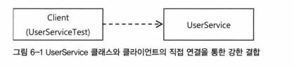

[노션을 참고하면 더욱 좋습니다.](https://near-sunscreen-c35.notion.site/6-AOP-38848a7a35714b679f998f25802a3aaf)


# 6장 AOP

AOP 는 IoC , DI, 서비스 추상화와 더불어 스프링 3대 기반기술의 하나이다.

AOP는 정말 중요한 개념이다 해당 장을 이용하여 자세히 알아보도록 하자

---

## 6.1 트랜잭션 코드의 분리

지금까지 서비스 추상화 기법을 적용해 트랜잭션 기술에 독립적으로 만들어줬고

다른 코드들도 깔끔하게 만들었다.

하지만 찜찜하다 더 깔끔한 코드를 만들고 싶다 비즈니스 로직에서 트랜잭션 로직을 분리해보자

### 6.1.1 메소드 분리

기존 코드를 보면 뚜렷하게 두가지 종류의 코드가 구분되어 있다.

트랜잭션과 비즈니스가 존재한다

비즈니스 로직을 담당하는 코드를 메소드로 추출해서 독립시켜 보자.

**분리 전**

```java
class UserService {

	public void upgradeLevels() {

        TransactionStatus status = this.transactionManager.getTransaction(new DefaultTransactionDefinition());

        try {
            List<User> userList = userDao.getAll();

            for(User user : userList) {

                if (canUpgradeLevel(user)) {
                    upgradeLevel(user);
                }
            }
            this.transactionManager.commit(status);
        } catch (RuntimeException e) {
            this.transactionManager.rollback(status);
            throw e;
        }
    }

}
```

**분리 후**

```java
class UserService {

	public void upgradeLevels() {

        TransactionStatus status = this.transactionManager.getTransaction(new DefaultTransactionDefinition());

        try {
            
            upgradeLevelsInternal();
            
            this.transactionManager.commit(status);
        } catch (RuntimeException e) {
            this.transactionManager.rollback(status);
            throw e;
        }
    }

    private void upgradeLevelsInternal() {
        List<User> userList = userDao.getAll();

        for(User user : userList) {

            if (canUpgradeLevel(user)) {
                upgradeLevel(user);
            }
        }
    }

}
```

코드가 보기 편해졌다. 테스트 코드를 다시 돌려보는것도 있지 말자

### 6.1.2 DI를 이용한 클래스의 분리

비즈니스 로직이 분리돼서 보기 좋지만 

트랜잭션을 담당하는 기술적인 코드가 UserService 안에 자리 잡고 있다.

정보를 주고받는것도 아닌데 UserService에서는 보이지 않게 할수 있지 않을까?

트랜잭션 코드를 클래스 밖으로 뽑아내자.

### **DI 적용을 이용한 트랜잭션 분리**

UserService는 UsertServiceTest가 클라이언트로 사용중이다.

실전에서는 다른 클래스가 호출할 것이다.

그런데 UserService는 현재 클래스로 되어 있으니 

다른 코드에서 사용한다면 UserService 클래스를 직접 참조하게 된다.

그렇다면 트랜잭션 코드를 UserService 밖으로 빼버리면 트랜잭션 기능이 빠진

UserService 가 되어버린다.

직접 사용하는 것이 문제가 된다면 간접적으로 사용하면 된다

DI의 기본 아이디어는 실제 사용할 오브젝트의 클래스 정체는 감춘 채

인터페이스를 통해 간접적으로 접근하는 것이다.

그 덕분에 구현 클래스는 얼마든지 외부에서 변경할 수 있다.

현재는 아래 그림처럼 클라이언트간의 관계가 강한 결합도로 고정되어 있다.



그래서 다음과 같이 UserService를 인터페이스로 만들고 기존 코드는

인터페이스의 구현 클래스를 만들어넣도록 한다.

그럼 결합이 약해지고 직접 구현 클래스에 의존하지 않기 때문에 유연한 확장이 가능하다.


런타임 시에 DI를 통해 적용하는 방법을 쓰는 이유는, 일반적으로

구현클래스를 바꿔가면서 사용하기 위해서다.

정식 운영중에는 정규 구현 클래스를 DI 해주는 방법처럼 한 번에 한 가지 클래스를 선택해서

적용하도록 되어있다.

하지만 꼭 그래야 한다는 제약은 없다.

한 번에 두 개의 UserService 인터페이스 구현 클래스를 동시에 이용한다면 어떨까?

지금 문제는 순수하게 비즈니스 로직을 담고 있는 코드만 놔두고

트랜잭션 경계설정을 담당하는 코드를 외부로 빼내려는거다.

하지만 클라이언트가 UserService의 기능을 제대로 이용하려면 트랜잭션이 적용돼야 한다.

아래와 같은 구조를 생각해볼 수 있다.

UserService를 구현한 또다른 구현 클래스를 만든다.

이클래스는 단지 트랜잭션의 경계설정 이라는 책임을 맡고 있다.

스스로 비즈니스 로직은 담고 있지 않다. 그래서 또 다른 비즈니스 로직을 담고있는 UserService의

구현 클래스에 실제적인 로직 처리 작업을 위임하는 것이다.


### UserService 인터페이스 도입

UserService 를 UserServiceImpl 로 변경하고 트랜잭션 로직을 제거한후

UserService Interface를 만들어서 상속 받게 만들자.

```java
public interface UserService {

    void add(User user);
    void upgradeLevels();

}
```

```java
public class UserServiceImpl implements UserService {
//...
	public void upgradeLevels() {

        List<User> userList = userDao.getAll();

        for(User user : userList) {

            if (canUpgradeLevel(user)) {
                upgradeLevel(user);
            }
        }
    }

}
```

### 분리된 트랜잭션 기능

이제 비즈니스 트랜잭션 처리를 담은 UserServiceTx를 만들어보자 UserServiceTx는 기본적으로

UserService를 구현하게 만든다. 그리고 같은 인터페이스를 구현한 다른 오브젝트에게

고스란히 작업을 위임하게 만들면 된다.

그러면 적어도 비즈니스 로직에 대해 UserServiceTx가 아무런 관여도 하지 않는다.

```java
public class UserServiceTx implements UserService {

    UserService userService;
    PlatformTransactionManager transactionManager;

    public void setUserService(UserService userService) {
        this.userService = userService;
    }

    @Override
    public void add(User user) {
        userService.add(user);
    }

    @Override
    public void upgradeLevels() {

        TransactionStatus status = this.transactionManager.getTransaction(new DefaultTransactionDefinition());

        try {
            userService.upgradeLevels();
            this.transactionManager.commit(status);
        } catch (RuntimeException e) {
            this.transactionManager.rollback(status);
            throw e;
        }

    }
}
```

자이제 TX에서는 트랜잭션 로직만 담당한다.

아래와 같은 구조가 된거다


### 트랜잭션 적용을 위한 DI 설정

이제 남은 것은 설정파일을 수정하는 부분이다.

-중요-

토비의 스프링에서는 XML 설정으로 나와있지만 

저는 SpringBoot를 이용한 어노테이션 설정을 작성하였습니다.

**비즈니스 로직을 담고 있는 UserServiceImpl**

```java
@RequiredArgsConstructor
@Service("UserServiceImpl") // <- Bean 이름 설정
public class UserServiceImpl implements UserService {
	
..// 로직
}
```

**트랜잭션 로직을 담고 있는 UserServiceTx**

```java
@Service // <- 이름을 따로 주지 않을 경우 클래스명으로 등록됨.
public class UserServiceTx implements UserService {
	....//
}
```

**UserServiceTest 에서의 DI 방법**

```java
@SpringBootTest
public class UserServiceTest {

    @Qualifier("userServiceTx") // UserService 인터페이스 타입의 구현체 이름 DI
    @Autowired
    UserService userService;

}
```

---

## 6.2 고립된 단위 테스트

### 6.2.1 복잡한 의존관계 속의 테스트

UserService의 경우를 생각해보자.

UserService 는 현재 매우 간단한 기능만을 가지고 있지만 아래와 같이 의존되어있는게 많다.


UserService 에서 하나의 메소드만 테스트 하려해도

트랜잭션, 메일 , DB연결 등 많은 준비와 내부적으로 여러 환경이 같이돌아간다.

그러다 보면 오류를 찾으려해도 UserService에서 찾는게 아닌 다른 곳 에서 찾아야 할수도 있다.

그리고 막상 UserService는 가져온 목록을 가지고 간단한 계산을 하는 게 전부라면

배보다 배꼽이 더 큰 작업이 될지도 모른다.

### 6.2.2 테스트 대상 오브젝트 고립시키기

### 테스트를 위한 UserServiceImpl 고립

UserService를 고립시키면 아래와 같은 구성을 할 수 있다.


MockUserDao를 내부클래스로 선언해주자

```java
public class UserServiceTest {
	.../

		// Mock
    static class MockUserDao implements UserDao {

        private List<User> users;
        private List<User> updated = new ArrayList<>();

        private MockUserDao(List<User> users) {
            this.users = users;
        }

        public List<User> getUpdated() {
            return updated;
        }

        @Override
        public List<User> getAll() {
            return this.users;
        }

        @Override
        public void update(User user) {
            updated.add(user);
        }

        //테스트에 사용안함
        @Override
        public void deleteAll() {
            throw new UnsupportedOperationException();

        }

        @Override
        public void add(User user) throws DuplicateUserIdException {
            throw new UnsupportedOperationException();
        }

        @Override
        public User get(String id) {
            throw new UnsupportedOperationException();

        }
    }
}
```

현재 지금 upgradeLvels() 테스트만 할거니 나머지 사용하지 않은 메소드에 대해선

UnsupportedOperationException 를 던지게해서 지원하지 않는 기능이라고 명시해주자.

그리고 upgradeLevels 테스트 메소드를 변경해주자

```java
public class UserServiceTest {

		@Test
    public void upgradeLevels() throws SQLException {

        MockUserDao mockUserDao = new MockUserDao(this.userList);

        UserServiceImpl userService = new UserServiceImpl(mockUserDao); // 고립 테스트 직접생성

        userDaoImpl.deleteAll();

        userService.upgradeLevels();

        List<User> updated = mockUserDao.getUpdated();

        assertThat(updated.size()).isEqualTo(2);
        checkUserAndLevel(updated.get(0), "joytouch", Level.SIlVER);
        checkUserAndLevel(updated.get(1), "madnite1", Level.GOLD);

    }
    // upgradeLevels 에서 사용할 테스트용 메소드
    private void checkUserAndLevel(User updated, String expectedId, Level expectedLevel) {
        assertThat(updated.getId()).isEqualTo(expectedId);
        assertThat(updated.getLevel()).isEqualTo(expectedLevel);
    }

}
```

고립 테스트를위해 테스트의 대상을 직접 생성한다.

위에서 만들어진 UserList 를 Mock 객체에 넣고 로직을 수행한다.

테스트를 돌려보자 통과가 나올 것이다.

### 6.2.3 단위 테스트와 통합 테스트

단위 테스트의 단위는 정하기 나름이다.

중요한것은 단위에 초점을 맞춘 테스트다

**"테스트 대상 클래스를 목 오브젝트 등의 테스트 대역을 이용해 의존 오브젝트나 외부의 리소스를 사용하지 않도록 고립시켜서 테스트하는 것"** 을 단위 테스트라고 부른다

외부의 DB나 파일, 서비스 등의 리소스가 참여하는 테스트는 **통합 테스트** 라고 부른다.

통합테스트란 두개의 단위가 결합해서 동작하면서 수행되는 것이다.

### 가이드 라인

- 항상 단위 테스트를 먼저 고려한다.
- 하나의 클래스나 성격과 목적이 같은 긴밀한 클래스 몇 개를 모아서 외부와의 의존관계를 모두 차단하고 필요에 따라 스텁이나 목 오브젝트 등의 테스트 대역을 이용하도록 테스트를 만든다. 단위 테스트는 테스트 작성도 간단하고 실행 속도도 빠르며 테스트 대상 외의 코드나 환경으로부터 테스트 결과에 영향을 받지도 않기 때문에 가장 빠른 시간에 효과적인 테스트를 작성하기에 유리하다.
- 외부 리소스를 사용해야만 가능한 테스트는 통합 테스트로 만든다.
- 단위 테스트로 만들기가 어려운 코드도 있다. 대표적인 게 DAO다. DAO는 그 자체로 로직을 담고 있기 보다는 DB를 통해 로직을 수행하는 인터페이스와 같은 역할을 한다. SQL을 JDBC를 통해 실행하는 코드만으로는 고립된 테스트를 작성하기가 힘들다. 작성한다고 해도 가치가 없는 경우가 대부분이다. 따라서 DAO는 DB까지 연동하는 테스트로 만드는 편이 효과적이다. DB를 사용하는 테스트는 DB에 테스트 데이터를 준비하고, DB에 직접 확인을 하는 드으이 부가적인 작업이 필요하다
- DAO 테스트는 DB라는 외부 리소스를 사용하기 때문에 통합 테스트로 분류된다. 하지만 코드에서 보자면 하나의 기능 단위를 테스트하는 것이기도 하다. DAO를 테스트를 통해 층분히 검증해두면, DAO를 이용하는 코드는 DAO 역할을 스텁이나 목 오브젝트로 대체해서 테스트할 수 있다.이후 실제 DAO와 연동했을 때도 바르게 동작하리라고 확신할 수 있다. 물론 각각의 단위 테스트가 성공했더라도 여러개의 단위를 연걸해서 테스트하면 오류가 발생할 수도 있다. 하지만 충분한 단위 테스트를 거친다면 통합 테스트에서 오류가 발생할 확률도 줄어들고 발생한다고 하더라도 쉽게 처리할 수 있다
- 여러 개의 단위가 의존관계를 가지고 동작할 때를 위한 통합 테스트는 필요하다. 다만, 단위 테스트를 충분히 거쳤다면 통합 테스트의 부담은 상대적으로 줄어든다.
- 단위 테스트를 만들기가 너무 복잡하다고 판단되는 코드는 처음부터 통합 테스트를 고려해본다. 이때도 통합 테스트에 참여하는 코드 중에서 가능한 한 많은 부분을 미리 단위 테스트로 검증해두는 게 유리하다.
- 스프링 테스트 컨텍스트 프레임워크를 이용하는 테스트는 통합 테스트다. 가능하면 스프링의 지원 없이 직접 코드 레벨의 DI를 사용하면서 단위 테스트를 하는 게 좋겠지만 스프링의 설정 자체도 테스트 대상이고, 스프링을 이용해 좀 더 추상적인 레벨에서 테스트해야 할 경우도 종종 있다. 이럴 땐 스프링 테스트 컨텍스트 프레임워크를 이용해 통합 테스트를 작성한다.

### 6.2.4 목 프레임워크

매번 Mock 를 직접 만들기는 힘들다 다양한 목 오브젝트를 지원해주는 프레임워크를 알아보자

### Mockito 프레임워크

Mockito 같은 프레임워크를 사용하면 간단하게 Mock 객체를 만들 수 있다

변경된 테스트 코드

```java
public class UserServiceTest {
	
		@Test
    public void upgradeLevels() throws SQLException {

        UserDao mockUserDao = mock(UserDao.class);

        when(mockUserDao.getAll()).thenReturn(this.userList); // getAll() 할때 userList 리턴하도록 설정

        UserServiceImpl userService = new UserServiceImpl(mockUserDao); // Service 에 Mock 객체 주입

        userDaoImpl.deleteAll();

        userService.upgradeLevels();

        verify(mockUserDao, times(2)).update(any(User.class)); // 2번 호출되었는지 확인
        verify(mockUserDao, times(2)).update(any(User.class));

        verify(mockUserDao).update(userList.get(1)); // 
        assertThat(userList.get(1).getLevel()).isEqualTo(Level.SIlVER);

        verify(mockUserDao).update(userList.get(3));
        assertThat(userList.get(3).getLevel()).isEqualTo(Level.GOLD);

    }
	
}
```

MockIto 목 오브젝트의 단계별 사용법 두번째와 네번째는 각각 필요한 경우에만 사용할 수 있다

1. 인터페이스를 이용해 목 오브젝트를 만든다.
2. 목 오브젝트가 리턴할 값이 있으면 이를 지정해준다. 메소드가 호출되면 예외를 강제로 던지게 만들 수도 있다.
3. 테스트 대상 오브젝트에 DI해서 목 오브젝트가 테스트 중에 사용되도록 만든다.
4. 테스트 대상 오브젝트를 사용한 후에 목 오브젝트의 특정 메소드가 호출됐는지, 어떤 값을 가지고 몇 번 호출됐는지를 검증한다.

---

## 6.3 다이내믹 프록시와 팩토리 빈

### 6.3.1 프록시와 프록시 패턴, 데코레이터 패턴

트랜잭션 경계설정 코드를 비즈니스 로직 코드에서 분리해낼 때 적용했던 기법을 다시 검토해보자.

아래 그림과 같이 부가기능 전부를 핵심 코드가 담긴 클래스에서 독립시켰다

이 방법을 이용하여 UserServiceTx를 만들었고 UserServiceImpl 에는

트랜잭션 관련 코드가 하나도 남지 않게 됐다.


이렇게 만들어도 클라이언트가 직접 핵심기능을 사용한다면 부가기능이 적용되지 않는다.

이걸 방지하기 위해서 클라이언트는 인터페이스를 통해서만 핵심기능을 사용하게 하고

부가기능 자신도 같은 인터페이스를 구현한뒤 그 사이에 끼어들어야 한다

이러면 클라이언트는 자신이 핵심기능을 사용할 것이라고 생각하지만 사실은 부가기능을 통해

핵심기능에 접근하는 구조이다.


이렇게 마치 자신이 클라이언트가 사용하려고 하는 실제 대상인것처럼 위장해서 클라이언트의 요청을 받는객체를

대리자, 대리인과 같은 역할을 한다고 해서 **프록시** 라고 부른다.

그리 프록시를 통해 최종적으로 요청을 위임받아 처리하는 실제 오브젝트를 

타깃 또는 실체 라고 부른다.


### 데코레이터 패턴

데코레이터 패턴은 타깃에 부가적인 기능을 런타임 시 다이내믹하게 부여해주기 위해

프록시를 사용하는 패턴을 말한다.

다이내믹하게 기능을 부가한다는 의미는 컴파일 시점, 즉 코드상에서는 어떤 방법과 순서로 프록시와

타깃이 연결되어 사용하는지 정해져 있지 않다는 뜻이다.

이 패턴의 이름이 데코레이터 라고 불리는 이유는 마치 제품이나 케익등을 여러 겹으로 포장하고

그 위에 장식을 붙이는 것처럼 실제 내용물은 동일하지만 부가적인 효과를 부여해줄 수 있기 때문이다.

따라서 데코레이터는 프록시가 꼭 한 개로 제한되지 않는다.

프록시가 직접 타깃을 사용하도록 고정시킬 필요도 없다.

이를 위해 데코레이터 패턴에서는 같은 인터페이스를 구현한 타겟과 여러 개의 프록시를 사용할 수 있다.

예를 들어 소스코드를 출력하는 기능을 가진 핵심기능이 있다고 생각해보자.

이 클래스에 데코레이터 개념을 부여해서 타깃과 같은 인터페이스를 구현하는 프록시를 만들 수 있다.


프록로서 동작하는 각 데코레이터는 위임하는 대상에도 인터페이스로 접근하기 때문에

자신ㅣ 최종 타깃에 위임하는지, 아니면 다음 단계의 데코레이터 프록시로 위임하는지 알지 못한다.

그래서 다음 데코레이터는 인터페이스로 선언하고 생성자나 수정자 메소드를 통해 대상을 외부에서 런타임 시에 주입 받도록 만들어야 한다.

자바 IO 패키지의 InputStream과 OutputStream 구현 클래스는 데코레이터 패턴이 사용된 대표적인 예다.

다음 코드는 InputStream 이라는 인터페이스를 구현한 타깃인 FileInputStream에 

버퍼 읽기 기능을 제공해주는 BufferedInputStream 이라는 데코레이터를 적용한 예다.

```java
InputStream is = new BufferedInputStream(new FileInputStream("a.txt));
```

UserService 이ㄴ터페이스를 구현한 타깃인 UserServiceImpl에 트랜잭션 부가기능을 제공해주는

UserServiceTx를 추가한 것도 데코레이터 패턴을 적용한 것이라고 볼수 있다.

필요하다면 언제든지 트랜잭션 외에도 다른 기능을 부여해주는 데코레이터를 만들어서

UserServiceTx와 UserServiceImpl 사이에 추가해줄 수도 있다.

**데코레이터 패턴은 타깃의 코드를 손대지 않고 클라이언트가 호출하는 방법도 변경하지 않은 채로**

**새로운 기능을 추가할 때 유용한 방법이다.**

### 프록시 패턴

일반적으로 사용하는 프록시라는 용어와 디자인 패턴에서 말하는 프록시 패턴은 구분할 필요가 있다.

전자는 클라이언트와 사용 대상 사이에 대리 역할을 맡은 오브젝트를 두는 방법을 총칭한다면

후자는 프록시를 사용하는 방법 중에서 타깃에 대한 접근 방법을 제어하려는 목적을 가진 경우를 가리킨다.

프록시 패턴의 프록시는 타깃의 기능을 확장하거나 추가하지 않는다.

대신 클라이언트가 타깃에 접근하는 방식을 변경해준다. 타깃 오브젝트를 생성하기가 복잡하거나

당장 필요하지 않은 경우에는 꼭 필요한 시점까지 오브젝트를 생성하지 않는 편이 좋다.

그런데 타깃 오브젝트에 대한 레퍼런스가 미리 필요할 수 있다.

이럴 때 프록시 패턴을 적용하면 된다.

클라이언트에게 타깃 레퍼런스를 넘겨야 하는데. 실제 타깃 오브젝트를 만드는 대신 프록시를 넘겨주는 것이다.

그리고 프록시의 메소드를 통해 타깃을 사용하려고 시도하면

그때 프록시가 타깃 오브젝트를 생성하고 요청을 위임해주는 식이다.

이렇게 프록시 패턴은 타깃의 기능 자체에는 관여하지 않으면서 

접근하는 방법을 제어해주는 프록시를 이용하는 것이다. 

구조적으로 보자면 프록시와 데코레이터는 유사하다.

다만 프록시는 코드에서 자신이 만들거나 접근할 타깃 클래스 정보를 알고 있는 경우가 많다.

프록시 패턴도 인터페이스를 통해 위임하도록 만들 수도 있다. 인터페이스를 통해 

다음 호출 대상으로 접근하게 하면 그 사이에 다른 프록시나 데코레이터가 계속 추가될 수 있기 때문이다.

아래 그림은 접근제어를 위한 프록시를 두는 프록시 패턴과 컬러, 페이징 기능을 추가하기 위한 프록시는 두는

데코레이터 패턴을 함께 적용한 예다. 두가지 모두 프록시의 기본 원리대로 타깃과 같은 인터페이스를 구현해두고 위임하는 방식으로 만들어져 있다.


### 6.3.2 다이내믹 프록시

프록시는 기존 코드에 영향을 주지 않으면서 타깃의 기능을 확장하거나

접근 방법을 제어할 수 있는 유용한 방법이다.

근데 개발자들은 이런 프록시 객체를 만드는걸 귀찮아한다. 해야할일이 많아지기 때문이다.

목 오브젝트를 매번 만드는게 힘들어서 목 프레임워크를 사용한것처럼 프록시도 그런 방법이 없을까

자바에는 java.lang.reflect 패키지 안에 프록시를 손쉽게 만들도록 지원해주는 클래스들이 있다.

### 프록시의 구성과 프록시 작성의 문제점

프록시는 다음의 두 가지 기능으로 구성된다

- 타깃과 같은 메소드를 구현하고 있다가 메소드가 호출되면 타깃 오브젝트로 위임한다.
- 지정된 요청에 대해서는 부가기능을 수행한다.

트랜잭션 부가기능을 만든 UserTx는 기능 부가를 위한 프록시다. 

UserServiceTx 코드는 UserService 인터페이스를 구현하고 타깃으로 요청을 위임하는

트랜잭션 부가기능을 수행하는 코드로 구분할 수 있다. 

이렇게 프록시의 역할은 위임과 부가작업이라는 두가지로 구분할 수 있다.

그렇다면 프록시를 만들기 번거로운 이유는 무엇일까?

1. 첫 번째
    - 타깃의 인터페이스를 구현하고 위임하는 코드를 작성하기가 번거롭다는점
    - 부가기능이 필요 없는 메소드도 구현해서 타깃으로 위임하는 코드를 다 만들어야함.
    - 복잡하진 않지만 인터페이스의 메소드가 많아지고 다양해지면 부담스러운 작업이됨
    - 타깃 인터페이스가 추가되거나 변경될 때마다 모든걸 다 수정해줘야 함
2. 두 번째
    - 부가기능 코드가 중복될 가능성이 많다는점.
    - 메소드가 많아지고 트랜잭션 같은 기능을 적용해야하는 비율이 높아지면 코드가 중복될수 있다.

위의 문제들을 해결하는데 유용한 것이 바로 JDK의 다이내믹 프록시다.

### 리플렉션

다이내믹 프록시는 리플렉션 기능을 이용해서 프록시를 만들어준다.

리플렉션은 자바의 코드 자체를 추상화해서 접근하도록 만든 것이다.

다음과 같이 만들어진 간단한 스트링 타입의 오즈젝트가 있다고 하자.

```java
String name = "Spring";
```

이 클래스의 길이를 알고 싶으면 length() 메소드를 호출하면 된다.

일반적인 사용 방법은 name.length() 같이 직접 메소드를 호출하는 코드로 만드는 것이다.

자바의 모든 클래스는 그 클래스 자체의 구성정보를 담은 Class 타입의 오브젝트를 하나씩 갖고 있다.

해당 클래스 정보를 가져오면 정보를 얻거나 행위를 할 수 있다.

- 클래스 코드에 대한 메타정보를 얻거나 오브젝트를 조작
- 클래스 이름이 무엇인지
- 어떤 클래스를 상속하는지
- 어떤 인터페이스를 구현했는지
- 어떤 필드를 갖고 있는지 각각 타입은 무엇인지
- 메소드는 어떤것인지 파라미터는 무엇인지 리턴타입은 무엇인지
- ETC..

String의 length 메소드 정보를 얻어보자.

```java
Method lengthMethod = String.class.getMethod("length");

//public int java.lang.String.length()
```

reflect를 이용해 메소드의 정보를 얻거나 실행할 수 있다.

Method 인터페이스에 정의된 invoke() 메소드를 사용하면 된다.

테스트를 진행해보자

```java
public class ReflectionTest {

    @Test
    public void invokeMethodTest() throws Exception {

        String name = "Spring";

        //length()
        assertThat(name.length()).isEqualTo(6);

        Method lengthMethod = String.class.getMethod("length");
        assertThat((Integer) lengthMethod.invoke(name)).isEqualTo(6);

        // charAt()

        assertThat(name.charAt(0)).isEqualTo('S');

        Method charAtMethod = String.class.getMethod("charAt", int.class);
        assertThat((Character) charAtMethod.invoke(name, 0)).isEqualTo('S');

    }

}
```

결과는 통과이다.

### 프록시 클래스

다이내믹 프록시를 이용한 프록시를 만들어보자. 

프록시를 적용할 간단한 타깃 클래스와 인터페이스를 아래와 같이 정의한다.

```java
public interface Hello {
    String sayHello(String name);
    String sayHi(String name);
    String sayThankYou(String name);
}

public class HelloTarget implements Hello {

    @Override
    public String sayHello(String name) {
        return "Hello " + name;
    }

    @Override
    public String sayHi(String name) {
        return "Hi " + name;
    }

    @Override
    public String sayThankYou(String name) {
        return "Thank You " + name;
    }
}

```

이제 테스트할 테스트 클래스도 만들자

```java
public class SimpleProxyTest {

    @Test
    public void simpleProxy() {
        Hello hello = new HelloTarget();

        assertThat(hello.sayHello("Toby")).isEqualTo("Hello Toby");
        assertThat(hello.sayHi("Toby")).isEqualTo("Hi Toby");
        assertThat(hello.sayThankYou("Toby")).isEqualTo("Thank You Toby");

    }

}
```

이제 Hello 인터페이스를 구현한 프록시를 만들어보자

만들 프록시는 HelloUppercase 프록시다 이 프록시는 모든 문자를 대문자로 바꿔준다.

```java
public class HelloUppercase implements Hello {
    
    Hello hello;

    public HelloUppercase(Hello hello) {
        this.hello = hello;
    }

    @Override
    public String sayHello(String name) {
        return hello.sayHello(name).toUpperCase();
    }

    @Override
    public String sayHi(String name) {
        return hello.sayHi(name).toUpperCase();
    }

    @Override
    public String sayThankYou(String name) {
        return hello.sayThankYou(name).toUpperCase();
    }
}
```

프록시 테스트도 만들어 보자

```java

public class SimpleProxyTest {

	..//
		@Test
    public void uppercaseProxy() {

        final String name = "Toby";

        Hello proxiedHello = new HelloUppercase(new HelloTarget());

        assertThat(proxiedHello.sayHello(name)).isEqualTo("HELLO TOBY");
        assertThat(proxiedHello.sayHi(name)).isEqualTo("HI TOBY");
        assertThat(proxiedHello.sayThankYou(name)).isEqualTo("THANK YOU TOBY");
    }	

}

```

이 프록시들은 문제점을 가지고 있다

인터페이스의 모든 메소드를 구현해 위임하도록 코드를 만들어야 하며

부가적인 기능인 리턴 값을 대문자로 바꾸는 기능이 모든 메소드에 중복돼서 나타난다.

### 다이내믹 프록시 적용

클래스로 만든 프록시인 HelloUppercase를 다이내믹 프록시를 이용해 만들어보자.


다이내믹 프록시는 프록시 팩토리에 의해 런타임 시 다이내믹하게 만들어지는 오브젝트다.

다이내믹 프록시는 타깃의 인터페이스와 같은 타입으로 만들어진다.

클라이언트는 다이내믹 프록시 오브젝트를 타깃 인터페이스를 통해 사용할 수 있다.

이 덕분에 프록시를 만들 때 인터페이스를 모두 구현해가면서 클래스를 정의하는 수고를 덜 수 있다.

프록시 팩토리에게 인터페이스 정보만 제공해주면 해당 인터페이스를 구현한 클래스 오브젝트를 자동으로 만들어준다.

다만, 다이내믹 프록시가 인터페이스 구현 클래스의 오브젝트는 만들어주지만

프록시로서 필요한 부가기능 제공 코드는 직접 작성해야 한다.

부가기능은 프록시 오브젝트와 독립적으로 InvocationHandler를 구현한 오브젝트에 담는다.

**InvocationHandler**

- Invoke 단 하나의 메소드만 가진 인터페이스다
- Object proxy를 파라미터로 받는다.
- 리플렉션의 Method 인터페이스를 파라미터로 받는다.
- 메소드를 호출할 때 전달되는 파라미터도 args로 받는다.

다이내믹 프록시는 오브젝트는 클라이언트의 모든 요청을 리플렉션 정보로 변환해서 InvocationHandler

구현 오브젝트의 invoke() 메소드로 넘긴다.


다이내믹 프록시를 만들어보자.

Hello의 리턴타입은 모두 String 이므로 String 클래스로 캐스팅 해준다.

```java
public class UppercaseHandler implements InvocationHandler {
    
    Hello target;

    public UppercaseHandler(Hello target) {
        this.target = target;
    }

    @Override
    public Object invoke(Object proxy, Method method, Object[] args) throws Throwable {
        String ret = (String) method.invoke(target, args);
        return ret.toUpperCase();
    }
}
```

테스트를 진행해보자

```java
public class SimpleProxyTest {
		@Test
    public void dynamicProxy() {

        final String name = "Toby";

        Hello proxiedHello = (Hello) Proxy.newProxyInstance(
                getClass().getClassLoader(), // 동적으로 생성되는 다이내믹 프록시 클래스의 로딩에 사용될 클래스 로더
                new Class[] {Hello.class}, // 구현할 인터페이스
                new UppercaseHandler(new HelloTarget()) // 부가기능과 위임 코드를 담은 클래스
        );

        assertThat(proxiedHello.sayHello(name)).isEqualTo("HELLO TOBY");
        assertThat(proxiedHello.sayHi(name)).isEqualTo("HI TOBY");
        assertThat(proxiedHello.sayThankYou(name)).isEqualTo("THANK YOU TOBY");
    }
}
```

테스트는 통과한다.

### 다이내믹 프록시의 확장

다이내믹 프록시 방식이 직접 정의해서 만든 프록시보다 훨씬 유연하고 많은 장점이 있다.

Hello 인터페이스의 메소드가 3개가 아니라 30개로 늘어나면 어떻게 될까?

기존 방식은 모든 메소드를 구현해줘야하지만

다이내믹 프록시를 이용한거는 손댈게 없다 invoke() 에서 모두 처리되기 때문이다.

현재 UppercaseHandler는 모든 메소드의 리턴 타입이 스트링이라고 가정하에 만들어졌다.

근데 스트링 외의 리턴 타입을 갖는 메소드가 추가되면 어떨까?

유연하게 변경을 해보자

어떤 타입이 오든 사용이 가능하게 Object 로 변경해주고

String 으로 변경이 가능하면 toUpperCase()를 실행되게 변경하였다.

```java
public class UppercaseHandler implements InvocationHandler {

    Object target;

    public UppercaseHandler(Object target) {
        this.target = target;
    }

    @Override
    public Object invoke(Object proxy, Method method, Object[] args) throws Throwable {
        Object ref = method.invoke(target, args);
        if (ref instanceof String) {
            return ((String) ref).toUpperCase();
        } else {
            return ref;
        }
    }
}
```

이제 추가로 특정 메소드가 들어오면 toUpperCase() 가 호출되게 해보자.

String 타입으로 변환이 가능하고 메소드 이름의 시작이 Say 일경우만 toUpperCase()를 실행하도록 변경했다.

```java
		@Override
    public Object invoke(Object proxy, Method method, Object[] args) throws Throwable {
        Object ref = method.invoke(target, args);
        if (ref instanceof String && method.getName().startsWith("Say")) {
            return ((String) ref).toUpperCase();
        } else {
            return ref;
        }
    }
```

### 6.3.3 다이내믹 프록시를 이용한 트랜잭션 부가기능

UserServiceTx를 다이내믹 프록시 방식으로 변경해보자.

```java
public class TransactionHandler implements InvocationHandler {

    private Object target;
    private PlatformTransactionManager transactionManager;
    private String pattern;

    public void setTarget(Object target) {
        this.target = target;
    }

    public void setTransactionManager(PlatformTransactionManager transactionManager) {
        this.transactionManager = transactionManager;
    }

    public void setPattern(String pattern) {
        this.pattern = pattern;
    }

    @Override
    public Object invoke(Object proxy, Method method, Object[] args) throws Throwable {
        if (method.getName().startsWith(pattern)) {
            return invokeInTransaction(method, args);
        } else {
            return method.invoke(target, args);
        }
    }

    private Object invokeInTransaction(Method method, Object[] args) throws Throwable {
        TransactionStatus status = this.transactionManager.getTransaction(new DefaultTransactionDefinition());

        try {
            Object ret = method.invoke(target, args);
            this.transactionManager.commit(status);
            return ret;
        } catch (InvocationTargetException e) {
            this.transactionManager.rollback(status);
            throw e.getTargetException();
        }
    }
}
```

요청을 위임할 타깃을 DI로 제공받도록 한다. 타깃을 저장할 변수는 Object로 선언하자.

따라서 UserServiceImpl 외에 트랜잭션 적용이 필요한 어떤 타깃 오브젝트에도 적용할 수 있다.

### TransactionHandler와 다이내믹 프록시를 이용하는 테스트

앞에만든 트랜잭셔널 기능을 테스트해보자.

기존에 있던 테스트 코드를 수정해보자.

트랜잭션이 적용되어야먄 롤백이되면서 실행되는 테스트 코드가 정상적으로 돌아간다.

테스트는 성공이다 그러면 트랜잭션이 적용되었다는 뜻이다.

```java
class UserServiceTest {
		@Test
    public void upgradeAllOrNothing() throws SQLException {
        UserServiceImpl testUserServiceImpl = new TestUserServiceImpl(userList.get(3).getId(), userDaoImpl);

//        UserServiceTx userServiceTx = new UserServiceTx(testUserServiceImpl, transactionManager);

        TransactionHandler transactionHandler = new TransactionHandler();
        transactionHandler.setTarget(testUserServiceImpl);
        transactionHandler.setTransactionManager(transactionManager);
        transactionHandler.setPattern("upgradeLevels");

        UserService txUserService = (UserService) Proxy.newProxyInstance(
                getClass().getClassLoader(), new Class[]{ UserService.class }, transactionHandler
        );

        userDaoImpl.deleteAll();

        for (User user : userList) userDaoImpl.add(user);

        try {
            txUserService.upgradeLevels();
            fail("TestUserServiceException expected");
        } catch (TestUserServiceException e) {

        }
        checkLevel(userList.get(1), false);
    }
}
```

### 6.3.4 다이내믹 프록시를 위한 팩토리 빈

이제 TransactionHandler와 다이내믹 프록시를 스프링의 DI를 통해 사용할 수 있도록 만들어야 한다.

그런데 문제는 DI의 대상이 되는 다이내믹 프록시 오브젝트는 

일반적인 스프링의 빈으로는 등록할 방법이 없다는 점이다.

팩토리 빈을 이용하여 만들어보자

### 트랜잭션 프록시 팩토리 빈

아래와 같이 설정해 빈을 생성할 수 있다.

```java
public class TxProxyFactoryBean implements FactoryBean<Object> {

    Object target;
    PlatformTransactionManager transactionManager;
    String pattern;
    Class<?> serviceInterface;

    public void setTarget(Object target) {
        this.target = target;
    }

    public void setTransactionManager(PlatformTransactionManager transactionManager) {
        this.transactionManager = transactionManager;
    }

    public void setPattern(String pattern) {
        this.pattern = pattern;
    }

    public void setServiceInterface(Class<?> serviceInterface) {
        this.serviceInterface = serviceInterface;
    }

    
    // FactoryBean 인터페이스 구현 메소드
    @Override
    public Object getObject() throws Exception {
        TransactionHandler txHandler = new TransactionHandler();
        txHandler.setTarget(target);
        txHandler.setTransactionManager(transactionManager);
        txHandler.setPattern(pattern);
        return Proxy.newProxyInstance(
                getClass().getClassLoader(), new Class[]{ serviceInterface }, txHandler
        );
    }

    @Override
    public Class<?> getObjectType() {
        return serviceInterface;
    }

    @Override
    public boolean isSingleton() {
        return false; // 매번 같은 오브젝트를 리턴하지 안ㅇㅎ는다는 의미다 싱글톤 빈이 아니라는 뜻이 아님.
    }
}
```

### 프록시 팩토리 빈 방식이 장점

- 다이내믹 프록시를 이용하면 타깃 인터페이스를 구현하는 클래스를 일일이 안만들어도 된다.
- 하나의 핸들러 메소드를 구현하는것 만으로도 수많은 메소드에 부가기능을 부여함으로 중복문제가 사라진다.
- 다이내믹 프록시에 팩토리 빈을 이용한 DI까지 더해주면 번거로운 다이내믹 프록시 생성 코드도 제거 가능

---

## 6.4 스프링의 프록시 팩토리 빈

지금까지 트랜잭션 부가기능을 추가해주는 다양한 방법을 살펴봤다

이제 스프링은 이러한 문제에 어떤 해결책을 제시하는지 살펴볼 차례다.

### 6.4.1 ProxyFactoryBean

스프링은 트랜잭션 기술등에 적용했던 서비스 추상화를 프록시 기술에도 동일하게 적용하고 있다.

자바 JDK에서 제공하는 다이내믹 프록시 외에도 다양한 기술이 존재한다

스프링은 일관된 방법으로 프록시를 만들 수 있게 도와주는 추상 레이어를 제공한다.

생성된 프록시는 스프링의 빈으로 등록돼야 한다. 

스프링은 프록시 오브젝트를 생성해주는 기술을 추상화한 팩토리 빈을 제공해준다.

ProxyFactoryBean이 생성하는 프록시에서 사용할 부가기능은 

MethodInterceptor 인터페이스를 구현해 만든다.

InvocationHandler의 Invoke() 메소드는 타깃 오브젝트에 대한 정보를 제공하지 않는다.

따라서 타깃은 InvocationHandler를 구현한 클래스가 직접 알고 있어야 한다

반면에 MethodInterceptor의 invoke() 메소드는 ProxyFactoryBean 으로부터 타깃 오브젝트에

대한 정보까지 함게 제공받는다. 그차이 덕분에 MethodInterceptor 는 타깃 오브젝트에 상관없이

독립적으로 만들어 질 수 있다.

---

### AOP 란 무엇인가?

전통적인 객체지향 기술의 설계 방법으로는 독립적인 모듈화가 불가능한 트랜잭션 경계설정과 같은

부가기능을 어떻게 모듀로하할 것인가를 연구해온 사람들은, 이 부가기능 모듈화 작업은

기존의 객체지향 설계 패러다임과는 구분되는 새로운 특성이 있다고 생각했다.

그래서 이런 부가기능을 모듈을 객체지향 기술에서 주로 사용하는 오브젝트와는

다르게 특별한 이름으로 부르기 시작했다

그것이 바로 애스펙트(aspect다) 애스펙트란 그 자체로 애플리케이션이 핵심기능을 담고 있지는 않지만

애플리케이션을 구성하는 중요한 한가지 요소이고, 핵심기능에 부가되어 의미를 갖는 특별한 모듈을 가리킨다.

이렇게 트랜잭션 설정처럼 애플리케이션의 핵심정이 기능에서 부가적인 기능을 분리해서

애스펙트라는 독특한 모듈로 만들어서 설계하고 개발하는 방법을

애스팩트 지향 프로그래밍 (Aspect Oriented Programming ) 또는 약자로 AOP 라고 부른다.

### AOP의 용어

- 타깃
    - 타깃은 부가기능을 부여할 대상이다. 핵심기능을 담은 클래스일 수도 있지만 경우에 따라서는 다른 부가기능을 제공하는 프록시 오브젝트일 수도 있다.
- 어드바이스
    - 어드바이스는 타깃에게 제공할 부가기능을 담은 모듈이다. 어드바이스는 오브젝트로 정의하기도 하지만 메솓 레벨에서 정의할 수도 있다.
    - 어드바이스는 여러 가지 종류가 있다. MethodInterceptor 처럼 메소드 호출 과정에 전반적으로 참여하는 것도 있지만, 예외가 발생했을 때만 동작하는 어드바이스처럼 메소드 호출 과정의 일부에서만 동작하는 어드바이스도 있다.
- 조인 포인트
    - 처음 소개하는 용어다. 조인 포인트란 어드바이스가 적용될 수 있는 위치를 말한다. 스프링의 프록시 AOP에서 조인 포인트는 메소드의 실행 단계뿐이다. 타깃 오브젝트가 구현한 인터페이스의 모든 메소드는 조인 포인트가 된다.
- 포인트컷
    - 포인트 컷이란 어드바이스를 적용할 조인 포인트를 선별하는 작업 또는 그기능을 정의한 모듈을 말한다. 스프링 AOP의 조인 포인트는 메소드의 실행이므로 스프링의 포인트컷은 메소드를 선정하는 기능을 갖고 있다. 그래서 포인트컷 표현식은 메소드의 실행이라는 의미인 execution으로 시작하고 메소드의 시그니처를 비교하는 방법을 주로 이용한다. 메소드는 클래스 안에 존재하는 것이기 때문에 메소드 선정이란 결국 클래스를 선정하고 그 안의 메소드를 선정하는 과정을 거치게 된다.
- 프록시
    - 프록시는 클라이언트와 타깃 사이에 투명하게 존재하면서 부가기능을 제공하는 오브젝트다. DI를 통해 타깃대신 클라이언트에게 주입되며, 클라이언트의 메소드 호출을 대신 받아서 타깃에 위임해주면서, 그 과정에서 부가기능을 부여한다. 스프링은 프록시를 이용해 AOP를 지원한다.
- 어드바이저
    - 어드바이저는 포인트컷과 어드바이스를 하나씩 갖고 있는 오브젝트다. 어드바이저는 어떤 부가기능**(어드바이스)**을 어디에**(포인트컷)** 전달할 것인가를 알고 있는 AOP의 가장 기본이 되는 모듈이다. 스프링은 자동 프록시 생성기가 어드바이저를 AOP 작업의 정보로 활용한다. 어드바이저는 스프링 AOP에서만 사용되는 특별한 용어이고, 일반적인 AOP 에서는 사용되지 않는다.
- 애스펙트
    - OOP의 클래스와 마찬가지로 애스펙트는 AOP의 기본 모듈이다. 한 개 또는 그 이상의 포인트컷과 어드바이스의 조합으로 만들어지며 보통 싱글톤 형태의 오브젝트로 존재한다. 따라서 클래스와 같은 모듈 정의와 오브젝트와 같은 실체(인스턴스)의 구분이 특별히 없다. 두가지 모두 애스펙트라고 불린다. 스프링의 어드바이저는 아주 단순한 애스펙트라고 볼 수도 있다

### AOP 네임스페이스

- 자동 프록시 생성기
    - 스프링의 DefaultAdvisorAutoProxyCreator 클래스를 빈으로 등록한다. 다른 빈을 DI 하지도 않고 자신도 DI 되지 않으며 독립적으로 존재한다. 따라서 id도 굳이 필 요하지 않다. 애플리케이션 컨텍스트가 빈 오브젝트를 생성히는 과정에 빈 후처리기 로 참여한다. 빈으로 등록된 어드바이저를 이용해서 프록시를 자동으로 생성하는 기 능을담당한다.
- 어드바이스
    - 부가기능을 구현한 클래스를 빈으로 등록한다. TransactionAdvice는 AOP 관련 빈 중에서 유일하게 직접 구현한 클래스를 사용한다.
- 포인트컷
    - 스프링의 AspectJExpressionPointcut을 빈으로 등록하고 expression 프로퍼티에 포인트컷 표현식을 넣어주면 된다. 코드를 작성할 펼요는 없다.
- 어드바이저
    - 스프링의 DefaultPointcutAdvisor 클래스를 빈으로 등록해서 사용한다. 어드바이 스와 포인트컷을 프로퍼티로 참조하는 것 외에는 기능은 없다. 자동 프록시 생성기 에 의해 자동 검색되어 사용된다.
    

---

## 트랜잭션

DefaultTransactionDefinition이 구현하고 있는 TransactionDefinition 인터페이 스는 트랜잭션의 동작방식에 영향을 줄 수 있는 네 가지 속성을 정의하고 있다.

### 트랜잭션 전파

트랜잭션 전파란 트랜잭션의 경계에서 이미 진행 중인 트랜잭션이 있을 때 또는 없을 때 어떻게 동작할 것인가를 결정하는 방식을 말한다.


위와 같은 각각 독립적인 트랜잭션 경계를 가진 두 개의 코드가 있다고 하자.

그런데 A의 트랜잭션이 시작되고 아직 끝나지 않은 시점에서 B를 호출했다면

B의 코드는 어떤 트랜잭션 안에서 동작해야 할까?

여러가지 시나리오가 있다

1. A에서 이어진 트랜잭션이 B까지 같이 전파되어 하나의 트랜잭션으로 구분 B에서 예외가 발생하면 A까지 전부 DB 작업이 취소된다.
2. A와는 무관한 B의 독립적인 트랜잭션 B가 끝날경우 커밋 되거나 롤백될거고 A는 따로 A의 트랜잭션으로 진행될거다. 이 경우 A에서 롤백되어도 B에 영향이 가지 않는다.

이런 성격을 정의하는걸 트랜잭션 전파 속성이다. 

트랜잭션 전파 속성은 다음과 같은 옵션을 줄 수 있다

- PROPAGATION_REQUIRED
    
    가장 많이 사용되는 트랜잭션 전파 속성이다. 진행 중인 트랜잭션이 없으면 새로 시작하고, 이미 시작된 트랜잭션이 있으면 이에 참여한다
    
- PROPAGATION_REQUIRES_NEW
    
    항상 새로운 트랜잭션을 시작한다. 즉 앞에서 시작된 트랜잭션이 있든 없든 상관없이 새로운 트랜잭션을 만들어 독자적으로 동작하게 한다. 독립적인 트랜잭션이 보장돼야 하는 코드에 적용할 수 있다.
    
- PROPAGATION_NOTSUPPORTED
    
    이 속성을 사용하면 트랜잭션 없이 동작하도록 만들 수도 있다. 진행중인 트랜잭션이 있어도 무시한다.
    

### 격리 수준

모든 DB 트랜잭션은 격리수준(isolation level) 을 갖고 있어야 한다. 서버환경에서는 여러개의 트랜잭션이

동시에 진행될 수 있다.

가능하다면 모든 트랜잭션이 순차적으로 진행돼서 다른 트랜잭션의 작업에 독립적인 것이 좋겠지만, 그러자면

성능이 떨어질 수 있다.

격리 수준은 기본적으로 DB에 설정되어 있지만 JDBC 드라이버나 DataSource 등에서 재설정 할 수 있고

필요하다면 트랜잭션 단위로 격리수준을 조정할 수 있다.

### 제한시간

트랜잭션을 수행하는 제한시간 timeout를 설정 할 수 있다.

### 읽기 전용

읽기전용 Read Only으로 설정해두면 트랜잭션 내에서 데이터를 조작하는 시도를 막아줄 수 있다.

또한 데이터 액세스 기술에 따라서 성능이 향상될 수도 있다.

### 트랜잭션 애노테이션

타깃에 부여할 수 있는 트랜잭션 애노테이션은 다음과 같이 정의되어 있다.  스프링 3.0은 자바5에서 

등장한 애노테이션을 많이 사용한다. 필요에 따라서 애노테이션 정의를 읽고 

그 내용과 특징을 이해할 수 있도록 애노테이션의 정의에 사용되는 주요 메타애노테이션을 알고 있어야 한다.

```java
package org.springframework.transaction.annotation;

import java.lang.annotation.Documented;
import java.lang.annotation.ElementType;
import java.lang.annotation.Inherited;
import java.lang.annotation.Retention;
import java.lang.annotation.RetentionPolicy;
import java.lang.annotation.Target;

import org.springframework.core.annotation.AliasFor;
import org.springframework.transaction.TransactionDefinition;
@Target({ElementType.TYPE, ElementType.METHOD})
@Retention(RetentionPolicy.RUNTIME)
@Inherited
@Documented
public @interface Transactional {
	@AliasFor("transactionManager")
	String value() default "";
	@AliasFor("value")
	String transactionManager() default "";

	String[] label() default {};

	Propagation propagation() default Propagation.REQUIRED;

	Isolation isolation() default Isolation.DEFAULT;

	int timeout() default TransactionDefinition.TIMEOUT_DEFAULT;
	String timeoutString() default "";

	boolean readOnly() default false;

	Class<? extends Throwable>[] rollbackFor() default {};

	String[] rollbackForClassName() default {};

	Class<? extends Throwable>[] noRollbackFor() default {};

	String[] noRollbackForClassName() default {};

}
```

- @Target
    
    애노테이션을 사용할 대상을 지정한다.
    
- @Retention
    
    애노테이션 정보가 언제까지 유지되는지를 지정한다.
    
- @Inherited
    
    상속을 통해서도 애노테이션 정보를 얻을 수 있게 한다.
    

스프링은 @Transactional 부여된 모든 오브젝트를 자동으로 타깃 오브젝트로 인식한다.

이때 사용되는 포인트컷은 TransactionAttributeSourcePointcut 이다. 

TransactionAttributeSourcePointcut은 스스로 표현식과 같은 선정기준을 갖 고 있진 않다.

대신 @Transactional이 타입 레벨이든 메소드 레벨이든 상관없이 부여 된 

빈 오브젝트를 모두 찾아서 포인트컷의 선정 결과로 돌려준다. 

@Transactional은 기본적으로 트랜잭션 속성을 정의하는 것이지만

동시에 포인트컷의 자동등록에도 사용된다.

### 트랜잭션 속성을 이용하는 포인트컷


@Transactional 애노테이션을 사용했을 때 어드바이저 동작방식을 보여준다.

Transactionlnterceptor는 메소드 이름 패턴을 통해 부여되는 

일괄적인 트랜 잭션 속성정보 대신 @Transactional 애노테이션의 엘리먼트에서 트랜잭션 속성을 가져 오는 

AnnotationTransactionAttributeSource를 사용한다.

@Transactional은 메소드 마다 다르게 설정할 수도 있으므로 매우 유연한 트랜잭션 속성 설정이 가능해진다.

### 대체 정책

그래서 스프링은 @Transactional 을 적용할 때 4단계의 대체 failback 정책을 이용하게 해준다.

메소드의 속성을 확인할 때 타깃 메소드, 타깃 클래스, 선언 메소드, 선언 타입 의 순서에 따라서

@Transactional이 적용됐는지 차례로 확인하고, 가장 먼저 발견되는 속성정보를 사용하게 하는 방법이다.

```java
[1]
public interface Service {
	
	[2]
	void method1();
	
	[3]
	void method2();

}

[4]
public class ServiceImpl implements Service {
	
	[5]
	public void method1() {}
	
	[6]
	public void method2() {}

}

```

스프링은 트랜잭션 기능이 부여될 위치인 타깃 오브젝트의 메소드부터 시작해서

@Transactional 애노테이션이 존재하는지 확인한다.

따라서 [5] , [6] 이 @Transactional이 위치할 수 있는 첫 번째 후보다.

여기서 애노테이션이 발견되면 해당 속성을 가져다 트랜잭션 속성으로 사용한다.

메소드에서 @Transactional 를 발견하지 못하면, 다음 타깃 클래스인 [4]에 @Transactional이 존재하는지

확인한다.  이렇게 @Transactional 을 적용할곳을 순서대로 찾는다.

### 선언적 트랜잭션과 트랜잭션 전파 속성


다른 곳에서 Add를 가져가 사용하고 Add 에는 트랜잭션을 걸지 않아도

스프링 에서는 다른 곳에서 사용된 트랜잭션이 전파되어 하나의 트랜잭션으로 연결되어 사용된다.

AOP를 이용해 코드 외부에서 트랜잭션의 기능을 부여해주고 속성을 지정 할 수 있게 하는 방법을

선언적 트랜잭션 이라고 한다

반대로 다른 트랜잭션API 를 사용해 직접 코드안에서 사용하는 방법은 프로그램에 의한 트랜잭션이라고 한다.

스프링은 이 두 가지 방법을 모두 지원하고 있다.

---

## 정리

- 트랜잭션 경계설정 코드를 분리해서 별도의 클래스로 만들고 비즈니스 로직 클래스와 동일
한 인터페이스를 구현하면 DI의 확장 기능을 이용해 클라이언트의 변경 없이도 깔끔하게
분리된 트랜잭션 부가기능을 만들 수 있다.
- 트랜잭션처럼 환경과 외부 리소스에 영향을 받는 코드를 분리하면 비즈니스 로직에만 충실한 테스트를 만들 수 있다.
- 목 오브젝트를 활용하면 의존관계 속에 있는 오브젝트도 손쉽게 고립된 테스트로 만들 수 있다.
- DI를 이용한 트랜잭션의 분리는 데코레이터 패턴과 프록시 패턴으로 이해될 수 있다.
- 번거로운 프록시 클래스 작성은 JDK의 다이내믹 프록시를 사용하면 간단하게 만들 수 있다.
- 다이내믹 프록시는 스태틱 팩토리 메소드를 사용하기 때문에 빈으로 등록하기 번거롭다. 따라서 팩토리 빈으로 만들어야 한다. 스프링은 자동 프록시 생성 기술에 대한 추상화 서비스를 제공하는 프록시 팩토리 빈을 제공한다.
- 프록시 팩토리 빈의 설정이 반복되는 문제를 해결하기 위해 자동 프록시 생성기와 포인트컷을 활용할 수 있다. 자동 프록시 생성기는 부가기능이 담긴 어드바이스를 제공하는 프록시를 스프링 컨테이너 초기화 시점에 자동으로 만들어준다.
- 포인트컷은 AspectJ 포인트컷 표현식을 사용해서 작성하면 편리하다.
- AOP는 OOP 만으로는 모듈화하기 힘든 부가기능을 효과적으로 모듈화하도록 도와주는 기술이다.
- 스프링은 자주 사용되는 AOP설정과  트랜잭션 속성을 지정하는데 사용할 수 있는 전용 태그를 제공한다.
- AOP를 이용해 트랜잭션 속성을 지정하는 방법에는 포인트컷 표현식과 메소드 이름 패턴을 이용하는 탁릿에 직접 부여하는 @Transactional 애노테이션을 사용하는 방법이 있다.
- @Transactional 을 이용한 트랜잭션 속성을 테스트에 적용하면 손쉽게 DB를 사용하는 코드의 테스트를 만들 수 있다.