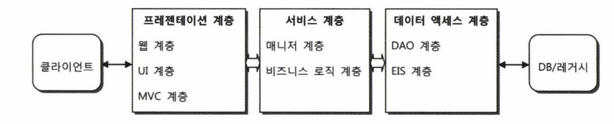

# 9.3장 애플리케이션 아키텍처

9.3장만 정리 합니다.

---

## 9.3 애플리케이션 아키텍처

스프링 웹 애플리케이션의 아키텍처를 알아보자

아키텍처는 여러 가지 방식으로 정의되고 이해될 수  있는 용어다.

가장 단순한 정의를 보자면 어떤 경계 안에 있는 내부 구성요소들이 어떤 책임을 갖고 있고,

어떤 방식으로 서로 관계를 맺고 동작하는지를 규정하는 것이라고 할 수 있다.

### 9.3.1 계층형 아키텍처

성격이 다른 모듈이 강하게 결합되어 한데 모여 있으면 한 가지 이유로 변경이 일어날 때

다른 요소도 함께 영향을 받게된다. 이런 부분을 방지 하기 위해서 인터페이스와 같은

유연한 경계를 만들어두고 분리하거나 모아두는 작업이 필요하다.

### 아키텍처와 SoC

지금까지는 주로 오브젝트 레벨에서 이런 분리의 문제에 대해 생각해봤다.

얽혀 있는 것을 분리하고 인터페이스를 둬서 유연하게 만들엇다.

이런 원리는 아키텍처 레벨에서 좀 더 큰 단위에 대해서도 동일하게 적용할 수 있다.

오브젝트를 하나의 모듈 단위라고 생각해보자.

모듈의 단위를 크게 확장해 볼 수도 있다.

애플리케이션을 구성하는 오브젝트들을 비슷한 성격과 책임을 가진 것들끼리 묶을 수 있다.

예를 들면 데이터 액세스 로직을 담당하는 DAO들은 하나의 단위로 생각해도 좋다.

어떤 DAO든 비슷한 성격을 띠고 유사한 방식으로 다른 오브젝트와 관계를 갖는다.

주로 DAO들은 저장과 검색등을 하고 DB의 엔티티 모델과 유사한 도메인 오브젝트를 이용해 데이터를

저장하고 가공하고 주고받는 일을 한다. 이는 각 DAO들의 유사한 성격이다

이렇게 애플리케이션 오브젝트들을 유사한 성격을 띤 그룹으로 나눌수가 있다.

만약 나뉘어 있지 않다면 DB 와 연동하는 DAO 코드에 HTML 태그에 들어가는 값이라던가

다양한 연산을 하는 로직이 섞여 있을 수 있다. 

코드가 섞여 있을때 HTML이나 연산로직에 변경이 있으면 여러가지 오브젝트들을 수정해야 한다.

그래서 성격이 다른 것은 아키텍처 레벨에서 분리해주는 게 좋다.

이렇게 분리된 각 오브젝트는 독자적으로 개발과 테스트가 가능해서 개발과 변경 작업이 모두 빨라 질 수 있다.

또 구현 방법이나 세부 로직이 변경되어도 서로 영향을 주지않고 변경될 수 있을만큼 유연해진다.

이렇게 책임과 성격이 다른 것을 크게 그룹으로 만들어 분리해두는 것을 아키텍처 차원에서는

계층형 아키텍처(layered architecture) 라고 부른다.

보통 웹 기반의 엔터프라이즈 애플리케이션은 일반적으로 세 개의 계층을 갖는다고 해서

3계층 애플리케이션이라고 한다.

### 3계층 아키텍처와 수직 계층

3계층 아키텍처는 백엔드의 DB나 레거시 시스템과 연동하는 인터페이스 역할을 하는

데이터 액세스 계층, 비즈니스 로직을 담고 있는 서비스 계층, 주로 웹 기반의 UI를 만들어내고

그 흐름을 관리하는 프레젠테이션 계층으로 구분한다.

**데이터 액세스 계층**

데이터 액세스 계층은 DAO 계층이라고도 불린다. 

DAO 패턴을 보편적으로 사용하기 때문이다.

또한 DB외에도 ERP, 레거시 시스템, 메인 프레임 등에 접근하는 역할을 하기 때문이

EIS 계층이라고도 한다.

보통은 장기적인 데이터 저장을 목적으로 한다.

또 외부 시스템을 호출해서 서비스를 이용하는 것은 기반(infrastructure) 계층으로 따로 분루햔다.

데이터 액세스 계층은 사용 기술에 따라서 다시 세분화된 계층으로 구분될 수 있다.

3계층과 달리 데이터 액세스 계층 안에서 다시 세분화하는 경우는 추상화 수준에 따른 구분이기 때문에

수직적인 계층이라고 부르기도 한다.

기본 3계층과는 다르게 역할에 따라 구분한 것이므로 보통 그림으로 나타낼 때도 가로로 배열한다.

반면에 같은 책임을 가졌지만 추상화 레벨에 따라 구분하는 경우는 세로로 배열해서 표현한다.

아래는 스프링의 JdbcTemplate을 사용하는 DAO 계층을 그린 그림이다.

JdbcTemplate 말고 다른것을 사용할때 이름 묶어서 더 단순한 방법으로 

DAO 코드를 작성하고 싶다면 하나의 추상 계층을 추가할 수 있다.

이렇게 계층을 추가하면 개발자의 코드에 지대한 영향을 주기 때문에 매우 신중하게 결정해야 한다. 

또한 유연하게 하위 계층의 변화에 대항할 수 있도록 변화에 대한 책임같은 설계를 잘해야하며

사용법에 대한 가이드라인이나 코딩 정책이 잘 만들어져서 개발자에게 제공될 필요가 있다.

**서비스 계층**

서비스 계층은 구조로 보자면 가장 단순하다.

스프링 애플리케이션의 서비스 계층 클래스는 이상적인 POJO로 작성된다.

서비스 계층은 DAO 계층을 호출 하고 이를 활용해서 만들어진다.

때론 데이터 액세스를 위한 기능 외에 서버나 시스템 레벨에서 제공하는

기반 서비스를 활용할 필요도 잇다. 

예를 들어 웹 서비스와 같은 원격 호출을 통해 정보를 가져오거나 

메일 또는 메시징 서비스를 이용하는 것이 대표적인 예다

이런 기반 서비스는 3계층 어디에서나 접근이 가능하도록 만들 수도 있고

아키텍처를 설계하기에 따라서 반드시 서비스 계층을 통해 사용되도록 제한할 수도 있다.

서비스 계층은 특별한 경우가 아니라면 추상화 수직 계층 구조를 가질 필요가 없다.

기술API 를 직접 다루는 코드가 아니기 때문에 기술에 일관된 방식으로

접근하게 하거나 편하게 사용하게 해주는 추상화는 필요 없기 때문이다.

아래는 서비스 계층이 기반 서비스 계층을 호출하는 것과

기반 서비스 계층이 서비스 계층을 호출하는 관계도이다

원칙적으로 서비스 계층 코드가 기반 서비스 계층의 구현에 종속되면 안된다.

굳이 필요하다면 AOP를 통해서 서비스 계층의 코드를 침범하지 않고

부가기능을 추가하는 방법을 활용해야 한다.

**프레젠테이션 계층**

프레젠 테이션 계층은 가장 복잡한 계층이다

웹과 프레젠테이션 기술은 끊임없이 발전하고 진보하고 새로운 모델이 등장하기 때문이다.

따라서 프레젠테이션 계층에서 사용 되야 할 기술과 구조를 선택하는 일은 간단하지 않다.

엔터프라이즈 애플리케이션의 프레젠테이션 계층은 클라이언트의 종류와 상관없이

HTTP 프로토콜을 사용하는 서블릿이 바탕이 된다

단순한 HTML 과 자바스크립트만을 사용하는 브라우저이든 

다운로드해서 플러그인 안에서 동작하는 액티브X

RESTful 스타일이든

주로 HTTP 프로토콜을 선호한다. 

클라이언트와 연결돼서 동작하는 프레젠테이션 계층은 자바에서는 주로

HTTP 프로토콜을 처리하는 가장 기본엔진인 서블릿으로 사용한다.

**계층형 아키텍처 설계의 원칙**

- 각 계층은 자신의 계층에 책임에만 충실해야 한다.
- 데이터 액세스 계층은 데이터 액세스에 관한 모든 것을 스스로 처리해야 한다.
- 프레젠테이션 계층의 오브젝트를 그대로 서비스 계층으로 전달하지 말자
    
    HttpServletRequest 나 HttpServletResponse , HttpSession 같은 타입을 서비스 계층
    
    메소드의 파라미터로 사요하면 안된다. ( 종속되지 않은 오브젝트로 변환해줘야 한다 )
    

---

### 9.3.2 애플리케이션 정보 아키텍처

엔터프라이즈 시스템은 본질적으로 동시에 많은 작업이 빠르게 수행돼야 하는 시스템이다.

엔터프라이즈 애플리케이션은 일반적으로 사용자의 

요청을 처리하는 동안만 간단한 상태를 유지한다. 

주요 상태정보는 클라이언트나 백엔드 시스템에 분산돼서 보관되며

이렇게 애플리케이션 사이에 두고 흘러다니는 정보를 어떤식으로 다룰지를

결정하는 일도 아키텍처를 결정할 때 매우 중요한 기준이 된다.