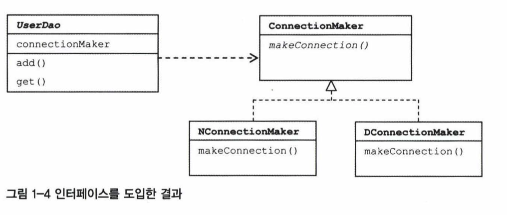
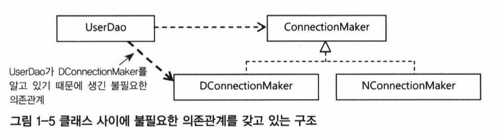
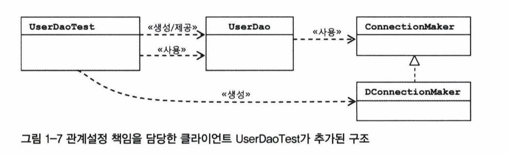

해당 문서는 노션에 최적화 되어있습니다. 가능하다면 노션에서 읽어주시기 바랍니다.

노션 링크:
https://reminiscent-headlight-ee3.notion.site/1-fd3ff68f48434297a01ace0577a52e76

# 1장

Created: October 1, 2021 6:00 PM
Tags: 백엔드 스터디

# 오브젝트와 의존관계

---

## 1.1 초난감 DAO

---

### 1.1.1 User 및 UserDAO

---

1.1 ~1.3에서 설명하는 동안 계속해서 언급할 (사용자 정보를 database에 저장하고 조회하는 기능을 가진)
간단한 예제 DAO는 아래와 같다.

```java
// 사용자 정보 저장용 자바빈 User 클래스
public class User {
  String id;
  String name;
  String password;

  getId(), getName(), getPassword();
  setId(), setName(), setPassword();
}
```

```sql
// User 객체 정보가 실제로 보관될 database의 users 테이블 구조
CREATE TABLE users (
  id varchar(10) pk,
  name varchar(20) not null,
  password varchar(20) not null
)
```

```java
// 사용자 정보를 Database에 넣고 관리하는 UserDAO 클래스
public class UserDao {
  // User 한명을 저장하는 메서드.
  public void add(User user) {
    Connection c = "jdbc:mysql://localhost/spring";
    PreparedStatement ps = c.sql("insert into users(id, name, password) values (?, ?, ?)");
    ps.setString(1, user.getId());
    ps.setString(2, user.getName());
    ps.setString(3, user.getPassword());
    ps.executeUpdate();
    ps.close();
    c.close();
  }

  // User 한명을 조회하는 메서드.
  public User get(String userid) {
    Connection c = "jdbc:mysql://localhost/spring";
    PreparedStatement ps = c.sql("select * from users where id = ?");
    ps.setString(1, user.getId());
    ResultSet rs = ps.executeQuery();
    User user = new User();
    user.setId(rs.getString("id");    
    user.setName(rs.getString("name");
    user.setPassword(rs.getString("password");
    rs.close();
    ps.close();
    c.close();
    return user;
  }
}
```

### 1.1.3 UserDAO 검증

---

> UserDao 클래스가 "*제대로 동작"* 하는지 검증하는 다양한 방법들.
> 
- UserDao를 사용하는 웹애플리케이션을 만들고, 해당 서버를 실행하고,
이 객체를 사용하기 위한 html 폼을 작성하고, 브라우저를 열고, 직접 실행하는 방법
— (검증을 위한 준비과정이 너무 길기 때문에 따로 작성하지는 않겠음)

- main() 메서드 사용하는 방법

```java
public static void main(String... args) {
	UserDao dao = new UserDao();
	User user = new User();

	user.setId("whiteship");
	user.setName("백기선");
	user.setPassword('married');

	dao.add(user); // UserDAO의 User 저장메서드 실행

	User savedUser = dao.get(user.getId()); // UserDAO의 User 조회메서드 실행
	System.out.println(savedUser.getId());
	System.out.println(savedUser.getName());
	System.out.println(savedUser.getPassword());
}
```

- test code를 작성하는 방법

```java
public class UserDAOTest {

  @Test
  @DisplayName("데이터베이스에 유저 등록 및 조회 테스트")
  void addUserTest() {
		// given
		UserDAO dao = new UserDAO();
		User user = new User();

		user.setId("whiteship");
		user.setName("백기선");
		user.setPassword('married');

	  // when
		userDAO.add(user); // 유저 등록 실행
		User savedUser = dao.get(user.getId()); // 유저 조회 실행
    
		// then (저장하고자 했던 유저의 이름과 실제로 DB에 저장된 유저의 이름이 같은지 검증하라)
    assertThat(user.getName()).isEqualTo(savedUser.getName());
  }
}
```

어떤 방법이든 위와 같이 구현했다면 UserDAO가 성공적으로 수행되는지 검증할 수 있을 것이다.
하지만 UserDAO가 제대로 동작한다고 해도, UserDAO의 코드에는 문제가 많다.

- 왜 문제가 많을까? 어떤 부분이 문제가 있는가?
- 잘 작동하는 것을 확인했음에도 불구하고 "**굳이"** 수정하고 개선해야하는 이유는 무엇인가?
- 개선했을 때의 장점은 무엇인가? 개선하지 않는다면 어떤 단점이 있는가?
- 개선 후의 장점들이 당장 또는 미래에 주는 유익은 무엇인가?

스프링을 공부한다는 것은 바로 이런 문제 제기와 의문에 대한 답을 찾아나가는 과정이다.
스프링은 이 과정에서 개발자가 위와 같은 고민을 제대로 하고 있는지 끊임없이 확인시켜주며
좋은 결론을 내릴 수 있도록, 선구자들이 먼저 고민하고 제안한 방법에 대한 힌트를 제공해준다.

## 1.2 DAO의 분리

---

객체지향의 세계에서 모든 것은 변한다.
사용자의 요구사항, 구현 기술 및 환경들은 계속 바뀌며 더 이상 사용자가 없어 폐기될 때서야 변화가 중지된다.

따라서 개발자가 객체를 만들 때 가장 염두해야 할 사항은 바로
**"미래의 변화를 어떻게 대비할 것인가"**이다.
조금이라도 원활하게 미래의 변화를 대처하기 쉽게 객체를 설계해야 한다.

가장 좋은 대책은 요구사항이 변했을 때 코드가 변화하는 정도를 최소한으로 줄이는 방식으로 객체를 설계하는 것이다.

A, B 두 명의 개발자에게 동일한 기능 변경을 요청했다고 가정해보자.
A는 단 몇 줄의 코드만 수정하고 그 변경이 다른 기능에 전혀 문제를 일으키지 않는다는 것까지 검증하는데 5분이 걸렸다.  
반면 B는 많은 코드를 수정해야 해서 5시간이 걸렸다.
어느 쪽이 더 미래의 변화를 잘 준비한 것일까? 누구라도 두말할 것 없이 A라고 답할 것이다.

어떻게         **"*미래에 변화하는 요구사항에 대해"** **코드 변경을** **최소한으로** 줄일 수 있는가?*
또 어떻게     *그 변경이 다른 곳에 문제가 없도록 할 수 있는가?* 

이제부터 두 가지 설계원칙**(관심사의 분리, 확장)**을 고려해보자.

### 1.2.1 관심사의 분리

---

변경 요청은 동시에 여러가지가 한꺼번에 오지 않는다. 예를 들어

"Database를 오라클에서 MySQL로 바꾸면서,
웹 화면의 레이아웃을 다중 프레임 구조에서 단일 프레임에 Ajax를 적용한 구조로 바꾸고,
매출이 일어날 때 에 지난달 평균 매출액보다 많으면 감사 시스템의 정보가 웹 서비스로 전송되는
동시에 로그의 날짜 포맷을 6자리에서 Y2K를 고려해 8자리로 바꿔라”

와 같이 발생하지는 않는다.

모든 변경과 발전은 "한 번에" ,
                             "한 가지 관심사항" 에 집중해서 일어난다.

만약 위와 같은 변경 요청이 발생한다면 요구사항은 사실상 4가지이며,
따라서 관심사항도 4가지가 된다.

문제는
변화 자체는 대체로 집중된 한가지 관심에 대해서만 일어나지만
변경 작업은 한 곳에 집중되지 못하는 경우가 발생할 수 있다.

단지 사용하는 Database를 교체하고 싶을 뿐인데 DAO 클래스 수백개를 모두 수정해야 한다면?
트랜잭션 기술을 다른 것으로 바꿨다고 전체 비즈니스 코드의 구조를 모두 변경해야 한다면?
다른 개발자가 개발한 코드에 변경이 일어날 때마다 내가 만든 클래스도 함께 수정해야 한다면?

변경이 한 번에 한 가지 관심사항에 집중되어 있다면 변경 작업도 그 한가지 관심사항에 집중되도록,

다시 말해 관심이 같은 것끼리 모으고 관심이 다른 것은 분리 (— 관심사를 분리) 함으로서 변경을 최소화할 수 있다. 

관심사를 분리해야 하는 이유를 이해했다면
이제부터 위에서 만든 UserDAO를 실제로 수정하면서 관심사를 분리하는 과정을 살펴보도록 하자.

### 1.2.2 데이터베이스 연결하는 로직 추출

---

```java
/**
 빨간색으로 bold되고 밑줄까지 쳐진, 데이터베이스에 연결을 시도하는 Connection는
 보다시피 add()와 get()에서 완전히 동일하게 작성되어 코드가 중복된 상태이다.
 지금은 2개의 메서드밖에 없지만 만약에 메서드가 1000개인 상태인데 
 "데이터베이스를 mysql에서 oracle로 변경하라"라는 요구사항이 들어온다면
 1000개의 메서드를 전부 수정해야 하는 사태가 발생할 수 있다.
 그러한 사태를 미연에 방지하기 위해
 데이터베이스 연결 부분을 다른 곳으로 분리하여 코드 중복을 제거해보자.
*/ 

// 사용자 정보를 Database에 넣고 관리하는 UserDAO 클래스
public class UserDao {
  // User 한명을 저장하는 메서드.
  public void add(User user) {
    C**lass.forName('com.mysql.jdbc.Driver');**
    **Connection c = "jdbc:mysql://localhost/spring";**
    PreparedStatement ps = c.sql("insert into users(id, name, password) values (?,?,?)");
    ps.setString(1, user.getId());
    ps.setString(2, user.getName());
    ps.setString(3, user.getPassword());
    ps.executeUpdate();
    ps.close();
  ****  c.close();
  }

  // User 한명을 조회하는 메서드.
  public User get(String userid) {
	  **Class.forName('com.mysql.jdbc.Driver');
    Connection c = "jdbc:mysql://localhost/spring";**
    PreparedStatement ps = c.sql("select * from users where id = ?");
    ps.setString(1, user.getId());
    ResultSet rs = ps.executeQuery();
    User user = new User();
    user.setId(rs.getString("id");    
    user.setName(rs.getString("name");
    user.setPassword(rs.getString("password");
    rs.close();
    ps.close();
    ****c.close();
    return user;
  }
}
```

위의 코드를 아래와 같이 변경하면,

"데이터베이스를 Mysql에서 오라클로 변경하라"와 같은 요구사항이 발생했을 때
getConnection() 메서드만 수정하면 된다.

```java
// 사용자 정보를 Database에 넣고 관리하는 UserDAO 클래스
public class UserDao {
  // User 한명을 저장하는 메서드.
  public void add(User user) {
    Connection c = getConnection();
    PreparedStatement ps = c.sql("insert into users(id, name, password) values (?,?,?)");
    ps.setString(1, user.getId());
    ps.setString(2, user.getName());
    ps.setString(3, user.getPassword());
    ps.executeUpdate();
    ps.close();
  }

  // User 한명을 조회하는 메서드.
  public User get(String userid) {
    Connection c = getConnection();
    PreparedStatement ps = c.sql("select * from users where id = ?");
    ps.setString(1, user.getId());
    ResultSet rs = ps.executeQuery();
    User user = new User();
    user.setId(rs.getString("id");    
    user.setName(rs.getString("name");
    user.setPassword(rs.getString("password");
    rs.close();
    ps.close();
    return user;
  }

  // 중복된 코드를 독립적 메서드로 만들어 중복 제거하기 + 에러발생시 예외처리하는 목적까지 달성
  private Connection getConnection() throws ClassNotFoundException, SQLException {
    **Class.forName('com.mysql.jdbc.Driver');**
		**Connection c = "jdbc:mysql://localhost/spring";
    return c;**
  }
}
```

변경된 UserDAO는 이제 두 개의 관심사, 즉

- "DB 연결에 대한 것에만" 관심이 있는 메서드
- "DB에 작업을 수행하는 것에만" 관심이 있는 메서드

로 나뉘게 되었다.

코드가 개선되었지만, 코드 변경 전과 완전히 똑같이 동작하는지는 확신할 수 없다. 따라서 다시 검증이 필요하다.
앞서 만들어두었던 main 메서드 또는 userDAOTest 를 실행해서 검증할 수 있는데,

- 사실 두 방법 모두 문제가 있다.
    
    첫번째 실행은 잘되지만 두번째 실행부터는 반드시 실패한다.
    pk가 중복되기 때문이다.
    여러번 실행했을 때에도 성공하려면 데이터베이스의 user를 제거하는 과정도 추가로 필요하다.
    
    ```java
    public static void main(String... args) {
    	UserDao dao = new UserDao();
    	User user = new User();
    
    	user.setId("whiteship");
    	user.setName("백기선");
    	user.setPassword('married');
    
    	dao.add(user); // UserDAO의 User 저장메서드 실행
    
    	User savedUser = dao.get(user.getId()); // UserDAO의 User 조회메서드 실행
    	System.out.println(savedUser.getId());
    	System.out.println(savedUser.getName());
    	System.out.println(savedUser.getPassword());
    
      // 아래의 삭제 로직 추가 필요
      dao.remove(user.getId()); // delete from users where id = 'user.getId()'
    }
    ```
    

### 1.2.3 Database 연결의 완전한 분리

---

아래와 같은 시나리오가 발생했다고 가정해보자.

UserDAO의 기능이 너무 좋아서 UserDAO를 구매하려는 두 회사가 나왔다.
A회사는 mysql을 사용하여 UserDAO를 사용하고 싶다.
B회사는 oracle을 사용하여 UserDAO를 사용하고 싶다.

UserDAO의 소스코드 전체를 두 회사 각각에 그대로 제공하고, 회사마다 그냥 각자 알아서
getConnection() 메서드를 수정해서 사용하라고 할 수도 있겠지만,
안타깝게도 UserDAO를 만든 회사는 UserDAO의 소스코드를 공개할 수 없다는 방침이다.

- 내용이 잘 이해되지 않는다면...
    
    MS사의 Windows OS를 생각해보자.
    MS사는 Windows OS의 구현코드를 외부에 공개하지 않는 방침을 두고 있다.
    그럼에도 불구하고 많은 사람들이 다양한 환경에서(랩탑, 데스크탑 등에서)
    해당 OS를 설치하고 사용하는데 문제를 느끼지 않는다.
    UserDAO와 Windows OS는 이러한 맥락에서 같다고 할 수 있다.
    

어떻게 해야 UserDAO의 소스코드를 A, B회사에 제공하지 않고도
그들이 원하는 데이터베이스 연결 방식을 적용하여 UserDAO를 사용하게 할 수 있을까?

> 상속을 통한 확장
> 

기존 UserDAO의 getConnection() 메서드를 더 분리함으로서 가능하다.
일단 우리가 만든 UserDAO를 추상클래스로 만들고,
getConnection() 구현 메서드를 제거하고 추상메서드로 변경하자.

```java
// 사용자 정보를 Database에 넣고 관리하는 UserDAO 클래스
public **abstract** class UserDao {
  // User 한명을 저장하는 메서드.
  public void add(User user) {
    Connection c = getConnection();
    PreparedStatement ps = c.sql("insert into users(id, name, password) values (?,?,?)");
    ps.setString(1, user.getId());
    ps.setString(2, user.getName());
    ps.setString(3, user.getPassword());
    ps.executeUpdate();
    ps.close();
  }

  // User 한명을 조회하는 메서드.
  public User get(String userid) {
    Connection c = getConnection();
    PreparedStatement ps = c.sql("select * from users where id = ?");
    ps.setString(1, user.getId());
    ResultSet rs = ps.executeQuery();
    User user = new User();
    user.setId(rs.getString("id");    
    user.setName(rs.getString("name");
    user.setPassword(rs.getString("password");
    rs.close();
    ps.close();
    return user;
  }

  protected **abstract** Connection getConnection() throws ClassNotFoundException, SQLException;
}
```

이 상태로 만들고 UserDao를 암호화해버린 뒤, A, B회사에게 판매할 때 UserDao 사용가이드로서
"UserDAO를 사용하기전에 반드시 getConnection()을 재정의해주세요"라는 말과 함께,
UserDAO가 제공하는 기능 목록표를(회원 등록할떄는 add()를 호출하면 된다, 회원을 조회할때는 get()을 호출하면 된다 등) 함께 제시하면 된다.

A회사와 B회사는 UserDao 클래스를 상속한 클래스를 만들고
getConnection() 메서드를 오버라이딩하여 원하는 데이터베이스 연결을 아래와 같이 구현하면 UserDAO를 사용할 준비가 된 것이다.

```java
// A회사의 코드
public class A회사Dao extends UserDao {
   @Override
   Connection getConnection() throws ClassNotFoundException, SQLException{
       // ....mysql 연결 코드
       return connection;
   }
}

// B회사의 코드
public class B회사Dao extends UserDao {
   @Override
   Connection getConnection() throws ClassNotFoundException, SQLException{
       // ....oracle 연결 코드
       return connection;
   }
}
```

두 회사는 실제로 UserDAO를 아래와 비슷한 방법으로 사용하게 될 것이다.

```java
// A회사가 UserDAO를 사용하는 방법:
String addUser() {
   UserDao dao = new A회사Dao();
   dao.add(new User());
   return "회원을 등록헀습니다";
}

// B회사가 UserDAO를 사용하는 방법:
void insertUser() {
   UserDao dao = new A회사Dao();
   dao.add(new User());
}
```

이렇게 슈퍼클래스에 기본적인 기능을 만들고,
기능의 일부를 추상 메서드나 protected 메서드 등으로 만든 뒤
서브클래스에서 이 메서드를 재구현해서 사용하도록 하는 패턴을 ***템플릿 메소드 패턴***이라고 부른다.
이 패턴은 스프링에서 자주 애용되는 디자인 패턴이다. 

사실 getConnection() 메서드는 Connection이라는 객체를 생성하는 방식을 추상화했다고도 말할 수 있다.
이렇게 서브클래스에서 구체적인 객체 생성 방법을 결정하게 하는 것을 ***팩토리 메서드 패턴***이라고 칭한다.
(getConnection() == 템플릿 메소드 패턴 + 팩토리 메서드 패턴)

**그러나** **아직까지도 UserDAO에는 문제가 있다.** 

1.  A회사Dao 혹은 B회사Dao가 UserDAO를 무조건 상속해야 UserDAO를 사용할 수 있기 때문에,
  A회사Dao/B회사Dao는 다른 클래스를 상속할 수 있는 선택지를 제한받게 된다. (다중 상속 불가)
2. UserDAO를 만든 회사에서 add(), getConnection()등의 메서드명을 변경해버린다면?
A회사Dao, B회사Dao가 호출하고 있던 add(), getConnection()도 변경이 불가피해진다.
3. 만약 UserDao를 상속하는 다른 Dao 클래스들이 계속 만들어진다면,
매 Dao 클래스마다 getConnection() 을 재정의해야하는데, 똑같은 데이터베이스를 사용한다면 동일 코드 중복이 발생할 수 밖에 없을 것이다.

## 1.3 DAO의 확장

---

지금 UserDAO는 데이터베이스 제어 및 데이터베이스 연결이라는 두가지 관심으로 분리된 상태이며,
그 분리는 상속을 사용하여 이루어졌다. 상속이 관심사 분리라는 목적을 일부분 달성하기는 했지만,
다른 문제들을 야기시켰기 때문에 이 경우 상속은 그다지 유용한 도구가 아님을 알게 되었다.

- 그렇다면 상속을 사용하지 않고 관심사를 분리하는 다른 방법은 무엇이 있을까?

### 1.3.1 클래스의 분리

---

우리는 처음에 독립된 메소드를 만들어 관심사를 분리했다.
관심사가 충분히 분리되지 못했다고 판단되었기 때문에, 
그 다음 시도로서 우리는 상속을 사용하여 상하위클래스로 분리해보았다.

이번에는 상속관계가 아닌 완전히 다른 두 개의 독립적인 클래스로 분리해보겠다.

방법은 사실 간단하다.

DB 커넥션과 관련된 부분을 서브클래스가 아니라, 아예 완전히 다른 별도의 클래스에 담는다. 
그리고 이 클래스를 UserDAO가 참조하게 하면 된다.

그렇게 구현한 코드는 다음과 같다.

```java
// UserDao
public class UserDao {
	//상태톨 관리하는 것도 아니니 한 번만 만둘어 인스턴스 변수에 저장해두고, 메소드에서 사용하게 한다. 
	private SimpleConnectionMaker simpleConnectionMaker;

	public UserDao() {
		simpleConnectionMaker = new SimpleConnectionMaker();
	}

public void add(User user) throws ClassNotFoundException, SQLException {
		Connection c = simpleConnectionMaker.makeNewConnection();
		//...sql
}

public User get(String id) throws ClassNotFoundException, SQLException {
		Connection c = simpleConnectionMaker.makeNewConnection(); 
   // ...sql
}
```

```java

// 완전히 독립된 DB연결 클래스. 상속을 사용하지 않으므로 추상클래스가 될 필요도 없다.
public class SimpleConnectionMaker (
	public Connection makeNewConnection() throws ClassNotFoundException, SQLException {
			Class.forName("com.mysql.jdbc.Driver");
			Connection c = DriverManager.getConnection( "jdbc:mysql://localhost/springbook");
		  return c; 
}
```

조금 더 나아졌다고 할 수 있을까? 이 정도면 완벽한 관심사 분리가 아닐까?
겉보기엔 그럴 수 있지만, 치명적인 문제가 생겼다.

상속을 사용해 DB 연결 기능을 확장해서 사용하게 했던 것이 불가능해기 때문이다.
UserDao의 코드가 SimpleConnectionMaker라는 특정 클래스에 종속되어 있기 때문에,
상속을 사용했을 때와는 다르게 UserDao 코드의 수정 없이 DB 연결 생성 기능을 변경할 방법이 없다.

- 상세히 적은 두 클래스의 문제점은 다음과 같다.
    1. UserDao는 SimpleConnectionMaker의 메서드명이 변경되면 자신도 바뀔 수 밖에 없다.
    
    1.  makeNewConnection()은 mysql, oracle 등 여러가지 다양한 DB연결방식을 유연하게 선택할 수 없다. 만약 A회사 B회사가 UserDao를 사용하고 싶은데 UserDao가 암호화되어 내용을 볼 수 없다면, 다음과 같은 선행조건을 필수적으로 사전에 알고 있어야한다.
    - UserDao는 SimpleConnectionMaker라는 클래스를 참조하고 있다.
    - SimpleConnectionMaker의 구현메서드는 반드시 makeNewConnection라는 이름이어야한다.
    - makeNewConnection은 반드시 Connection 타입의 객체를 리턴하여야 한다.
        
        각 회사의 개발자들이 기억력이 좋고 오타를 발생시키지 않는 훌륭한 실력자들이라면 다행이겠지만,
        나중에 입사하는 후임자가 그들로부터 아무런 설명을 듣지 못한 채 이 코드를 유지보수해야 된다면 
        선임개발자들이 구현한  SimpleConnectionMaker 클래스가 어디에서 쓰이는지 알 방법이 전무해진다. 
        
        후임자는 makeNewConnection이 왜 Connection을 리턴하고 있는지 정확하게 알 방법이 없으며 따라서 구현코드를 보며 어림짐작하거나
        (어딘가 파묻혀 있는) UserDao를 판매한 회사의 가이드북을 하나하나 뒤져봐야 할지도 모른다..
        
    

문제점은 앞에서부터 실컷 지적했으니
이제 어떻게 이 문제를 해결하면서 동시에 "관심사 분리"라는 소기의 목적을 달성할 수 있는지 알아보자.

### 1.3.2 인터페이스의 도입

---

자바는 추상클래스외에도 인터페이스라는 기능을 제공하여 추상화를 통한 관심사 분리를 할 수 있도록
해준다. 인터페이스는 추상클래스와는 다른 방식을 통해 관심사 분리를 달성한다.
인터페이스는 UserDao 객체화 SimpleConnectionMaker 객체 중간에 끼어들어서 둘이 서로 실제로 무슨 일을 구체적으로 하는지 알 수 없게 만든다. 두 객체는 이제 서로를 직접적으로 호출하지 않고 대신 인터페이스를 호출하여 처리하게 된다. 



UserDao객체는 NConnectionMaker 객체가 어떻게 구현되었는지 모르지만, 인터페이스의 옆구리를 쿡 찔러 커넥션을 요청한다. 어떤 데이터베이스에 연결하는지도 모르고 어떻게 연결하는지도 모르지만 UserDao는 ConnectionMaker 인터페이스의 makeConnection()를 호출하면 잘 되더라는 것만 알고 있으면 충분하다. 

NConnectionMaker, DConnectionMaker 객체들도 UserDao 객체의 존재를 모른채로 인터페이스가 시키는 방식만 지켜서 무지성 Connection 반환만 하면 되도록 바뀌었다.  전체 코드는 아래와 같다.

```java
// 인터페이스 생성
public interface ConnectionMaker {
	public Connection makeConnection() throws ClassNotFoundException, SQLException;
}
```

```java
// 인터페이스의 추상메서드를 구현하는 구체클래스 AConnectionMaker
public class AConnectionMaker implements ConnectionMaker {
	public Connection makeConnection() throws ClassNotFoundException, SQLException { 
		// A 사의 독자적인 방법으로 Connection올 생성하는 코드
  }
}
```

```java
// 인터페이스의 메서드를 구현하는 구체클래스 BConnectionMaker
public class BConnectionMaker implements ConnectionMaker {
	public Connection makeConnection() throws ClassNotFoundException, SQLException { 
		// B 사의 독자적인 방법으로 Connection올 생성하는 코드
  }
}
```

```java
public class UserDao {
	// 1. 인터페이스톨 룡해 오브젝트에 접근하므로 UserDao는 구체적인 클래스 정보흘 일 필요가 없다. ㅎㅎ
	private ConnectionMaker connectionMaker;

	public UserDao() (
		connectionMaker = new AConnectionMaker(); // 2. 앗! 그런데 여기에는 클래스 이름이 나오네?;;ㅋㅋ
																						   //  UserDao는 DConnectionMaker를 알 필요 없이
																						   //  인터페이스만 알면 되어야하는데.. 
																							 //  UserDao가 BConnectionMaker를 사용하게 하려면.. 코드를 변경해야하네..
																							 // 어떡하지? 결국 이 방법도 안되는 건가? 
	}
public void add(User user) throws ClassNotFoundException, SQLException {
		Connection c = connectionMaker.makeConnection(); // 클래스가 바뀌어도 메서드이름이 변경될 걱정은 없다.
		//...sql
 }

public User get(String id) throws ClassNotFoundException, SQLException {
		Connection c = connectionMaker.makeConnection();
    //...sql
}
```

UserDAO와 DatabaseConnection 관심사 분리 시도는

결국 실패?



UserDao와 ConnectionMaker의 구현객체들을 서로 완전히 모르게 만들고 싶은데..

### 1.3.3 관계설정 책임의 분리

---

UserDao클래스를 아래처럼 변경해보면???

```java
public class UserDao {
	// 1. 인터페이스톨 룡해 오브젝트에 접근하므로 UserDao는 구체적인 클래스 정보흘 일 필요가 없다. ㅎㅎ
	private ConnectionMaker connectionMaker;

	public UserDao(ConnectionMaker connectionMaker) (
		this.connectionMaker = connectionMaker; // new AConnectionMaker()를 대체. 음? 뭔가 괜찮아졌는데?
  }
public void add(User user) throws ClassNotFoundException, SQLException {
		Connection c = connectionMaker.makeConnection(); // 클래스가 바뀌어도 메서드이름이 변경될 걱정은 없다.
		//...sql
 }

public User get(String id) throws ClassNotFoundException, SQLException {
		Connection c = connectionMaker.makeConnection();
    //...sql
}
```

```java
// 괜찮은지 실제로 사용해보기

public class UserDaoTest {

   public static void main(String... args) throws ClassNotFoundException, SQLException {
			ConnectionMaker connectionMaker = new DConnectionMaker();
			UserDao dao = new UserDao(connectionMaker); // 약한 의존관계 설정됨 (인터페이스를 거치므로, 간접적으로 의존함)
	    dao.add(new User("user1", "charlie"));
      Member member = dao.get("user1");
		  assert member.getName().equals("charlie"); // ***성공!!!!!!***
	 }

}
```



관심사 분리도 달성되었고, 
이제 각각(UserDao, DConnectionMaker 등)의 객체들은 자신이 변경될 때
자신을 호출하는 다른 객체에게 자신의 변경을 강요하지 않아도 되었다. 

결과: 초난감 DAO 리팩토링 최종적으로 성공!

### 1.3.4 원칙과 패턴

---

**객체지향 설계 원칙(SOLID)**

---

- 개방-폐쇄 원칙(OCP) - 클래스나 모듈은 확장에는 열려 있어야 하고 변경에는 닫혀 있어야 한다.
Open-Close Principle

UserDao는 DB 연결 방법이라는 기능을 확장하는데는 열려있다.
UserDao에 전혀 영향을 주지 않고도 얼마든지 기능을 확장할 수 있다.
동시에 UserDao 자신의 핵심 로직 구현코드는 그러한 확장에 영향을 전혀 받지 않고 유지가능하므로
변경에는 닫혀 있다고 할 수 있다.

- 단일책임 원칙(SRP) - 클래스는 반드시 하나의 책임만 져야한다.
Single Responsibility Principle

AConnectionMaker는 데이터베이스 연결을 위한 Connection 객체 생성이라는 단 하나의 관심사에만 관심이 있고 Connection을 제대로 생성하는 것에 온전히 책임을 진다.
따라서 단일책임 원칙을 지켰다고 할 수 있다.

이 외에 다른 세가지 원칙들이 더 있다.

- 리스코프 치환 원칙(LSP)
Liskov Substitution Principle
- 인터페이스 분리 원칙(ISP)
Interface Segregation Principle
- 의존관계 역전 원칙(DIP) 
Dependancy Injection Principle

---

**높은 응집도, 낮은 결합도**

---

**응집도는 높으면 높을수록 좋고** **결합도는 낮으면 낮을수록 좋다.**

> **응집도가 높다는 것은** 하나의 클래스 또는 모듈이 하나의 책임 또는 관심사에만 집중되어 있고
직접적으로 관련이 없는 다른 관심사에는 책임도, 의존도 거의 하지 않는 것을 말한다.
> 

- ConnectionMaker 인터페이스를 살펴보자.

DB 연결에 대한 책임 하나만 지고 있다. 관심사도 단지 그 것뿐이다.
새로운 기존에 없던 DB 연결이 추가적으로 필요하게 되어도,
새로이 만들어지는 DB 연결 클래스는 단지 이 인터페이스의 메서드를 구현하기만 하면 된다.
이 새로운 DB 연결 클래스는 기존에 있던 DB 연결 클래스에는 아무런 영향도 끼치지 않는다.
적은 변경만으로도 책임과 관심사 집중을 이루어낼 수 있으므로, 응집도가 높다고 말할 수 있다.

> **결합도란** "하나의 객체에 변경이 일어날 때 관계를 맺고 있는 다른 객체에게 변화를 요구하는 정도"를 말하며 이 정도에 따라 높고 낮음이 결정된다.
결합도가 낮다는 것은 서로 다른 책임과 관심사를 가진 객체들은 서로 느슨한 결합(loose-coupling)으로 연결되어 있다는 것과 동일하다.
> 

하나의 변경이 발생할 때 마치 파문이 이는 것처럼 여타 모듈과 객체로 변경에 대한 요구가 전파되지 않는 상태를 유지함으로서 낮은 결합도를 달성할 수 있다.
ConnectionMaker 인터페이스의 도입으로, DB 연결 기능을 구현한 클래스가 아무리 바뀌더라도 
UserDao의 코드는 변경될 필요가 전혀 없게 되었다. ConnectionMaker와 UserDao의 결합도가 낮아진 것이다.

한 줄 요약:

응집도: 관심사가 **같은** 것들끼리 얼마나 밀접히 연결되어 있는가
결합도: 관심사가 **다른** 것들끼리 얼마나 **덜** 밀접히 연결되어 있는가

## 1.4 제어의 역전

---

1.4.1 오브젝트 팩토리

---

UserDaoTest는 UserDao를 테스트하는 책임만을 맡아야 한다 (SRP, 단일책임원칙)
그런데 이제까지의 예제 코드에서는 userDaoTest 객체가 *UserDao를 생성하는 역할*도 하고 있었다.

따라서 아래와 같이,
UserDao 객체를 생성하는 역할을 맡는 UserDaoFactory 객체를 따로 만들어 관심을 분리시키자.
(UserDao 객체생성 / UserDao를 테스트 분리)

```java
public class DaoFactory {		
	public UserDao **getUserDao_Instance**() {
		ConnectionMaker connectionMaker = new DConnectionMaker();
		userDao dao = new UserDao(connectionMaker);
		return dao;
	}	
}
```

UserDaoFactory가 UserDaoTest 를 생성시켜줄 것이므로
UserDaoTest는 이제 스스로 직접 UserDao를 생성할 필요없이 UserDaoTest 객체에 의존하기만 하면 된다.

변경된 코드는 아래와 같다.

```java
import DaoFactory;

public class UserDaoTest {
	 public static void main(String... args) throws ClassNotFoundException, SQLException {
			ConnectionMaker connectionMaker = new DConnectionMaker();
			UserDao dao = new UserDao(connectionMaker); // 이 코드들을
	
			**UserDao dao = new DaoFactory()**.getUserDao_Instance()**;** // 이렇게 변경

	    dao.add(new User("user1", "charlie"));
      Member member = dao.get("user1");
		  assert member.getName().equals("charlie");
	 }
}
```

이렇게 분리하면 어떤 장점이 있을까?

1. 사용자(main 메서드)는 데이터베이스 연결에 대해서 몰라도 이용에 불편함이 없다.
2. 만약 새로운 DB 연결이 필요해지는 경우 직관적으로 DaoFactory만 수정하면 된다.
이때 다른 객체들은 수정될 필요없이 그대로 계속 사용된다.

### 1.4.2 오브젝트 팩토리의 활용

---

이번에는 UserDao 외에 다른 Dao, 그러니까

MessageDao(메시지정보와 관련된 비즈니스 로직에만 DB 액세스를 하는 객체)
TeamDao(팀의 정보와 관련된 비즈니스 로직에만 DB 액세스를 하는 객체) 

등이 더 추가가 되는 상황을 생각해보자.

```java
public class DaoFactory {		
	public UserDao **getUserDao_Instance**() {
		ConnectionMaker connectionMaker = new AConnectionMaker();
		UserDao dao = new UserDao(connectionMaker);
		return dao;
	}	

	public UserDao **getTeamDao_Instance**() {  // 추가됨
		ConnectionMaker connectionMaker = new AConnectionMaker();
		TeamDao dao = new UseTeamDao(connectionMaker);
		return dao;
	}	

	public UserDao **getMessageDao_Instance**() { // 추가됨
		ConnectionMaker connectionMaker = new AConnectionMaker();
		MessageDao dao = new MessageDao(connectionMaker);
		return dao;
	}	
}
```

위 코드의 문제점은 다음과 같다.

- 새로운 Dao가 생성될때마다 
ConnectionMaker connectionMaker = new AConnectionMaker(); 가 중복 발생하고,
만약 다른 DB연결로 변경하라는 요구사항이 발생하면 중복된 코드 모두를 수정해야 할 수밖에 없다.
(Dao가 만약 1000개라면 Dao를 생성하는 메서드 전부를 찾아서 아래의 코드로 변경해야 함)
new AConnectionMaker();  →  new 새로운ConnectionMaker();

중복 문제를 해결하려면 역시 분리해내는게 좋아보인다.

ConnectionMaker의 구현 클래스를 결정 및 ConnectionMaker 객체 생성을 담당하는 코드를
별도의 메소드로 분리하자. 그렇게 수정한 코드는 아래와 같다.

```java
public class DaoFactory {		
	public UserDao **getUserDao_Instance**() {
		ConnectionMaker connectionMaker = new AConnectionMaker(); // 제거 
		UserDao dao = new UserDao(connectionMaker);
		return dao;
	}	

	public TeamDao **getTeamDao_Instance**() {
		ConnectionMaker connectionMaker = new AConnectionMaker(); // 제거
		TeamDao dao = new TeamDao(connectionMaker);
		return dao;
	}	

	public MessageDao **getMessageDao_Instance**() {
		ConnectionMaker connectionMaker = new AConnectionMaker(); // 제거
		MessageDao dao = new MessageDao(connectionMaker);
		return dao;
	}	

  public ConnectionMaker connectionMaker() { // 추가
    return new AConnectionMaker();
  }
}
```

### 1.4.3 제어권의 이전을 통한 제어관계 역전(IoC, Inversion of Control)

---

제어의 역전이란,  간단히 말하자면
**프로그램의 제어 흐름 구조가 뒤바뀌는 것**이라고 할 수 있다.

일반적인 제어 흐름은

> (main 메서드처럼) 프로그램이 시작되는 지점에서
1. 사용할 객체를 선택 및 결정 → 2. 그 객체를 생성 → 3. 생성된 객체의 메서드를 호출 → 4. 다시 무엇을 사용할지 선택 및 결정 → 5. 그 것을 생성 → 6. 생성된 객체의 메서드를 호출 ...
> 

하는 식의 작업이 반복되는 것으로 진행된다.

다시 말해, *어떤 작업을 할지 결정하는 것은* **전부** 사용자 객체 시점에서 제어된다.

"***제어의 역전이란** 이러한 제어 흐름의 개념을 완전히 뒤집는 것이다."*

제어의 역전에서는 사용자 객체가 더이상 자신이 어떤 객체를 사용할지 스스로 선택하지 않는다.
또한 생성도 하지 않는다. 심지어 본인조차도 다른 객체가 자신을 생성해서 사용하고 있는지 알지 못한다.

제어의 역전 세계에서는 모든 제어가
**모든 객체들을 생성하고 관리하도록 권한을 가진 "특별한 객체"에게 전부 맡겨진다.**

개념이 생소할 수 있지만, 사실 이 제어의 역전 개념은 기존에도 폭넓게 적용되어 있다.

- 적용된 예시
    1. 서블릿이 그 중 한 가지 예시이다. 서블릿을 개발자가 개발해서 배포할 수는 있지만 
    서블릿의 실행을 직접 제어할 수 있는 방법은 없다. 
    대신 서블릿에 대한 제어 권한을 가진 컨테이너가 적절한 시점에 서블릿 클래스의 객체를 만들고 그 안의 메소드를 호출한다. 이렇게 서블릿이나 JSP, EJB처럼 컨테이너 안에서 동작하는 구조는 간단한 방식이지만 제어의 역전 개념이 적용되어 있다고 볼 수 있다.
    
    2. 우리가 만든 추상 UserDao를 상속한 서브클래스도 getConnection()을 구현하기는 했지만 
    이 메서드가 언제 어떻게 사용될지 자신은 알지 못한다. 
    
    단지 이런 방식으 로 DB 커넥션을 만든다는 기능만 구현해놓으면, 슈퍼클래스인
    UserDao의 템플릿 메소드인 add(), get() 등에서 필요할 때 호출해서 사용하는 것이다.
    즉 제어권을 상위 템플릿 메소드에 넘기고 자신은 필요할 때 호출되어 사용되도록 한다는,
    제어의 역전 개념을 발견할 수 있다. 
    
    템플릿 메소드는 제어의 역전이라는 개념을 활용해 문제를 해결하는 디자인 패턴이라 볼 수 있다.
    
    1. 우리가 만든 UserDao와 DaoFactory 또한 제어의 역전이 적용되어 있다.
    원래 ConnectionMaker의 구현 클래스를 결정하고 이 객체를 만드는 제어권은 UserDao에게 있었지만 이제는 DaoFactory에게 있다. 자신이 어떤 ConnectionMaker 구현클래스를 생성하고 사용할지를 결정하는 권한을 DaoFactory에게 넘겼으니 UserDao는 능동적이 아니라 수동적인 존재가 됐다.
    UserDaoTest는 DaoFactory가 만들어주는대로밖에 ConnectionMaker를 사용할 수 밖에 없다. UserDaoTest 또한 어떠한 방식으로 DaoFactory ConnectionMaker를 만들어서 주는지도 알지 못하는 수동적인 존재가 되었다.
    
    1. 프레임워크는 제어의 역전 개념이 적용된 대표적인 기술이다.
    프레임워크는 단순히 미리 만들어둔 반제품이나, 확장해서 사용할 수 있도록 준비된 추상 라이브러리의 집합이 아니다.
    라이브러리를 사용하는 애플리케이션은 애플리케이션 흐름을 직접 제어한다.
    다시 말해 어떤 필요한 기능이 있을때 라이브러리를 가져다 사용한다. 
    
    반면 프레임워크는 거꾸로 애플리케이션 코드가 프레임워크에 의해 사용된다.
    보통 프레임워크 위에 개발한 클래스를 등록해두고, 프레임워크가 흐름을 주도하는 중에 개발자가 만든 애플리케이션을 사용하도록 만드는 방식이다.
    
    프레임워크에는 분명한 제어의 역전 개념이 적용되어 있어야한다.
    애플리케이션 코드는 프레임워크가 짜놓은 틀에서 수동적으로 동작해야 한다.

제어의 역전 세계에서는 —프레임워크 또는 컨테이너와 같이—
애플리케이션 컴포넌트의 생성과 관계설정, 사용, 생명주기 관리 등을 관장하는 존재가 필요하다.

간단한 경우에는 개발자 스스로가 제어의 역전 구조대로 코드를 생성해서 만들 수도 있겠지만,
이 개념을 애플리케이션 전반에 걸쳐 본격적으로 적용하려면 스프링과 같은 프레임워크의 도움을 받는 편이 훨씬 유리하다. 스프링은 IoC를 극한까지 적용하고 있는 프레임워크이다.

이제 본격적으로 스프링이 제공하는 IoC에 대해 살펴보자.

## 1.5 스프링의 IoC

---

스프링은 다양한 영역과 기술에 관여한다. 또한 매우 많은 기능을 제공한다.
하지만 **스프링의 핵심**을 담당하는 것은 바로 

- **빈팩토리 (및 애플리케이션 컨텍스트)** 라고 불리는 것이다.
(Beanfactory는 스프링의 최상위 인터페이스이며,
애플리케이션 컨텍스트는 빈 팩토리를 확장한 인터페이스이다.)
    
    (애플리케이션 컨텍스트 == IoC 컨테이너 == 스프링 컨테이너)
    
    
    

### 1.5.1 오브젝트 팩토리를 이용한 스프링 IoC

---

> **애플리케이션 컨텍스트와 설정정보**
> 

이제 아래의 DaoFactory를 스프링에서 사용이 가능하도록 변신시켜보자.

```java
// 아직 DaoFactory 클래스는 스프링이 제어권을 갖지 않았다. 따라서 빈(Bean)이 아니다.
public class DaoFactory {		

	public UserDao **getUserDao_Instance**() {
     return new UserDao(connectionMaker());
	}	

	public TeamDao **getTeamDao_Instance**() {
		 return new TeamDao(connectionMaker());
	}	

	public MessageDao **getMessageDao_Instance**() {
	 	 return new MessageDao(connectionMaker());
	}	

  public ConnectionMaker connectionMaker() {
     return new AConnectionMaker();
  }
}
```

위 코드에서 아래 코드로.   아래 코드는 스프링이 제어권을 갖도록 변경된 코드이다.

```java
import org.springframework.context.annotation.Bean; 
import org.springframework.context.annotation.Configuration;

@Configuration // 애롤러케이션 텍스트 또는 빈 팩토리가 사용할 설정 정보라는 표시
public class DaoFactory { 
		
		@Bean // 제어가 역전(IoC)되어, 스프링이 객체 생성을 담당할 때 사용하게 될 메소드라는 표시 
		public UserDao **getUserDao_Instance**() {
			return new UserDao(connectionMaker()); // UserDao "빈" 생성 시점은 스프링이 결정한다.
		}
		
		@Bean // 제어가 역전(IoC)되어, 스프링이 객체 생성을 담당할 때 사용하게 될 메소드라는 표시 
		public TeamDao **getTeamDao_Instance**() {
  		 return new TeamDao(connectionMaker());  // TeamDao "빈" 생성 시점은 스프링이 결정한다.
		}
		
		@Bean // 상동
		public MessageDao **getMessageDao_Instance**() {
		 	 return new MessageDao(connectionMaker()); // 상동
		}	
	
		@Bean  // 상동
		public ConnectionMaker connectionMaker() ( 
			return new AConnectionMaker(); // 상동
	}
}

```

스프링에서는 스프링이 제어권을 가지고 객체를 생성하고 관리하는 객체들을 **빈(Bean)**이라고 부른다.

이제 DaoFactory를 설정정보로 사용하는 애플리케이션 컨텍스트를 만들어보자.

ApplicationContext를 구현한 클래스는 여러가지가 있는데,
DaoFactory처럼 @Configuration이 붙은 자바코드를 설정정보로 사용하려면
아래와 같이 AnnotationConfigApplicationConext를 이용하면 된다.

```java
public class UserDaoTest ( 
	public static void main(String[) args) throws ClassNotFoundException, SQLException ( 
    // @Configuation이 붙은 객체를 파라매터로 넘긴다.
		ApplicationContext context = new AnnotationConfigApplicationContext(DaoFactory.class);
		// getBean으로, 스프링이 관리중인 설정정보 중 DaoFactory에서 생성된
		// UserDao를 꺼내어 사용할 수 있다.
		UserDao dao = context.getBean("**getUserDao_Instance**", UserDao.class);
		...
}
```

```java
// 스프링의 기능을 사용했기 떄문에 필요한 라이브러리를 추가해주어야 한다.
// 필수 라이브러리는 다음과 같다.

com.springsource.net.st.cglib.jar
                .org.apache.commons.logging.jar

org.springframework.asm.jar
                   .beans.jar
                   .context.jar
                   .core.jar
                   .expression.jar
```

***스프링을 사용하여 IoC 기능을 사용하면***,
직접 DaoFactory같은 오브젝트 팩토리를 만들어 사용했을 때보다 ***어떤 장점이 더 있을까?***

### 1.5.2 애플리케이션 컨텍스트의 동작방식

---

애플리케이션 컨텍스트는 스프링의 가장 대표적인 객체이다.

DaoFactory가 UserDao 등의 Dao객체를 생성하고 DB 생성 객체와 관계를 맺어주는
제한적인 역할밖에 하지 않는데 반해서, 

애플리케이션 컨텍스트는 애플리케이션에서 IoC를 적용해서 관리할 **모든 객체에 대한** 생성과 관계설저을 담당한다. 대신 ApplicationContect에는 DaoFactory와 달리 직접 객체를 생성하고 관계를 맺어주는 코드가 없고, 그런 생성 정보와 연관관계 정보를 별도의 설정정보를 통해 얻는다.  


@Configuration이 붙은 DaoFactory는 이 애플리케이션 컨텍스트가 활용하는 IoC 설정정보다.
내부적으로는 애플리케이션 컨텍스트가 DaoFactory의 userDao() 메서드를 호출해서 객체를 가져온 것을 클라이언트가 getBean()으로 요청할 때 전달해준다.

애플리케이션 컨텍스트는 DaoFactory 클래스를 설정정보로 등록해두고 @Bean이 붙은 메소드의 이름을 가져와 빈 목록을 만들어둔다. 
클라이언트가 애플리케이션 컨텍스트의 getBean() 메서드를 호출하면 자신의 빈 목록에서 요청한 이름이 있는지 찾고, 있다면 빈을 생성하는 메소드를 호출해서 객체를 생성시킨 후 클라이언트에 돌려준다.

애플리케이션 컨텍스트를 사용하면 다음과 같은 장점을 얻을 수 있다.

- 클라이언트는 구체적인 팩토리 클래스를 알 필요가 없다.
1. DaoFactory는 유용해보이지만 이렇게 IoC를 적용한 객체가 계속 추가된다면 결국
클라이언트는 필요한 객체를 가져오고 싶을때 어떤 팩토리 클래스를 사용할지 미리 알고 있을 수밖에 없게 된다.
- 일관된 방식으로 원하는 객체를 가져올 수 있다.
- 종합 IoC 서비스를 제공받는다.
객체의 생성, 관계설정 뿐만 아니라 객체에 대한 후처리, 설정 방식의 다변화, 인터셉팅, 생성 시점, 생성 전략, 외부 시스템과의 연동 등을 제공받을 수 있다.
- 빈을 검색하는 다양한 방법을 제공한다.
getBean() 메소드는 타입만으로 빈을 검색하거나 특별한 애너테이션 설정이 되어 있는 빈만을 찾을 수도 있다.

### 1.5.3 스프링 IoC의 용어 정리

---

- 빈(bean)

스프링이 IoC 방식으로 관리하는 객체들

- 빈 팩토리(BeanFactory)

스프링의 IoC를 담당하는 핵심 컨테이너.
빈 등록 · 생성 · 조회 · 반환 및 빈을 관리하는 부가기능 제공.

- 애플리케이션 컨텍스트(ApplicationContext)

빈 팩토리를 확장한 IoC 컨테이너.
빈 팩토리가 할 수 있는 일을 포함 및 스프링이 제공하는 각종 부가 서비스를 추가로 제공한다. 
일반적으로 빈팩토리보다 애플리케이션 컨텍스트를 사용할 일이 더 많다.

- 설정정보/설정 메타정보(configuration metadata)

애플리케이션 컨텍스트 또는 빈팩토리가 IoC를 적용하기 위해서 사용하는 메타정보를 말한다.
어떤 객체를 빈으로 등록할 것인지 등을 기술되어 있다. 

- 컨테이너 또는 IoC 컨테이너

99%의 경우 애플리케이션 컨텍스트를 칭하는 또 다른 표현이다. 컨테이너는 조금 더 추상적인 표현인데,

애플리케이션 컨텍스트는 ApplicationContext 인터페이스 이름 그 자체를 가리킬 수도 있지만,
컨테이너는 ApplicationContext 객체들이 여러 개 만들어져서 사용되고 있을때 그 모든 ApplicationContext를 다 가리키는 표현이 된다.

## 1.6 싱글톤 레지스트리와 오브젝트 스코프

---

우리가 만든 DaoFactory는 **getUserDao_Instance()** 메서드는 실행될때마다 
새로운 UserDao 객체를 메모리에 올리지만,
스프링 애플리케이션 컨텍스트가 반환하는 모든 빈은 싱글톤 패턴이 적용되어 매번 같은 객체를 반환한다.

```java
// 우리가 만든 DaoFactory 
DaoFactory factory = new DaoFactory(); 
UserDao dao1 = factory.**getUserDao_Instance**(); 
UserDao dao2 = factory.**getUserDao_Instance**(); 
**System.out.println(dao1 != dao2);** // true
```

```java
// 스프링이 제공하는 IoC 기능
ApplicationContext context = new AnnotationConfigApplicationContext(DaoFactory.class); 
UserDao dao3 = context.getBean("**getUserDao_Instance**", UserDao.class); 
UserDao dao4 = context.getBean("**getUserDao_Instance**", UserDao.class); 
**System.out.println(dao3 == dao2)**; // true. 
```

- 왜 스프링은 싱글톤으로 빈을 만드는 것일까?
    
    이는 스프링이 주로 적용되는 대상이 자바 엔터프라이즈 기술을 사용하는 서버환경이기 떄문이다.
    
    스프링이 처음 설계됐던 대규모의 엔터프라이즈 서버환경은 서버 하나당 최대로 초
    당 수십에서 수백 번씩 브라우저나 여타 시스템으로부터의 요청을 받아 처리할 수 있는 높은 성능이 요구되는 환경이었다.
    
    또 하나의 요청을 처리하기 위해 데이터 액세스 로직,  서비스 로직, 비즈니스 로직, 프레젠태이션 로직 등의 다양한 기능을 담당하는 오브젝트들이 참여히는 계층형 구조로 이뤄진 경우가 대부분이다. 비즈니스 로직도 복잡한 경우가 많다.
    
    그런데 매번 클라이언트에서 요청이 올 때마다 각 로직을 담당하는 오브젝트를 새로 만들어서 사용한다고 생각해보자.
    요청 한 번에 1개의 객체가 새로 만들어지고 초당 500개의 요청 이 들어오면 초당 2,500개의 새로운 객체가 생성된다.
    1분이면 15만 개, 한 시간이면 9백만 개의 새로운 객체가 만들어진다.
    아무리 자바의 객체 생성과 가비지 컬렉션의 성능이 좋아졌다고 한들 이렇게 부하가 걸리면 서버가 감당하기 힘들다.
    

일반적인 싱글톤 패턴은 아래와 같은 단점을 가진다.

- 전역 상태를 만든다.
- static 하기 떄문에 애플리케이션 어디서든지 사용될 수 있다. (객체지향적으로 위험하다)
- 멀티스레드 환경이라면 여러 스레드가 동시에 접근할 경우 위험해질 수도 있다.
- 하나만 만들어지는 것을 보장하지 못한다.
(서버에서 클래스 로더를 어떻게 구성하고 있느냐에 따라 싱글톤임에도 하나 이상 생성될 수도 있다. )
- 테스트가 어렵다. (단적인 예시로 기본 생성자를 사용하지 못하므로 특정 테스트에 제약이 있다.)
- private 생성자를 가지고 있기 떄문에 상속을 사용할 수 없다.
- 추가적인 구현 코드가 필요하다.

스프링의 싱글톤 패턴은 위의 단점을 모두 해소하였다.

---

***"싱글톤 레지스트리"***라고 불리는,  스프링이 제공하는 싱글톤 객체 생성방식은

- private 생성자를 사용하지 않아서 기본 생성자를 활용할 수 있게 해준다. (public 생성자 사용가능)
- 싱글톤화하는데 필요한 추가적 구현코드가 강제되지 않는다.
- static하지 않다.
- 하나만 만들어지는 것을 보장한다.

### 1.6.3 스프링 빈의 스코프

---

스프링이 관리하는 객체의 생성 및 적용범위를 가리켜 빈의 스코프(Scope)라고 한다.

스프링 빈의 기본 스코프는 싱글톤이며, 경우에 따라서 싱글톤 외의 다른 스코프를 가질 수도 있다.

- **싱글톤SingleTon (기본값)**
요청이 올때마다 똑같은 객체를 계속 반환한다
- 프로토타입Prototype
요청이 올때마다 새로운 객체를 만들어 반환한다.
- 요청Request
웹Http 요청이 올때마다 새로운 객체를 만들어 반환한다.
- 세션Session
브라우저가 달라질 때마다 새로운 객체를 만들어 반환한다.

## **1.7 의존관계 주입(DI)**

---

### 1.7.1 제어의 역전(IoC)과 의존관계 주입(DI)

---

IoC라는 용어는 매우 폭넓게 사용되는 용어이기 떄문에, 스프링을 IoC 컨테이너라고만 해서는
스프링이 제공하는 기능의 특징을 명확하게 설명하지 못한다.

- 스프링이 서블릿 컨테이너처럼 서버에서 동작하는 서비스 컨테이너인지
- 단순히 IoC 개념이 적용된 템플릿 메소드 패턴을 이용해 만들어진 프레임워크인지
- 아니면 또다른 IoC 특징을 지닌 기술인지

파악이 힘들다. 

그래서 몇몇 사람의 제안으로 스프링이 제공하는 IoC 방식을 핵심을 짚어주는 의존관계 주입(DI, Dependancy Injection)이라는, 좀 더 의도가 명확히 드러나는 이름을 사용하기 시작했다.

다시 말해서 스프링 IoC 기능의 대표적인 동작원리는 주로 의존관계 주입이라고 불린다.
물론 스프링이 컨테이너고 프레임워크이니 기본적인 동작원리가 모두 IoC 방식이라고 할 수 있지만,

스프링이 여타 프레임워크와 차별화되서 제공해주는 기능은 의존관계 주입이라는 새로운 용어를 사용할 때 분명하게 드러난다.  따라서 지금은 스프링을 IoC 컨테이너라고 부르기보다는 DI 컨테이너라고 부르는 경우가 더 많다.

### 1.7.2 런타임 의존관계 설정

---

**의존관계란 무엇인가?**

두 개의 클래스 또는 모듈이 의존관계에 있다고 말할 때는 항상 방향성을 부여해줘야 한다.
다시 말해 누가 누구에게 의존하는 관계에 있다는 식이어야 한다.


그림 1-10은 A가 B에 의존하고 있음을 나타낸다.

- **의존한다는 것은 무슨 의미일까?**
    
    B에 어떤 기능이 추가 되거나 변경되거나 하면 그 영향이 A로 전달되는 것을 말한다.
    대표적인 예시는 A가 B를 사용하는 경우,
    이를테면 A가 B에 정의된 메소드를 호출해서 사용하는 경우를 말한다. 
    
    B에 새로운 메소드가 추가되거나 기존 메소드의 형식이 바뀌면
    그에 따라 A도 수정되거나 추가되어야 할 것이다.
    
    그러나 B는 A의 변경이나 추가에 아무런 영향도 받지 않는다.
    이 말은 즉 A는 B를 의존하지만 B는 A에 의존하지 않는다는 것을 뜻한다.
    

인터페이스를 사용한다면 A가 B에 의존할 때 B의 변경에 대해 조금이라도 덜 영향받을 수 있게 된다.


중간에 ConnectionMaker라는 인터페이스가 있기 때문에, DConnectionMaker가 변경되더라도
ConnectionMaker가 변하지 않는다면 UserDao는 변경되지 않아도 된다.

- **의존 관계 주입이란?**
    - 런타임 시점의 의존관계는 (컨테이너 또는 팩토리) 같은 **제 3의 존재**가 그 관계를 결정한다.
    - 사용할 객체에 대한 레퍼런스를 외부(컨테이너/팩토리 등)에서 제공(주입)해줌으로서 만들어준다
    - 클래스 모델이나 코드에는 런타임 시점의 의존관계가 드러나지 않는다.
    그러기 위해서는 인터페이스에만 의존하고 있어야 한다.

제 3의 존재가 바로 ApplcationContext, Bean factory이며 즉 의존 관계를 맺어주는 책임을 지녔다.

```java
// 의존관계 주입 없는 코드 (1)
public class UserDao {
	// UserDao가 자신이 DB연결에 무엇을 사용할지 구체적으로 알고 있음
  private AConnectionMaker connection = new AConnectionMaker();
}

// 의존관계 주입 없는 코드 (2)
public class UserDao {
	// UserDao가 자신이 DB연결에 무엇을 사용할지 구체적으로 알고 있음
  private ConnectionMaker connection; // ConnectionMaker는 인터페이스이지만...
	
	public UserDao() {
     connection = new AconnectionMaker(); // 여전히 UserDao는 구체적으로 자신이 무엇을 사용할지
                                          // 알고 있다.
  }
}

// 의존관계 주입 없는 코드 (3)
public class UserDao {
	// UserDao가 자신이 DB연결에 무엇을 사용할지 구체적으로 알고 있음
  private ConnectionMaker connection; // ConnectionMaker는 인터페이스이지만...
	
	public UserDao(AconnectionMaker maker) {
     connection = maker; // AconnectionMaker는 클래스이다. 따라서 이것은 DI가 아니다.
  }
}

// 의존관계 주입으로 변경 1 (생성자 주입 방식)
public class UserDao {
	private ConnectionMaker connectionMaker;  // 인터페이스
	
	public UserDao(ConnectionMaker connectionMaker) { 
			this.connectionMaker = connectionMaker; // 인터페이스. 이제 UserDao는 자신이 무슨 클래스를
																							// 사용하게 될지 구체적으로 알지 못한다.
	}
}

// 의존관계 주입으로 변경하는 다른 방법
public class UserDao {
	private ConnectionMaker connectionMaker;  // 인터페이스
	
	public UserDao(ConnectionMaker connectionMaker) { 
			DaoFactory daoFactory = new DaoFactory(); 
			this.connectionMaker = daoFactory.connectionMaker(); // 이렇게 해도 UserDao는 자신이 어떤 
																								// ConnectionMaker 객체를 사용할지 알지 못한다.
	}
}

// 의존관계 주입으로 변경 2 (setter 주입 방식)
public class UserDao {
	private ConnectionMaker connectionMaker;  // 인터페이스
	
	public UserDao() {}

  public void setConnectionMaker(ConnectionMaker connectionMaker) { 
      this.connectionMaker = connectionMaker;
  }
}
```

## 1.8 XML 설정

---

```java
// Java 방식  --------------------------------->  XML 방식
@Configuration          -----------------------> <beans>
public class Config {
	@Bean                 -----------------------> <bean
  public ConnectionMaker
  connectionMaker() {   -----------------------> id="connectionMaker"
      return new AConnectionMaker(); ----------> class="springbook...AConnectionMaker" />
	}
}                       -----------------------> </beans>
```

```java
// 위와 이어짐  ------------------------------> XML 방식
public class UserDao {  ---------------------> <bean id="userDao" class="springbook.dao.UserDao">
   private ConnectionMaker connectionMaker;
	
	 public UserDao() {}

   public void setConnectionMaker     --------> <property name="connectionMaker"
	 		 (ConnectionMaker connectionMaker) { --->  ref="connectionMaker"/>
       this.connectionMaker = connectionMaker;
   }
}                      -----------------------> </bean>
```

```xml
<!-- 완성된 XML 설정정보 -->

<!-- 파일명: applicationContext.xml -->
<!-- 빈 조회방법:
		Application app = new GenericXmlApplicationContext("applicationConext.xml 파일위치"); -->

<?xml version="1.0" encoding="UTF-8"?>
<beans xmlns="http://www.springframework.org/schema/beans" 
xmlns:xsi="http://www.w3.org/2Ð01/XMLSchema-instance" 
xsi:schemaLocation="http://www.springframework.org/schema/beans 
										http://www.springframework.org/schema/beans/spring-beans-3.0.xsd">

		<bean id="변경된 이름: myConnectionMaker" class="springbook....AConnectionMaker"/> 
	  <bean id="userDao" class="springbook.user.dao.UserDao"> 
					<property name="connectionMaker" ref="변경된 이름: myConnectionMaker" /> 
		</bean> 

</beans>
```
