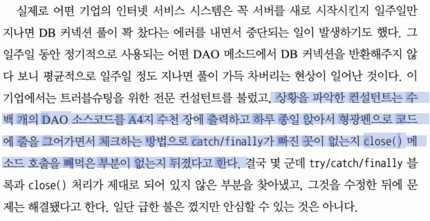
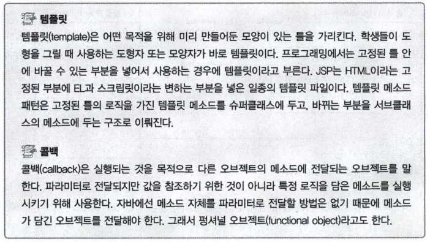
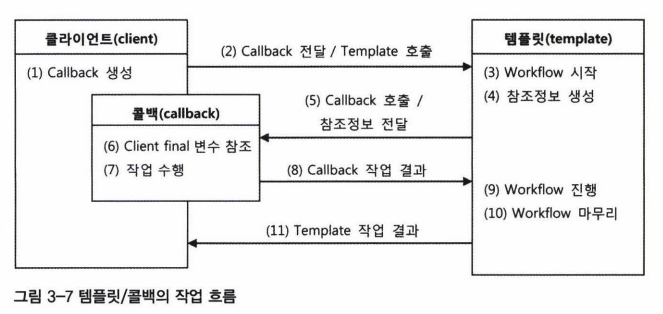
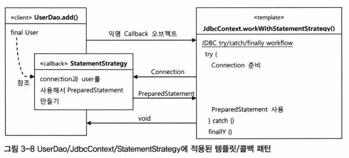

노션 링크: https://reminiscent-headlight-ee3.notion.site/3-221de133f1a1403faca8846e9df68db4

# 3장

Created: October 19, 2021 11:32 PM
Tags: 백엔드 스터디, 템플릿

## 3.1 다시 보는 초난감 DAO


```java
public class UserDao {

	private ConnectionMaker connectionMaker;

	public UserDao(ConnectionMaker connectionMaker) (
			this.connectionMaker = connectionMaker; 
  }
	
	public void add(User user) throws ClassNotFoundException, SQLException {
			Connection c = connectionMaker.makeConnection();
			//...sql
	}

	public User get(String id) throws ClassNotFoundException, SQLException {
			Connection c = connectionMaker.makeConnection();
	        //...sql
	}
	public User deleteAll() throws ClassNotFoundException, SQLException {
			Connection c = connectionMaker.makeConnection();
	       //...sql
	}
	public int getCount() throws ClassNotFoundException, SQLException {
			Connection c = connectionMaker.makeConnection();
		    //...sql
	}
}
```

위의 코드는 UserDao를 최종적으로 개선한 코드이다.
IoC에 대한 문제점은 해결했지만, UserDao에는 아직 예외처리 코드가 없다는 문제점이 있다.

```java
public void deleteAll() throws ClassNotFoundException, SQLException {
	Connection c = dataSource.getConnection();

	PreparedStatement ps = c.prepareStatement("delete from users");
	ps.executeUpdate(); // 여기서 예외가 발생하면 메소드 실행이 중단된다.
	
  // 예외가 발생하면 close() 메서드들이 실행되지 못한다.
  // 그렇게 될떄마다 제대로 ps와 c의 리소스가 반환되지 않게 되고, 
  // 커넥션 풀에 여유가 생기지 않게 되어 리소스가 모자라게 된다.
	ps.close();
	c.close();
}
```

### 3.1.1 예외처리 기능을 갖춘 DAO


예외처리를 DAO에 추가해보자.

먼저 deleteAll()에 대한 예외처리

```java
public void deleteAll() throws SQLException { 
	Connection c = null;
	PreparedStatement ps = null; 
	try {
		c = dataSource.getConnection(); 
		ps = c.prepareStatement("delete from users"); 
		ps.executeUpdate();
	//예외가 발생할 기능성이 있는 코드를 모두 try block 으로 묶어준다.
	} catch (SQLException e) { 
		throw e;
		//예외가 발생했을 때 부가적인 작업을 해줄 수 있도록 catch 블록을 둔다 
		//아직은 예외를 다시 메소드 밖으로 던지는 것밖에 없다 
	} finally { //finally이므로 try블록에서 예외가 발생했을 때나 안 했을 때나 모두 실행된다.
	if (ps != null) {
	 try {
			ps.close(); //ps.close() 메소드에서도 SQLException 발생할 수 있기 때문.
	 } catch (SQLException e) {} // ps.close() 메소드에서도 SQLException이 발생할 수 있기 때문에		
	                     // 그렇지 않으면 Connection을 close()하지 못하고 빠져나갈 수 있다.
	if (c != null) {
		try {
			c.close(); // Connection 빈환 
		} catch (SQLException e) {}
	 }
	}
}
```

위 코드는 예외상황에서도 안전한 코드가 되었지만, 

예외가 어느 시점에 나는 가에 따라서 Conntection과 PreparedStatement 중 

어떤 것의 close() 메소드를 호출해야 할지 달라진다는 문제점이 있다.

```java
public int getCount() throws SQLException ( 
	Connection c = null; 
	PreparedStatement ps = null; 
	ResultSet rs = null; 
	try { 
		c = dataSource.getConnection(); 

		ps = c.prepareStatement("select count(*) from users"); 
		
		//ResultSet도 다양한 SQLException이 발생할 수 있는 코드이므로 try 안에 둬야 한다.
		rs.ps.executeQuery();	
		rs.next();
		return rs.getlnt(1);
	} catch (SQLException e) {
			throw e; 
	} finally { 
		if (rs != null) { 
			try {
				rs.close(); // 만들어진 ResultSet을 닫아주는 기능.
									  // close는 만들어진 순서의 반대로 하는 것이 원칙이다. 
			} catch (SQLException e) {}
		}

		if (ps != null) { 
			try {
				ps.close(); 
			} catch (SQLException e) {}

		if (c != null) {
			try {
				c.close();
			}
		}
	}
}
```

## 3.2 변하는 것과 변하지 않는 것


### 3.2.1 JDBC try/catch/finally 코드의 문제점


코드를 보면서 엄청난 답답함을 느끼지 않았는가?
**try 블록이 2중으로 중첩되는데다 모든 메소드마다 반복된다.** 

- (딱히 문제되어보이지 않는다면 이걸 펼쳐보도록 하자)
    
    ResultSet이 필요한 경우와 필요없는 경우 두 가지에 대해 각각 하나씩 만들어두고 
    
    계속 코드를 복사해서 새로운 메소드를 만들고, 메소드마다 달라지는 try 블록의 일부코드만 수정후 copy & paste 하면 빠르게 편리하게 개발이 될 것처럼 보이지만
    
    이렇게 속도를 내서 작업하다가 어느 순간 한줄을 빼먹거나 몇 줄을 잘못 삭제했다면?
    
    중괄호를 잘못 닫은게 아니라면 당장 컴파일 에러가 나지는 않겠지만 
    
    잠재적으로 조금씩 커넥션이 하나씩 반환되지 않고 쌓여가면서 리소스가 부족해지는 사태가 발생하게 된다.
    
    
    
- 개선의 어려움
    
    테스트를 통해 DAO의 각 메소드마다
    예외상황에서 리소스를 반납하는지 체크하게 했으면 어떘을까?
    
    좋은 생각이긴 한데 막상 적용하기는 쉽지 않을 것이다.
    
    예외상황을 처리하는 코드는 테스트하기가 매우 어렵고 모든 DAO 메소드에 대해
    이런 테스트를 일일이 한다는 것이 매우 번거롭다.
    
    강제로 예외상황을 만들려면 테스트를 위해 특별히 개발한 Connection이나 PreparedStatement 구현 클래스가 필요하다. 그런데 이런 기능은 구현하기도 쉽지 않다.
    
    어떻게 적용했다고 하더라도 테스트 코드의 양이 엄청나게 늘어날 것이다.
    
    ```java
    
    UserDao의 add(), get(), deleteAll(), getCount()
    당장 위의 네 개 메소드에 대한 
    
    Connection, PreparedStatement, ResultSet의
    
    close()를 테스트하는데만해도 4 * 3 = 12,
    즉 12개의 테스트가 필요해진다. 
    
    ```
    

- 더 나은 방법은 없을까?

이 문제의 핵심은 (변하지 않는, 그러나 많은 곳에서 중복되는) 코드와
로직에 따라 **계속 확장되고 자주 변하는 코드**를 잘 분리해내는 작업이 요구된다는 점이다.

1장에서 살펴본 관심사의 분리와 비슷한 문제이고 같은 방법으로 접근하면 된다.
그러나 이번 코드는 DAO와 DB 연결 기능을 분리하는 것과는 성격이 다르기 때문에
해결 방법이 조금 다르다.

### 3.2.2 분리와 재사용을 위한 디자인 패턴 적용


- 먼저 UserDAO의 메소드를 개선하는 작업부터 시작해보자.

1. 변하지 않는 코드와 변하는 코드가 무엇인지 파악하기

```java
public void deleteAll() throws SQLException {
	Connection c = null;
	PreparedStatement ps = null; 
	try { 
		c = dataSource.getConnection(); 
	
	  **// 이부분을 제외하고 나머지 코드는 모두 변하지 않는 코드이다.**
		**ps = c.prepareStatement("delete from users");**

	  ps.executeUpdate(); 
	} catch (SQLException e) { 
		throw e; 
	} finally { 
		if (ps != null) { try { ps.close(); } catch (SQLException e) {} } 
		if (c != null) { try { c.close(); } catch (SQLException e) {} }
	}
}
```

2. 변하지 않는 부분의 공통적인 부분 (이것을 컨텍스트라고 부른다.) 이해하기 
    - DB 커넥션 가져오기
    - **PreparedStatement를 만들어줄 외부 기능 호출하기**
    (이부분이 변하는 부분이지만, 항상 공통적인 부분에 속한다는 점에서는
    변하지 않는 요소라고 할 수 있음)
    - 전달받은 PreparedStatement 실행하기
    - 예외가 발생하면 이를 다시 메소드 밖으로 던지기
    - 모든 경우에 만들어진 PreparedStatement와 Connection을 적절히 닫아주기

3. 개선 (전략패턴 적용)

```java
// 전략패턴 인터페이스
public interface StatementStrategy {
	PreparedStatement makePreparedStatement(Connection c) throws SQLException;
}

// 전략패턴 구현클래스
public class DeleteAllStatement implements StatementStrategy {
	public PreparedStatement makePreparedStatement(Connection c) throws SQLException { 
		PreparedStatement ps = c.prepareStatement("delete from users");
		return ps;
  }
}
```

```java
// workWithStatementStrategy는 컨텍스트다.						
public class JdbcContext {
	
	//클라이언트가 컨텍스트를 호출할때 넘겨줄 stmt 파라매터는 콜백이다.
	public void workWithStatementStrategy(StatementStrategy stmt) throws SQLException {
		Connection c = null;
		PreparedStatement ps = null;
		try {
			c = dataSource.getConnection();
	
			// 전략패턴 적용
			ps = stmt.makePreparedStatement(c);
****	
      ps.executeUpdate();
		} catch (SQLException e) {
			throw e;
		} finally {
			if (ps != null) { try { ps.close(); } catch (SQLException e) {} }
			if (c != null) { try { c.close(); } catch (SQLException e) {} }
		}
	}
}
```

## 3.3 JDBC 전략패턴의 최적화 및 3.4 컨텍스트와 DI


```java
public class AddStatement implements StatementStrategy { 
	public PreparedStatement makePreparedStatement(Connection c) throws SQLException { 
	 PreparedStatement ps = c.prepareStatement("insert into users(id, name , password)"+
																						" values(?, ?, ?)"); 
 	 ps.setString(1, user.getId());
	 ps.setString(2, user.getName()); 
	 ps.setString(3, user.getPassword()); // -> 이런경우에는 user를 어떻게 가져올까? 
	
	 return ps;
	}
}
```

```java

public class JdbcContext {
	// workWithStatementStrategy 메서드는 변하지 않는 부분이며, 이것을 컨텍스트라 부른다.
	// stmt는 변하는 부분이므로, 콜백이라 부른다.
	public void workWithStatementStrategy(StatementStrategy stmt) throws SQLException {
		Connection c = null;
		PreparedStatement ps = null;
		try {
			c = dataSource.getConnection();
	
			// 전략패턴 적용
			ps = stmt.makePreparedStatement(c);
****	
      ps.executeUpdate();
		} catch (SQLException e) {
			throw e;
		} finally {
			if (ps != null) { try { ps.close(); } catch (SQLException e) {} }
			if (c != null) { try { c.close(); } catch (SQLException e) {} }
		}
	}

	public void add(User user) throws SQLException {
	   StatementStrategy st = new AddStatement(user);
	   workWithStatementStrategy(st); // 이렇게 주입 
	}
}

```

- 익명클래스로 최적화할 수도 있다.

```java
public class UserDao {

	private JdbcContext jdbcContext;

	public UserDao(JdbcContext context) { // 생성자 DI로 초기화하도록 한다.
		this.context = context;
	}

	public void deleteAll() throws SQLException {
	  jdbcContextWithStatementStrategy(new StatementStrategy() { // 익명클래스
			public PreparedStatement makePreparedStatement(Connection c) throws SQLException {
				return c.prepareStatement("delete from users");
			}
	  }
	}	
	
	// 또는...
	
	public void add(final User user) throws SQLException {
		this.jdbcContext.workWithStatementStrategy( // jdbc 
				new StatementStrategy() { ... }
		)
	}
}
```

## 3.5 템플릿과 콜백


UserDao와 StatementStrategy, JdbcContext를 이용해 만든 코드는
일종의 전략 패턴이 적용된 것이라고 볼 수 있다.

- 전략패턴이란
    
    복잡하지만 바뀌지 않는 일정한 패턴을 가지는 워크 플로우가 존재하고,
    그 중의 일부분만 자주 바꿔서 사용해야 하는 경우에 적합한 구조.
    

정확히는 **전략 패턴의 기본 구조에 익명 내부 클래스를 활용한 방식**인데,
스프링에서는 이러한 방식을 **템플릿/콜백 패턴**이라고 부른다.

전략 패턴의 컨텍스트를 템플릿이라 부르고,
익명 내부 클래스로 만들어지는 오브젝트를 콜백이라고 부른다.



### 3.5.1 템플릿/콜백의 동작원리


템플릿은 고정된 작업흐름을 가진 코드를 재사용한다는 의미에서 붙인 이름이다.
콜백은 템플릿 안에서 호출되는 것을 목적으로 만들어진 객체를 말한다.

전략 패턴은 여러 개의 메소드를 가진 인터페이스를 사용하지만
템플릿/콜백 패턴은 단일 메소드를 가진 인터페이스를 사용한다는 차이점이 있다.



템플릿/콜백 방식은 전략 패턴과 DI의 장점을 익명 내부 클래스 사용 전략과 결합한 독특한 활용법이다.

```java
// 전략패턴.
// 같은 문제에 대하여 다른 방식을 적용할 수 있도록 한다.
// 어떻게 더하고(add), 어떻게 변경하고(update), 어떻게 삭제할지(delete)
// 전략을 바꾸어가며 사용할 때 유용하다.
public interface CrudStrategy {
   void add();
	 void update();
	 void delete();
}
```

```java
// 템플릿/콜백 패턴.
// 변경되지 않는 공통적인 부분은 미리 다 만들어두되,
// 변경이 필요한 것만 나중에 구현하여 워크플로우를 완성시키는 방식이다.
public class JdbcContext {
											//StatementStrategy는 인터페이스 또는 추상클래스로 만들어도 된다.
	// workWithStatementStrategy는 변하지 않는 공통적인 구현 부분이므로 컨텍스트이며,
	// StatementStrategy는 변하는 부분이므로 콜백이다.
  public void workWithStatementStrategy(StatementStrategy stmt) throws SQLException {
		Connection c = null;
		PreparedStatement ps = null;
		try {
			c = dataSource.getConnection();
	
			// 템플릿/콜백 패턴 적용
			ps = stmt.makePreparedStatement(c);
****	
      ps.executeUpdate();
		} catch (SQLException e) {
			throw e;
		} finally {
			if (ps != null) { try { ps.close(); } catch (SQLException e) {} }
			if (c != null) { try { c.close(); } catch (SQLException e) {} }
		}
	}

	public void exceuteSql(final String query) throws SQLException {
		workWithStatementStrategy(
      // StatementStrategy 콜백 클래스 정의 및 객체 생성	
		  new StatementStrategy() {
     	 public PreparedStatement makePreparedStatement(Connection c) throws SQLException {
			  		return c.preparedStatement(query); // query만 변한다.
				}
			}
		);
	} 
}

// UserDao에서 사용
public class UserDao {
	
	private JdbcContext jdbcContext;

	// setter DI
	public setJdbcContext(JdbcContext jdbcContext) {
		this.jdbcContext = jdbcContext;
	}

	public void deleteAll() throws SQLException {
			this.jdbcContext.executeSql("delete from users");
	}
}
```



바로 위에서 보았던 템플릿/콜백 패턴 코드를 도식화한 그림이다.

### 3.5.3 템플릿/콜백의 응용


```java
// 템플릿/콜백 패턴 인터페이스 정의
public interface LineCallback<T> {
  T doSomethingWithLine(String line, T value);
}

// 컨텍스트와 콜백을 정의하는 클래스 정의
public class LineTemplate {

	// callback.doSomethingWithLine()을 제외하고 나머지 부분은 변하지 않는 부분이다.
	public <T> T lineReadTemplate(String filepath, LineCallback<T> callback, T initVal) 
		throws IOException { 
			BufferedReader br = null; 
			try {
				br = new BufferedReader(new FileReader(filepath)); 
				T res = initVal; 
				String line = null; 
				
				while ((line = br.readLine()) != null) {
				 	 res = callback.doSomethingWithLine(line, res); //바뀌는 부분. (콜백)
				}
	
				return res;
	
			} catch (IOException e) { ... } finally { ... }
	}
	// 콜백 1: 파일을 하나 열어서 문자열을 모두 하나로 잇는 메서드
	public String concatenate(String filepath) throws IOException {
			LineCallback<String> concatenateCallback = 
					new LineCallback<String>() {
						// 익명 클래스 정의 및 생성
						public String **doSomethingWithLine**(String line, String value) { 
								return value + line; 
						}
					};   
			// 보기가 괴롭다면... 아래와 같이 람다를 쓰는 것도 방법이다.
			// 위의 익명 클래스와 아래의 주석처리된 람다식은 완전히 같은 동작을 보장한다.
			// LineCallback<String> concatenateCallback = (line, value) -> line + value;            

																// 템플릿 메소드의 T는 모두 스트링이 된다. 
			return lineReadTemplate(filepath, concatenateCallback, "");
	}

	// 콜백 2: 파일을 하나 열어서 모든 라인의 숫자를 더한 합을 돌려주는 메서드
	public Integer calcSum(String filepath) throws IOException {
			LineCallback sumCallback = new LineCallback () { 
				public Integer doSomethingWithLine(String line, Integer value) {
							return value + Integer.valueOf(line); 
				}
			};	
		return lineReadTemplate(filepath, sumCallback, e);
	}
}

// 사용
public class FileModifier {
	
	// 직접 생성 대신 DI를 이용해야 한다. 간편한 예시를 위해 여기서는 직접 생성방식을 사용했다.
	private LineTemplate lineTemplate = new LineTemplate;

	public String concat() {
			return lineTemplate.concatenate("C:\text.txt");
	}
	
	public Integer sumAllLines() {
		 return lineTemplate.calcSum("C:\text.txt");
	}

}
```

## 3.6 스프링의 JdbcTemplate


템플릿/콜백 패턴은 스프링에 국한된 개념은 아니므로 스프링없이도 사용할 수 있지만,
스프링은 템플릿/콜백 패턴을 다양한 곳에 적용하고 있으므로 
그 부분에 대해서 알아보도록 하자.

```java
// JdbcTemplate의 초기화를 위한 코드
public class UserDao {

	private JdbcTemplate jdbcTemplate;

	public void setDataSource(DataSource dataSource) {
			this.jdbcTemplate = new JdbcTemplate(dataSource);
			this.dataSource = dataSource;
	}
}
```

이제 템플릿을 사용할 준비가 됐다.

### 3.6.1 update()


deleteAll()에 먼저 적용해보자.

deleteAll()에 처음 적용했던 콜백은

StatementStrategy 인터페이스의 createPreparedStatement() 메서드였다. 
템플릿으로부터 Connection을 제공받아서
PreparedStatement를 만들어 돌려준다는 면에서 구조는 동일하다. 

PreparedStatementCreator 타입의 콜백을 받아서 사용하는
JdbcTemplate의 템플릿 메서드는 update()다.

```java
public class UserDao {

  public void deleteAll() {
	 this.jdbcTemplate.update(new PreparedStatementCreator() {
		public PreparedStatement createPreparedStatement(Connection con) throws SQLException {
				return con.preparedStatement("delete from users");
		}
	 }
  };
}
```

```java
public class UserDao {
	public void deleteAll() {
			this.jdbcTemplate.update("delete from users");
	}
}
```

JdbcTemplate를 사용하면 편리한 기능들이 제공된다.

예를들면 아래와 같이 사용해야 하는 코드를

```java
Prepared5tatement ps;
ps = c.prepare5tatement("insert into users(id, name, password) values(?, ?, ?)"); 
ps.set5tring(1 ,user.getld());
ps.set5tring(2, user.getName()); 
ps.set5tring(3, user.getPassword());
```

아래처럼 변경해서 사용할 수도 있다.

```java
this.jdbcTemplate.update("insert into users(id, name, password) values(?, ?, ?)", 
user.getld(), user.getName(), user.getPassword());
```

### 3.6.2 queryForInt()


```java
// 직접 만든 PreparedStatementCreator에 JDBCTemplete 적용
public int getCount() {
	return this.jdbcTemplate.query(new PreparedStatementCreator() {
		public PreparedStatement createPreparedStatement(Connection con) throws SQLException {
			return con.preparedStatement("select count(*) from users");
		}, new ResultSetExtractor<Integer>() { // 두번째 콜백 (ResultSet으로부터 값 추출)
			public Integer extractData(ResultSet rs) throws SQLException, DataAccessException {
				rs.next();
				return rs.getInt(1);
			}
  });
}

// 람다로 변경
public int getCount() {
	 return this.jdbcTemplate.query(con ->
															con.preparedStatement("select count(*) from users"),
				(resultSet) -> {
  					resultSet.next();
	  				return resultSet.getInt(1);
				}
}
```

위의 코드는 너무 장황하다. 아래의 코드로 변경하면 코드를 많이 줄일 수 있다.

```java
public int getCount() {
		return this.jdbcTemplate.queryForInt("select count(*) from users");
}
```

### 3.6.3 queryForObject()


```java
// queryForObject: (PreparedStatement를 만들기위한 SQL, SQL에 바인딩할 값, 결과값 매퍼)
public User get(String id) {
	return this.jdbcTemplate.queryForObject("select * from users where id = ?",
				 new Object[] {id}, // SQL에 바인딩할 파라미터 값. 가변인자 대신 배열을 사용한다.
				 new RowMapper<User>() {
						public User mapRow(ResultSet rs, int rowNum) throws SQLException {
							 User user = new User();
							 user.setId(rs.getString("id"));
							 user.setName(rs.getString("name"));
							 user.setPassword(rs.getString("password"));
							 return user;
						}
				}
}

```

### 3.6.4 query()


```java
// query()의 리턴타입은 List<T>이다. 여러값을 받을 때 사용하면 편리하다.
public List<User> getAll() {
		return this.jdbcTemplate.query("select * from users order by id",
			new RowMapper<User>() {
					public User mapRow(ResultSet rs, int rowNum) throws SQLException { 
							User user = new User(); 
							user.setld(rs.getString("id")); 
							user.setName(rs.getString("name")); 
							user.setPassword(rs.getString("password")); 
						  return user;
					}
			});
}
```

### 3.6.5 재사용 가능한 콜백의 분리


```java
// setDataSource()로 
public class UserDao {
	
  private JdbcTemplate jdbcTemplate; 
	
  public void setDataSource(DataSource dataSource) {
		 this.jdbcTemplate = new JdbcTemplate(dataSource);
	}
	
	private RowMapper<User> userMapper = new RowMapper<User>() {
			public User mapRow(ResultSet rs, int rowNum) throws SQLException {
				  User user = new User(); 
				  user.setld(rs.getString("id"); 
				  user.setName(rs.getString("name")); 
				  user.setPassword(rs.getString("password")); 
				  return user;
			}
	}

	public void add(final User user) { 
			this.jdbcTemplate.update("insert into users(id, name, password) values(?, ?, ?)",
						user.getId(), user.getName(), user.getPassword()); 
	}

	public User get(String id) { 
			return this.jdbcTemplate.queryForObject("select * from users where id = ?" , 
					new Object[] {id}, this.userMapper);

	public void deleteAll() {
			this.jdbcTemplate.update("delete from users"); 
	}

	public int getCount() { 
			return this.jdbcTemplate.queryForlnt("select count(*) from users"); 
	}

	public List<User> getAll() { 
			return this.jdbcTemplate.query("select * from users order by id", this.userMapper);
	}
}
```

## 3.7 정리


3장에서는 예외처리와 안전한 리소스 반환을 보장해주는 DAO 코드를 만들고
이를 객체지향 설계 원리와 디자인 패턴 DI 등을 적용해서 깔끔하고 유연하며 단순한 코드로
만드는 방법을 살펴봤다.

### 3장에서 다룬 내용은 다음과 같다.


- JDBC와 같은 예외가 발생할 가능성이 있으며 공유 리소스의 반환이 필요한 코드는
반드시 try/catch/finally 블록으로 관리해야 한다.

- **일정한 작업 흐름이 반복되면서 그중 일부 기능만 바뀌는 코드가 존재한다연 전략 때턴을
적용한다. 바뀌지 않는 부분은 컨텍스트로 바뀌는 부분은 전략으로 만들고 인터페이스를
통해 유연하게 전략을 변경할 수 있도록 구성한다.**

- 같은 애플리케이션 안에서 여러 가지 종류의 전략을
다이내믹하게 구성하고 사용해야 한다면
컨텍스트를 이용하는 클라이언트 메소드에서 직접 전략을 정의하고 제공하게 만든다.

- 클라이언트 메소드 안에 익명 내부 클래스를 사용해서
전략 오브젝트를 구현하면 코드도 간결해지고 메소드의 정보를 직접 사용할 수 있어서 편리하다.

- 컨텍스트가 하나 이상의 클라이언트 오브젝트에서 사용된다면
클래스를 분리해서 공유하도록 만든다.

- 컨텍스트는 별도의 빈으로 등록해서 DI 받거나 클라이언트 클래스에서 직접 생성해서 사용
한다. 클래스 내부에서 컨텍스트를 사용할 때 컨텍스트가 의존하는 외부의 오브젝트가 있다
면 코드를 이용해서 직접 DI 해줄 수 있다.

- **단일 전략 메소드를 갖는 전략 패턴이면서 익명 내부 클래스를 사용해서
매번 전략을 새로 만들어 사용하고, 컨텍스트 호출과 동시에 전략 DI를 수행하는 방식을
템플릿/콜백 때턴이라고 한다.**

- 콜백의 코드에도 일정한 패턴이 반복된다면
콜백을 템플릿에 넣고 재활용히는 것이 편리하다.

- 템플릿과 콜백의 타입이 다양하게 바뀔 수 있다면 제네릭스를 이용한다.

- 스프링은 JDBC 코드 작성을 위해 JdbcTemplate을 기반으로 하는 다양한 템플릿과 콜백을
제공한다.

- **템플릿은 한 번에 하나 이상의 콜백을 사용할 수도 있고,
하나의 콜백을 여러 번 호출할 수도 있다.**

- 템플릿/콜백을 설계할 때는 템플릿과 콜백 사이에 주고받는 정보에 관심을 둬야 한다.
