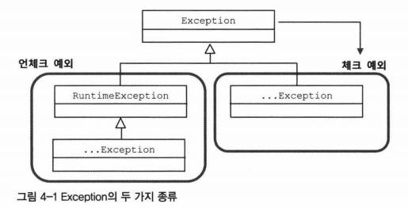

노션 링크: https://reminiscent-headlight-ee3.notion.site/4-1a42c978e0af4509a679bd713fb13175

# 4장

Created: October 24, 2021 9:25 PM
Tags: 백엔드 스터디, 예외

## 예외처리

---

자바에서 throw를 통해 발생시킬 수 있는 예외 세 가지

1. **`java.lang.Error` (JDK에서 기본 제공하는 예외 클래스)**
    
    OutOfMemoryError, TheadDeath 등의 시스템 레벨 차원의 예외처리 시 사용합니다.
    
2. **`java.lang.Exception` (JDK에서 기본 제공하는 예외 클래스)**
    
    애플리케이션 코드의 작업 중에 발생할 수 있는 예외를 처리할 때 사용합니다.
    java.lang.Exception은 아래와 같이 두 가지 예외로 구분됩니다.
    
    - **checked exception (컴파일 시간에 체킹이 가능한 예외들)**
        - java.lang.Exception을 상속받고 있으나 RuntimeException과는 관련이 없는 경우.
        (IOException, SQLException 등이 이 경우에 속합니다.)
        예외처리를 하지 않으면 컴파일 에러가 발생합니다.
        
    - **unchecked exception (런타임에만 체킹이 가능한 예외들)**
        - java.lang.Exception을 상속받는 RuntimeException 및 RuntimeException 하위의 Exception들.
        (NullPointerException, IllegalArgumentException 등이 이 곳에 속합니다.)
        예외처리가 필수는 아니므로 예외처리하지 않아도 컴파일 시 에러가 발생하지 않습니다.
        (단 런타임에 에러가 발생할 수 있습니다.)
        
    
    
    
3. **예외 전환 (exception translation) (java.lang.Error 또는 java.lang.Exception을 응용하는 경우)**
    
    예외의 의미를 조금이라도 더 명확하게 만들어줄 때 사용할 수 있습니다.
    
    ```java
    // 예시
    public class SomeClass111 {
    		public void error(int a) {
    				if (a == 0) throw new RuntimeException(); 
    		}
    }
    
    // SomeClass111처럼 쓰지 말고 아래의 SomeClass222 처럼 사용하면 됩니다.
    
    public class SomeClass222 {
    		public void error(int a) {
    				if (a == 0) throw new AisZeroException(); // <-- 조금더 구체적인 예외로 처리
    		}
    
    		public usetrycatch(int a) throws DuplicateUserldException, SQLException {
    				try { ... }
    				catch (SQLException sqle) {
    						// if (sqle가 pk 키 중복 때문에 발생한 예외라면)
    						if (sqle.getErrorCode() == MysqlErrorNumbers.ER_DUP_ENTRY) {
    						    throw DuplicateUserIdException("중복키발생"); // 구체적인 예외로 처리
    						} else { ... }
    				}
    		}
    }
    
    // 구체적인 예외 클래스 생성1
    public class AisZeroException extends RuntimeException {
    		public AisZeroException() {
    			super("a가 0이어서 예외가 발생했습니다");
    		}
    }
    
    // 구체적인 예외 클래스 생성2
    public class DuplicateUserIdException extends SQLException {
    		public DuplicateUserIdException(String reason) {
            super(reason);
        }
    }
    ```
    

### 예외처리에 대한 올바른 대처

---

- **check exception(컴파일 예외)을 계속 throws를 사용해 넘기는 것은 무의미하며,
아무런 장점이 없습니다.**

어짜피 복구가 불가능한 컴파일 예외라면 런타임 예외로 포장해서
불필요한 throws 선언이 들어가지 않도록 해주는 것이 좋습니다. (불필요한 코드 줄이기)

예를들어 java.lang.SQLException은 대부분 복구가 불가능한 예외이므로
이 예외를 처리해도 대응이 가능한 경우가 거의 없습니다.

즉 SQLException은 throws를 타고 계속 상위 예외로 전달되다가
마지막에 애플리케이션 밖으로 던져지기만 (log에 기록된다던지) 할 것입니다.

아래의 코드는 SQLException을 RuntimeException으로 바꾸고
개발자에게 의미있는 정보를 전달하도록 만든 코드입니다.

```java
// 런타임용 클래스 선언
public class DuplicateUserldException extends RuntimeException { 
		public DuplicateUserldException(Throwable cause) { 
				super(cause);
		}
}

//DuplicateUserldException 사용하기
//메서드에서 throws SQLException을 제거하고 DuplicateUserIdException만 선언해도 됩니다.
public useRuntimeException(int a) throws DuplicateUserIdException { 
		try { ... }
		catch (SQLException sqle) {
				// if (sqle가 pk 키 중복 때문에 발생한 예외라면)
				if (sqle.getErrorCode() == MysqlErrorNumbers.ER_DUP_ENTRY) {
				    throw DuplicateUserIdException(sqle); // 구체적인 예외로 처리 (예외 전환)
				} else { 
					throw new RuntimeException(e); // 예외 포장 (sqle를 런타임 예외로 해결하기)
			  }
		}
```

스프링의 JdbcTemplate은 SQLException을 복구 불가능한 예외라고 판단하였으며,

따라서 SQLException이 발생할 경우 **`DataAccessException`**이라는
RuntimeException을 상속한 예외클래스로 전환하여 처리합니다.

사실 스프링의 API 메소드에 있는 대부분의 예외는 RuntimeException을 상속한 클래스들입니다.

## DataAccessException

---

```java
public interface UserDao {
		public void add(User user); // 에러!
																// SQLException가 컴파일에 예외처리를 했는지 체크하기 떄문
		public void add(User user) throws SQLException; // 에러가 발생하지는 않지만...
}

public class UserDaoImpl implements UserDao {
		public void add(User user) throws SQLException {
				try { ... }
				catch (SQLException e) { ... }
		}
}
```

UserDao 인터페이스를 보면

public void add(User user)에 throws SQLException 을 붙여야만 하는데,
인터페이스에서 이렇게 되면 유연성이 많이 감소할 것입니다. 
데이터 액세스 기술의 API들은 각자 자신만의 독자적인 예외를 던지기 때문입니다. (아래 참조)

```java
public void add(User user) throws PersistentException; // JPA 
public void add(User user) throws HibernateException; // Hibernate 
public void add(User user) throws JdoException; // JDO
```

`**PersistentException**`, `**HibernateException**`, `**JdoException**`는 `**SQLException**`와
직접적 관련이 없으므로 UserDao 인터페이스의 add(User user) throws SQLException을 구현해도
예외가 의도대로 처리되는 코드를 작성할 수 없습니다.

다시 말해 아래와 같은 문제가 발생합니다.

```java

public interface UserDao {
		public void add(User user) throws SQLException;
}

public class UserDaoJPAImpl implements UserDao {
	 public void add(User user) throws SQLException {
		  try {
				jpa.persist(user); // insert 구문생성. 여기서 실패해도,
			} catch (SQLException e) {
				 // catch에서 예외가 처리되지 않는다......
				 // jpa.persist()가 발생시키는 예외는 PersistentException에서 처리된다.
			}
	 }
}
```

혹시`**PersistentException**`, `**HibernateException**`, `**JdoException`** 들은 Exception을 상속할테니

아래처럼 선언하면 어떨까요?

```java
public interface UserDao {
		public void add(User user) throws Exception; // 최상위 java.lang.Exception으로
																								 // 선언하면 모두 대응가능하긴 하지만...
}

public class UserDaoJPAImpl implements UserDao {
   public void add(User user) throws Exception {} //불필요한 throws Exception 선언 요구됨
					    	 //Database와 관련되지 않은, 예상치 못한 예외까지 처리되는 문제도 있음
}
```

물론 JPA, Hibernate 등은 내부적으로 RuntimeException 예외처리를 하기 떄문에
throws 구문 선언이 필요없습니다.

마찬가지로 DataAccessException도 RuntimeException 예외처리이므로
throws 선언없이 아래처럼 사용할 수 있습니다.

```java
public interface UserDao {
	 public void add(User user); // 그냥 이렇게만 선언해도 된다.
}

public class UserDaoJDBCImpl implements UserDao {
	 public void add(User user) { // JDBCTemplate을 사용하는 add 메서드 구현
			String sql = "insert into user values(1, ?)";
			template.update(sql, user.getName()); // 예외가 발생하면
												// DataAccessException이 처리하므로 throws 구문이 필요없습니다.
	 }
}
```