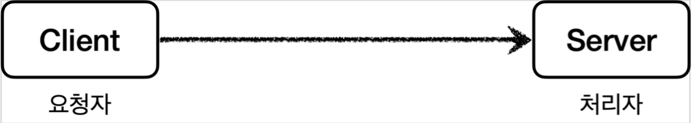
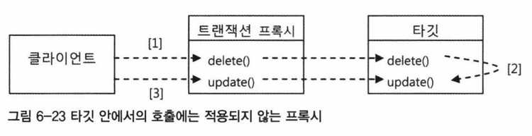

노션 링크: https://reminiscent-headlight-ee3.notion.site/6-c5e8154410af43ef9e7670ed371f9e19

# 6장

Created: November 8, 2021 10:41 PM
Tags: AOP, 백엔드 스터디

## 프록시 (Proxy)


### `개념` : 대리인 객체

 


전통적 클라이언트와 서버 구조. 

클라이언트는 서버에 필요한 것을 요청하고, 서버는 클라이언트의 요청을 처리한다.

전통적 클라이언트-서버 구조에서 클라이언트는 서버를 **직접** 호출한다.


**그런데 클라이언트가 서버를 *직접* 요청하는 것이 아니라**

어떤 **대리인을 통해서 *간접* 적으로 서버 자원을 요청하도록** 구조를 약간 변경할 수도 있다.

예를 들자면 내(클라이언트)가 직접 마트(서버)에 가서 장을 볼 수도 있지만 

다른 사람에게 대신 장을 봐달라고 부탁하는 방식으로 구조가 변경된다.


클라이언트가 서버를 직접 호출하지 않고 Proxy (대리인) 에게 부탁하여 서버 자원을 요청하는 구조.

- 간접적으로 호출하도록 구조를 변경하면 어떤 장점이 있을까?

1. **Proxy가 중간에서 다른 일을 부가적으로 더할 수도 있다. (부가 기능 추가)**

예시) 아버지께 자동차 주유를 부탁했는데 아버지가 주유 뿐만 아니라 세차까지 하고 왔다.

클라이언트는 원래 기대했던 것에 더해 세차라는 부가 기능까지 얻게 되었다. 

1. **Proxy가 서버까지 가지 않고 바로 클라이언트에게 결과를 전달할 수도 있다. (캐싱, 접근제어)**

예시) 어머니께 마트에 가서 라면을 사와 달라고 요청했는데

어머니가 그 라면은 이미 집에 있으니 바로 먹으면 된다고 할 수도 있다.

그러면 기대했던 것보다 더 빨리 라면을 먹을 수 있다.

또는 클라이언트의 접근 권한을 체킹하여

해당 요청이 실제 서버까지 가지 않도록 사전에 차단하여 부하를 줄일 수도 있다.

1. Proxy가 다른 Proxy를 부르는 것도 가능하다. (역할 및 책임 분리, 프록시 체인)
    
    
    

`**프록시의 주요 기능**`

위에서도 언급했듯, 프록시를 통해서 할 수 있는 일은 크게 2가지로 구분할 수 있다.

- **접근 제어**
    - 권한에 따른 접근 차단
    - 캐싱
    - 지연 로딩
    
- 부가 기능 추가
    - 원래 서버가 제공하는 기능에 더해서 부가 기능을 수행한다.
    - 예) 요청 값이나, 응답 값을 중간에 변형한다.
    - 예) 실행 시간을 측정해서 추가 로그를 남긴다.
    

**한줄 요약**: 프록시 객체가 중간에 있으면 크게 접근 제어와 부가 기능 추가를 수행할 수 있다.


프록시가 부가기능까지 추가할 수 있다는 것은 이해했다.

그러나 프록시를 굳이 중간에 만들어 끼워넣고 간접적으로 사용할 필요가 있을까?

그냥 원래의 서버 로직에 부가 기능까지 함께 추가해서 만들어도 되는데 말이다.

프록시를 사용하지 않고
메서드의 수행 시간에 대한 로그를 출력하는 기능을 구현해서 어떤 점이 달라지는지 살펴보자.

```java
// 1. 로그 저장용 클래스 생성
@Getter
@RequiredArgsConstructor
public class LogStatus {
    private final Long startTimeMs; // 로그 시작 시간 저장
    private final String message; // 사용자가 전달하는 로그 메시지 저장
}
```

```java

// 2. 로그를 찍는 로직을 수행하는 클래스 
@Slf4j
@Component
public class LogTrace {

  // 시작 시간
	public LogStatus begin(String message) {
	    long startTimeMs = System.currentTimeMillis();
	    log.info("[begin] {}", message);
	    return new LogStatus(startTimeMs, message);
	}

  // 종료 시간
  private void end(LogStatus status) {
      long stopTimeMs = System.currentTimeMillis();
      long resultTimeMs = stopTimeMs - status.getStartTimeMs();
      log.info("[{}] time={} ms", "end", resultTimeMs);
  }

}
```

`LogTrace` 및 `LogStatus`는 로그를 저장하고 출력하는 기능을 수행한다.

이제 이 두 클래스를 실제 비즈니스 로직에 적용해보자.

```java
// 컨트롤러
@RestController
@RequiredArgsConstructor
public class OrderController {

    private final OrderService orderService;
    private final LogTrace trace;

    @GetMapping("/v1/request")
    public String request(String itemId) {

        LogStatus status = null;

        status = trace.begin("OrderController.request()"); // 컨트롤러 로그 begin
        orderService.orderItem(itemId); // 실제 로직 처리
        trace.end(status); // 컨트롤러 로그 end
        return "ok";
    }
}
```

```java
// 서비스
@Service
@RequiredArgsConstructor
public class OrderService {

    private final OrderRepository orderRepository;
    private final LogTrace trace;

    public void orderItem(String itemId) {
        LogStatus status = null;
   
        status = trace.begin("OrderService.orderItem()"); // 서비스 로그 begin
        orderRepository.save(itemId); // 실제 로직 처리
        trace.end(status); // 서비스 로그 end
    }
}
```

```java
// 레포지토리
@Repository
@RequiredArgsConstructor
public class OrderRepository {

    private final LogTrace trace;

    public void save(String itemId) throws InterruptedException {

        LogStatus status = null;

        status = trace.begin("OrderRepository.save()"); // 레포지토리 로그 begin
        Thread.sleep(1000); // 1초정도 걸리는 어떤 로직 수행
        trace.end(status); // 레포지토리 로그 end
    }
}
```

어떤 점이 문제인지 알겠는가?

메서드의 메인 로직마다 로그 출력 기능이라는 부가기능까지 덕지덕지 붙어있다.

심지어 중복까지 발생한다.

프록시를 사용하는 방식은 그럼 어떻게 구현되어 있을까?

캐싱을 하는 프록시 패턴을 적용해 구현해보자.

`인터페이스 기반의 구조`에서 `캐싱 작업을 부가적으로 수행하는` 프록시 구조는 아래와 같다.

```java
// 공통 인터페이스.
// 프록시 객체와 실제 서버 객체는 이 인터페이스를 공통으로 구현한다.
public interface Subject {
    String operation();
}
```

```java

// 실제 서버 로직
@Slf4j
public class RealSubject implements Subject {
    @Override
    public String operation() throws InterruptedException {
        log.info("실제 객체 호출");
        Thread.sleep(1000); // 수행시간이 1초 정도 걸리는 어떤 로직
        return "data";
    }
}
```

```java
// 캐싱 작업을 수행하는 프록시 객체
@Slf4j
@RequiredArgsConstructor
public class CacheProxy implements Subject {

    private final Subject target; // 프록시는 실제 객체에 대한 참조를 가지고 있어야 한다.
    private String cacheValue;

    @Override
    public String operation() {
        log.info("프록시 호출");
        if (cacheValue == null) { // 캐싱 준비
            cacheValue = target.operation(); // 실제 서버 로직을 proxy가 수행
        }
        return cacheValue;
    }
}
```

```java
// 클라이언트 객체. 
// Subject 인터페이스를 가지고 있으므로
// Subject의 구현체라면 어떤 종류이든 상관없이 사용하게 된다.
@RequiredArgsConstructor
public class ProxyPatternClient {

    private final Subject subject;

    public void execute() {
        subject.operation();
    }

}
```

```java
// 클라이언트가 서버를 호출했을 때:
@Slf4j
public class ProxyPatternTest {

    @Test
	@DisplayName("프록시 객체 없이 사용했을 때")
    void noProxyTest() { 
        RealSubject realSubject = new RealSubject();
        ProxyPatternClient proxyPatternClient = new ProxyPatternClient(**realSubject**);
        proxyPatternClient.execute();
        proxyPatternClient.execute();
        proxyPatternClient.execute();
        // noProxyTest() 수행결과
        // 15:42:25.371 [main] INFO - 실제 객체 호출
        // 15:42:26.380 [main] INFO - 실제 객체 호출
        // 15:42:27.382 [main] INFO - 실제 객체 호출
    }
    
    @Test
	@DisplayName("프록시 객체가 있을 때")
    void cacheProxyTest() {
        RealSubject realSubject = new RealSubject();
        CacheProxy cacheProxy = new CacheProxy(realSubject);
				
        // 클라이언트가 cacheProxy를 사용하게 되지만, realSubject와 proxy는 
        // 같은 인터페이스 기반의 구현체이므로 클라이언트는 어느쪽이든 문제없이 사용하게 된다.
        // 다시말해 클라이언트는 자신이 프록시 객체를 사용한 것인지 실제 객체를 사용한 것인지
        // 알지 못하며 알 필요도 없다.
        ProxyPatternClient client = new ProxyPatternClient(**cacheProxy**);
        log.info("최초 호출");
        client.execute();
        log.info("두번째 호출");
        client.execute();
        log.info("세번째 호출");
        client.execute();

        // cacheProxyTest() 수행결과
        // 15:42:24.353 [main] INFO - 최초 호출
        // 15:42:24.355 [main] INFO - 프록시 호출
        // 15:42:24.355 [main] INFO - 실제 객체 호출
        // 15:42:25.364 [main] INFO - 두번째 호출
        // `두번째` 호출부터 캐싱되어 실제 객체를 호출하지 않는다.
        // 15:42:25.364 [main] INFO - 프록시 호출
        // 15:42:25.364 [main] INFO - 세번째 호출
        // 15:42:25.364 [main] INFO - 프록시 호출
    }
}
```

`**프록시의 중요한 특징**`

1. 클라이언트는 자신이 서버에 직접 자원을 요청했는지 아니면

간접적으로 Proxy를 거쳐서 자원을 요청했는지 알지 못한다.

2. 아무 객체나 Proxy가 될 수 있는 것은 아니다. 다시 말해 Proxy 객체가 되려면 제약이 있다.
    
    `제약 조건`
    
    - 1번 특징에 의해, 서버객체와 프록시객체는 같은 인터페이스를 사용함으로 클라이언트가

    프록시를 사용해서 요청했는지 아니면 서버에 직접 요청했는지 모르게 만들어져야 한다.

    - 1번 특징을 만족시켜야 하는데 공통 인터페이스가 없다면

    서버객체를 상속받은 객체만이 프록시 객체가 될 수 있다.

해당 코드는 캐싱을 하고 있으므로 `프록시 패턴`이라고 부른다. (프록시가 프록시 패턴으로 구현됨)

이번에는 

`인터페이스 기반의 구조`에서 `**실제 요청에 걸린 시간을 부가적으로 출력해주는**` 프록시 구조를 보자.

```java
// 공통 인터페이스. 프록시와 실제 서버 객체는 Component를 구현하는 구현체이다.
public interface Component {
    String operation();
}
```

```java
// 실제 서버 로직
@Slf4j
public class RealComponent implements Component {

    @Override
    public String operation() {
        log.info("RealComponent 실행");
        return "data";
    }
}
```

```java
// 프록시 객체. RealComponent의 operation() 실행에 걸리는 시간을 출력한다.
@Slf4j
@RequiredArgsConstructor
public class TimeDecorator implements Component {

    private final Component component;

    @Override
    public String operation() {
        log.info("TimeDecorator 실행");
        long startTime = System.currentTimeMillis();
        String result = component.operation();
        long endTime = System.currentTimeMillis() - startTime;
        log.info("component.operation() 실행에 걸린 시간: {}", endTime);
        return result;
    }
}
```

```java
// 클라이언트 객체
@Slf4j
@RequiredArgsConstructor
public class DecoratorPatternClient {

    private final Component component;

    public void execute() {
        String result = component.operation();
        log.info("result={}", result);
    }
}
```

```java
@Slf4j
public class DecoratorPatternTest {

    @Test
    @DisplayName("TimeDecorator 없이 사용")
    void noDecorator() {
        RealComponent realComponent = new RealComponent();
        DecoratorPatternClient client = new DecoratorPatternClient(realComponent);
        client.execute();

        // 결과:
        // 16:03:51.099 [main] INFO - RealComponent 실행
        // 16:03:51.101 [main] INFO - result=data
    }

	@Test
    @DisplayName("TimeDecorator 프록시 적용하기")
    void decorator() {
        RealComponent component = new RealComponent();
        TimeDecorator timeDecorator = new TimeDecorator(component);
        DecoratorPatternClient client = new DecoratorPatternClient(timeDecorator);
        client.execute();

        // 결과:
        // 16:01:46.100 [main] INFO - TimeDecorator 실행
        // 16:01:46.103 [main] INFO - RealComponent 실행
        // 16:01:46.104 [main] INFO - component.operation() 실행에 걸린 시간: 0
        // 16:01:46.105 [main] INFO - result=data
    }
}
```

위에서 살펴본 두 코드 모두 `프록시` 가 적용된 구조이다.

어떤 차이점이 있을까?

위의 코드는 `**프록시 패턴**` 이라 불리고,

아래의 코드는 `**데코레이터 패턴**`이라고 불린다는 점이다.

GoF 디자인패턴은 `프록시 패턴` 그리고 `데코레이터 패턴` 둘다

프록시를 사용하는 방법이지만 의도에 따라 두 가지 패턴으로 구분짓고 있다.

- 프록시 패턴: 접근 제어(및 캐싱)가 목적. 프록시 패턴은 실제 로직의 기능을 확장하지 않는다.
- 데코레이터 패턴: 새로운 기능 추가가 목적

다시 말해 용어가 프록시 패턴이라고 해서 프록시 패턴만 프록시를 쓰는 것이 아니라는 점이다.

데코레이터 패턴 또한 프록시를 사용한다.


- 참고사항
    
    `프록시`라는 개념은 클라이언트 서버라는 큰 개념안에서 자연스럽게 발생할 수 있다.
    
    프록시는 객체 안에서의 개념도 있고, 웹 서버에서의 프록시도 있다.
    
    객체안에서 객체로 구현되어 있는가,
    
    웹 서버로 구현되어 있는가 처럼 규모의 차이가 있을 뿐 근본적인 역할은 같다.
    

`**프록시**`는 기존 코드에 영향을 주지 않으면서 실제 로직의 기능을 확장하거나

접근 방법을 제어할 수 있는 유용한 방법이다.

그럼에도 불구하고 많은 개발자는 실제 로직 코드를 직접 고치고 말지

번거롭게 프록시를 만들지는 않겠다고 생각한다.

**왜냐하면 프록시를 만드는 일이 상당히 번거롭게 느껴지기 때문이다.**

**매번 새로운 클래스를 정의**해야 하고,  **인터페이스에 구현해야 할 메소드가 많으면**

모든 메소드를 일일히 구현해서 위임하는 코드를 넣어야 하기 때문이다.

다시 말해 로그를 기록한다던지하는 동일한 기능의 프록시조차도, 인터페이스마다 구현해야만 한다. 


CacheProxy 중복. 동일한 기능을 하는 프록시라해도 인터페이스마다 매번 구현해주어야 하는 문제점이 있다. 

또한 부가적인 기능이 여러 메소드에 반복적으로 나타나게 되어 코드 중복의 문제가 발생한다.

다행히 Java에는 java.lang.reflect 패키지 안에 프록시를

손쉽게 만들 수 있도록 지원해주는 클래스들이 있다. 

해당 기능을 사용하는 것을 `다이나믹 프록시` 라고 부른다.

예시를 먼저 간단한 코드를 통해 살펴보자.

```java
import java.lang.reflect.InvocationTargetException;
import java.lang.reflect.Method;

@Slf4j
public class ReflectionTest {

    @Test
    void reflection() throws ClassNotFoundException, NoSuchMethodException, InvocationTargetException, IllegalAccessException {
        
        // 런타임에 (동적으로) 어떤 메소드를 사용할지 문자열로 전달가능
        // 다만 메서드가 존재하지 않으면 런타임시간에 에러 발생
        // (컴파일시간에 문제를 찾을 수 없음)
        Class<?> classHello = Class.forName("com.example.ReflectionTest$실제객체");
        실제객체 target = new 실제객체();
        dynamicCall(classHello.getMethod("callA"), target); // 프록시 적용
        dynamicCall(classHello.getMethod("callB"), target); // 프록시 적용
    }

    // 로그를 기록하는 공통 프록시 메서드. 프록시를 여러개 만들 필요가 없다.
    // 위에서도 언급했듯 로그를 기록하는 프록시를 사용할 곳을 동적으로 설정할 수 있다. 
    private void dynamicCall(Method method, Object target) throws InvocationTargetException, IllegalAccessException {
        log.info("start"); // 로그 기록
        Object result = method.invoke(target); // 실제로직 수행
        log.info("result={}", result); // 결과 출력
    }

    @Slf4j
    static class 실제객체 {
        public String callA() {
            log.info("callA");
            return "A";
        }
        public String callB() {
            log.info("callB");
            return "B";
        }
    }
}
```

위 코드의 결과는 다음과 같이 출력된다.

```java
16:40:43.200 [main] INFO com.example.ReflectionTest - start
16:40:43.204 [main] INFO com.example.ReflectionTest$실제객체 - callA
16:40:43.204 [main] INFO com.example.ReflectionTest - result=A
16:40:43.206 [main] INFO com.example.ReflectionTest - start
16:40:43.206 [main] INFO com.example.ReflectionTest$실제객체 - callB
16:40:43.206 [main] INFO com.example.ReflectionTest - result=B
```

조금 더 상세한 코드로 다시 살펴보자.

먼저 살펴볼 것은 두 개의 다른 인터페이스와 구현체들이다. 

```java
public interface AInterface {
    String call();
}

@Slf4j
public class AImpl implements AInterface {
    @Override
    public String call() {
        log.info("A 호출");
        return "a";
    }
}
```

```java
public interface BInterface {
    String call();
}

@Slf4j
public class BImpl implements BInterface {
    @Override
    public String call() {
        log.info("B 호출");
        return "b";
    }
}
```

인터페이스가 다르기 때문에,

기존 방식대로라면 완전히 동일하게 동작하는 로그 출력 프록시라 해도

AInterface를 구현하는 로그 출력 프록시를 만들고,

BInterface를 구현하는 로그 출력 프록시를 각각 따로 만들어야 할 것이다. 

리플렉션을 도입하면 어떻게 달라지는지 계속 살펴보자.

아래의 클래스는 리플렉션을 적용한 프록시이다.

```java
// 실제 로직이 완료되는데 까지 걸리는 시간을 출력하는 프록시.
// 예전과는 다르게 인터페이스마다 똑같은 기능을 하는 프록시를 매번 구현할 필요가 없도록
// 리플렉션을 적용하여 구현하였다.

import java.lang.reflect.InvocationHandler;
import java.lang.reflect.Method;

@Slf4j
@RequiredArgsConstructor
public class TimeInvocationHandler implements InvocationHandler {

    private final Object target; // 실제 서버객체

    @Override
    public Object invoke(Object proxy, Method method, Object[] args) throws Throwable {
        log.info("TimeProxy 실행");

        long startTime = System.currentTimeMillis();

        Object result = method.invoke(target, args); //프록시가 실제 서버 로직을 요청한다.

        long endTime = System.currentTimeMillis();
        long resultTime = endTime - startTime;

        log.info("TimeProxy 종료 resultTime={}", resultTime);

        return result;
    }
}
```

인터페이스가 다른데 하나의 프록시를 AImpl과 BImpl에 어떻게 적용할 수 있을까?

```java
import java.lang.reflect.Proxy;

@Slf4j
public class JDkDynamicProxyTest {

    @Test
    void dynamicA() {
        AInterface target = new AImpl();
        TimeInvocationHandler handler = new TimeInvocationHandler(target);

        // java.lang.reflect.Proxy의 프록시를 동적으로 생성하는 기능 사용.
        // 생성된 다이나믹 프록시 객체는 AInterface 인터페이스를 구현하고 있으므로 
        // AInterface 타입으로 캐스팅해도 안전하다
        AInterface proxy = (AInterface) Proxy.newProxyInstance(
                                                AInterface.class.getClassLoader(),
                                                new Class[]{AInterface.class},
                                                handler
                                            );
		// 프록시 적용하여 실행
        proxy.call();
        log.info("targetClass={}", target.getClass());
        log.info("proxyClass={}", proxy.getClass());
    }
    /*
        dynamicA() 결과
        16:51:13.177 com.example.TimeInvocationHandler - TimeProxy 실행
        16:51:13.181 com.example.AImpl - A 호출
        16:51:13.181 com.example.TimeInvocationHandler - TimeProxy 종료 resultTime=0
        16:51:13.183 com.example.JDkDynamicProxyTest - targetClass=class com.example.AImpl
        16:51:13.183 com.example.JDkDynamicProxyTest - proxyClass=class com.sun.proxy.$Proxy8
    */

    @Test
    void dynamicB() {
        BInterface target = new BImpl();
        TimeInvocationHandler handler = new TimeInvocationHandler(target);

        BInterface proxy = (BInterface) Proxy.newProxyInstance(
                                            BInterface.class.getClassLoader(),
                                            new Class[]{BInterface.class},
                                            handler
                                    );												
        proxy.call();
        log.info("targetClass={}", target.getClass());
        log.info("proxyClass={}", proxy.getClass());
    }
    /*
        dynamicB() 결과
        16:51:13.193 com.example.TimeInvocationHandler - TimeProxy 실행
        16:51:13.193 com.example.BImpl - B 호출
        16:51:13.193 com.example.TimeInvocationHandler - TimeProxy 종료 resultTime=0
        16:51:13.193 com.example.JDkDynamicProxyTest - targetClass=class com.example.BImpl
        16:51:13.193 com.example.JDkDynamicProxyTest - proxyClass=class com.sun.proxy.$Proxy9
    */

}
```

Proxy.newProxyInstance() 메서드는 `프록시 팩토리`라고 부르며 프록시를 생성하는 기능을 수행한다.

전체적인 그림에서 다이나믹 프록시가 동작하는 방식은 다음과 같다.


살펴본 예제의 전체 워크 플로우

다이내믹 프록시 방식을 사용하면 프록시 객체는 하나만 만들어놓고
이 프록시 기능을 적용할 객체는 동적으로 전달받아 사용하면 되므로 편리하다.

스프링 AOP는 기본적으로 다이내믹 프록시 방식을 사용하여 프록시를 구현한다. 

그런데 **다이내믹 프록시 방식은 인터페이스가 반드시 필요하다.**

Proxy.newProxyInstance()의 사용법이 꽤 복잡하기 때문에,

스프링은 아래와 같이 조금더 편리하게 프록시를 생성하는 ProxyFactory 객체를 지원한다.

ProxyFactory에 `프록시 객체`와 `실제 객체(target)`,  `프록시 적용범위(Pointcut)` 를 설정해주면

ProxyFactory가 자동으로 Proxy를 만들어준다.

코드를 통해 알아보자.

```java
// 비즈니스로직 구현체
@Slf4j
public class ServiceImpl implements ServiceInterface {
    @Override
    public void save() {
        log.info("save 호출");
    }

    @Override
    public void find() {
        log.info("find 호출");
    }
}
```

```java
// 실제 로직의 수행시간을 출력하는 프록시 객체 (Advice)
@Slf4j
public class TimeAdvice implements MethodInterceptor {

    @Override
    public Object invoke(MethodInvocation invocation) throws Throwable {
        log.info("TimeProxy 실행");

        long startTime = System.currentTimeMillis();

        // target 클래스의 정보는,
		// 프록시 팩토리로 프록시를 생성하는 단계에서 전달받기 때문에 바로 사용할 수 있다.
        Object result = invocation.proceed();

        long endTime = System.currentTimeMillis();
        long resultTime = endTime - startTime;

        log.info("TimeAdvice 종료 resultTime={}", resultTime);

        return result;
    }
}
```

```java
import org.springframework.aop.framework.ProxyFactory;
import org.springframework.aop.support.DefaultPointcutAdvisor;

@Slf4j
public class AdvisorTest {

	@Test
	@DisplayName("ProxyFactory를 사용하여 프록시 객체를 생성 및 프록시 적용하기")
	void advisorTest1() {
	    ServiceImpl target = new ServiceImpl();
	    ProxyFactory proxyFactory = new **ProxyFactory**(target); // 프록시 생성
		DefaultPointcutAdvisor advisor = new DefaultPointcutAdvisor(
                                        new APointcut(), // 특정 조건을 만족했을때만 프록시가 동작하도록 설정
                                        new TimeAdvice()
					);

		proxyFactory.addAdvisor(advisor);
			
		// 프록시 객체 반환 
	    ServiceInterface proxy = (ServiceInterface) proxyFactory.getProxy(); 
	    proxy.save(); // TimeAdvice.invoke(proxy.save());
	    proxy.find(); // TimeAdvice.invoke(proxy.find());
	    log.info("advisor advice={}", advisor.getAdvice());
	    log.info("advisor pointcut={}", advisor.getPointcut());
	    log.info("proxyFactory={}", proxyFactory.getProxy());
	    log.info("proxyClass={}", proxy.getClass());
	}

	static class APointCut implements Pointcut {

        @Override
        public ClassFilter getClassFilter() {
            return ClassFilter.TRUE;
        }

        @Override
        public MethodMatcher getMethodMatcher() {
            return new AMethodMatcher();
        }
    }

	static class AMethodMatcher implements MethodMatcher {

        private String matchName = "save*"; // save로 시작하는 메서드에만 프록시 적용

        @Override
        public boolean matches(Method method, Class<?> targetClass) {
            boolean result = method.getName().equals(matchName);
            log.info("포인트컷 호출 method={} targetClass={}", method.getName(), targetClass);
            log.info("포인트컷 결과 result={}", result);
            return result;
        }

        @Override
        public boolean isRuntime() {
		    return false; // false이면 위의 matches가, true이면 아래의 matches가 실행됨
        }

        @Override
        public boolean matches(Method method, Class<?> targetClass, Object... args) {
            return false;
        }
    }

}
```

AdvisorTest 클래스의 advisorTest1() 테스트 결과:

```java
com.example.AdvisorTest - 포인트컷 호출 method=save targetClass=com.example.ServiceImpl
com.example.AdvisorTest - 포인트컷 결과 result=true
com.example.TimeAdvice  - TimeProxy 실행
com.example.ServiceImpl - save 호출
com.example.TimeAdvice  - TimeAdvice 종료 resultTime=1
com.example.AdvisorTest - 포인트컷 호출 method=find targetClass=com.example.ServiceImpl
com.example.AdvisorTest - 포인트컷 결과 result=false
com.example.ServiceImpl - find 호출 // 포인트컷 실행안됨, 어드바이저도 동작하지 않음
com.example.AdvisorTest - advisor advice=com.example.TimeAdvice@4d154ccd
com.example.AdvisorTest - advisor pointcut=com.example.AdvisorTest$MyPointCut@229c6181
com.example.AdvisorTest - proxyFactory=com.example.ServiceImpl@38cee291
com.example.AdvisorTest - proxyClass=class com.sun.proxy.$Proxy10
```


advice, advisor, advice 이해를 돕기 위한 그림. advisor가 등록된 상태에서 간접호출방식을 사용하면
직접호출방식을 사용했을 때보다 더 많은 일을 수행하게 할 수 있다.
또한 ProxyFactory를 사용하면 인터페이스마다 중복되는 어드바이저를 개별적으로 만들지 않아도 되어 편리하다.

```java
@Test
@DisplayName("aspectJ 방식의 포인트컷 설정")
void advisorTest2() {
    ServiceImpl target = new ServiceImpl();
    ProxyFactory proxyFactory = new ProxyFactory(target);
	/*
	// 기존 방식
	DefaultPointcutAdvisor advisor = new DefaultPointcutAdvisor(new APointcut(), new TimeAdvice());
	*/

	// 포인트컷을 생성하는 다른 방법
    **AspectJExpressionPointcut aspectJPointcut = new AspectJExpressionPointcut();**
	**aspectJPointcut.setExpression("execution(* *..save*(..))");**

    DefaultPointcutAdvisor advisor = new DefaultPointcutAdvisor(
                                **aspectJPointcut**, // aspectJ 방식으로 설정된 Pointcut를 advisor에 등록
                                new TimeAdvice()
		            );

	proxyFactory.addAdvisor(advisor);
		
	// 프록시 객체 반환 
    ServiceInterface proxy = (ServiceInterface) proxyFactory.getProxy(); 
    proxy.save(); // TimeAdvice.invoke(proxy.save());
    proxy.find(); // TimeAdvice.invoke(proxy.find());
}

// 결과는 advisorTest1()과 동일하게 출력된다.
```

그런데 사실 ProxyFactory는 스프링이 내부적으로 사용하는 기능으로써, 

스프링은 개발자가 직접 ProxyFactory를 사용해 Proxy를 만드는 것보다

더 편리한 방식으로 사용할 수 있도록  eclipse 재단의 aspectJ 기술을 차용해 제공하고 있다.

바로 위에서 사용한 execution(* *..save*(..)) 이 바로 이런 방식이다.


사용법은 그림과 같다.

aspectJ의 기본 사용 예시는 다음과 같다.

```java
package com.example;

import com.example.order.OrderService;
import com.example.member.MemberService;
import com.example.member.MemberServiceImpl;
import com.example.annotation.ClassAop;
import com.example.annotation.MethodAop;
import lombok.extern.slf4j.Slf4j;
import org.aspectj.lang.JoinPoint;
import org.aspectj.lang.ProceedingJoinPoint;
import org.aspectj.lang.annotation.Around;
import org.aspectj.lang.annotation.Aspect;
import org.aspectj.lang.annotation.Before;
import org.aspectj.lang.annotation.Pointcut;
import org.junit.jupiter.api.BeforeEach;
import org.junit.jupiter.api.Test;
import org.springframework.aop.aspectj.AspectJExpressionPointcut;
import org.springframework.beans.factory.annotation.Autowired;
import org.springframework.boot.test.context.SpringBootTest;
import org.springframework.context.annotation.Import;

import java.lang.reflect.Method;

import static org.assertj.core.api.AssertionsForInterfaceTypes.assertThat;

@Slf4j
@Import({AopMethodTest.BeanAspect.class, AopMethodTest.ParameterAspect.class})
@SpringBootTest
public class AopMethodTest {

    AspectJExpressionPointcut pointcut = new AspectJExpressionPointcut();
    Method helloMethod;

    @BeforeEach
    public void init() throws NoSuchMethodException {
        helloMethod = MemberServiceImpl.class.getMethod("hello", String.class);
    }

    @Test
    void printMethod() {
        log.info("helloMethod={}", helloMethod);
    }

    @Test
    void isAopExactMatch() {
      pointcut.setExpression("execution(public java.lang.String com.example.MemberServiceImpl.hello(String))");
      assertThat(pointcut.matches(helloMethod, MemberServiceImpl.class)).isTrue();
    }

    @Test
    void allMatch() {
       pointcut.setExpression("execution(* *(..))");
       assertThat(pointcut.matches(helloMethod, MemberServiceImpl.class)).isTrue();
    }

    @Test
    void nameMatch() {
       pointcut.setExpression("execution(* hello(..))");
       assertThat(pointcut.matches(helloMethod, MemberServiceImpl.class)).isTrue();
    }

    @Test
    void patternMatch() {
       pointcut.setExpression("execution(* *el*(..))");
       assertThat(pointcut.matches(helloMethod, MemberServiceImpl.class)).isTrue();
    }

    @Test
    void nameMatchFalse() {
       pointcut.setExpression("execution(* nonono(..))");
       assertThat(pointcut.matches(helloMethod, MemberServiceImpl.class)).isFalse();
    }

    @Test
    void packageExactMatch() {
       pointcut.setExpression("execution(* *.*(..))");
       assertThat(pointcut.matches(helloMethod, MemberServiceImpl.class)).isTrue();
    }

    @Test
    void packageExactMatchFalse() {
       pointcut.setExpression("execution(* com.example.member.*.*(..))");
       assertThat(pointcut.matches(helloMethod, MemberServiceImpl.class)).isFalse();
    }

    @Test
    void packageExactMatch2() {
       pointcut.setExpression("execution(* com.example.member..*.*(..))");
       assertThat(pointcut.matches(helloMethod, MemberServiceImpl.class)).isTrue();
    }

    @Test
    void typeExactMatch() {
       pointcut.setExpression("execution(* com.example.member.MemberServiceImpl.*(..))");
       assertThat(pointcut.matches(helloMethod, MemberServiceImpl.class)).isTrue();
    }

    @Test
    void typeMatchSuperType() {
       pointcut.setExpression("execution(*com.example.member.MemberService.*(..))");
       assertThat(pointcut.matches(helloMethod, MemberServiceImpl.class)).isTrue();
    }

    @Test
    void typeMatchInternalFalse() throws NoSuchMethodException {
       pointcut.setExpression("execution(* com.example.member.MemberService.*(..))");
       Method internal = MemberServiceImpl.class.getMethod("internal", String.class);
       assertThat(pointcut.matches(internal, MemberServiceImpl.class)).isFalse();
			 // 부모타입에 선언한 메서드까지만 됨
    }

    @Test
    void typeMatchInternal() throws NoSuchMethodException {
       pointcut.setExpression("execution(* com.example.member.MemberServiceImpl.*(..))");
       Method internal = MemberServiceImpl.class.getMethod("internal", String.class);
       assertThat(pointcut.matches(internal, MemberServiceImpl.class)).isTrue();
    }

    // String 타입의 파라매터 허용
    // (String)
    @Test
    void argsMatch() {
        pointcut.setExpression("execution (* *(String))");
        assertThat(pointcut.matches(helloMethod, MemberServiceImpl.class)).isTrue();
    }

    // 정확히 하나의 파라미터 허용, 대신 모든 타입 허용
    // 파라매터가 없어야 함
    // ()
    @Test
    void noArgsMatch() {
        pointcut.setExpression("execution (* *())");
        assertThat(pointcut.matches(helloMethod, MemberServiceImpl.class)).isFalse();
    }

    // 정확히 하나의 파라미터 허용, 대신 모든 타입 허용
    // (Xxx)
    @Test
    void OneArgsMatch() {
        pointcut.setExpression("execution (* *(*))");
        assertThat(pointcut.matches(helloMethod, MemberServiceImpl.class)).isTrue();
    }

    // String 타입으로 시작, 숫자와 무관하게 모든 파라매터, 모든 타입 허용
    // (String), (String, Xxx), (String, Xxx, Xxx)
    @Test
    void argsMatchComplex() {
        pointcut.setExpression("execution (* *(String, ..))");
        assertThat(pointcut.matches(helloMethod, MemberServiceImpl.class)).isTrue();
    }

    /**
     * within: "타입"만 매칭 검사, 부모타입 매칭 못함
     */
    @Test
    void withinExact() {
        pointcut.setExpression("within(com.example.member.MemberServiceImpl)");
        assertThat(pointcut.matches(helloMethod, MemberServiceImpl.class)).isTrue();
    }

    /**
     * 부모타입 매칭 못함
     */
    @Test
    void withinSuperTypeFalse() {
        pointcut.setExpression("within(com.example.member.MemberService)");
        assertThat(pointcut.matches(helloMethod, MemberServiceImpl.class)).isFalse();
    }

    @Test
    void withinStar() {
        pointcut.setExpression("within(com.example.member.*Service*)");
        assertThat(pointcut.matches(helloMethod, MemberServiceImpl.class)).isTrue();
    }

    /**
     * within 은 매칭 검사시 부모의 경우 적용이 안되지만
     * target 은 부모까지 매칭해준다.
       (execution 과의 다른 점은 within 과 마찬가지로 타입 매칭에만 사용된다는 것)
     */
    @Test
    public void targetTest() {
        pointcut.setExpression("target(com.example.member.MemberService)");
        assertThat(pointcut.matches(helloMethod, MemberServiceImpl.class)).isTrue();
    }

    /**
     * args: 런타임에 들어온 객체에 대한 타입 매칭 검사
     * execution: 컴파일 타임에 타입 매칭 검사
     */
    @Test
    void argsVsExecution() {

       // Args: Matching Resolve in Runtime
       assertThat(pointcut("args(String)")
               .matches(helloMethod, MemberServiceImpl.class)).isTrue();
       assertThat(pointcut("args(java.io.Serializable)")
               .matches(helloMethod, MemberServiceImpl.class)).isTrue();
        assertThat(pointcut("args(Object)")
                .matches(helloMethod, MemberServiceImpl.class)).isTrue();

        // Execution: Matching Resolve in Compile
        assertThat(pointcut("execution(* *(String))")
                .matches(helloMethod, MemberServiceImpl.class)).isTrue();
        assertThat(pointcut("execution(* *(java.io.Serializable))")
                .matches(helloMethod, MemberServiceImpl.class)).isFalse(); // 매칭 실패
        assertThat(pointcut("execution(* *(Object))")
                .matches(helloMethod, MemberServiceImpl.class)).isFalse(); // 매칭 실패
    }

    private AspectJExpressionPointcut pointcut(String match) {
        AspectJExpressionPointcut pc = new AspectJExpressionPointcut();
        pc.setExpression(match);
        return pc;
    }

    /**
     * @annotation 지시자:
		 * 애너테이션이 있는 클래스 / 메서드 등을 매칭하여 aop 를 실행할 수 있다
     */
    @Test
    public void annotationMatch() {
        pointcut.setExpression("@annotation(com.example.annotation.MethodAop)");
        assertThat(pointcut.matches(helloMethod, MemberServiceImpl.class)).isTrue();
    }

    /*
    @Slf4j
    @Aspect
    static class AtAnnotationAspect {
        @Around("@annotation(com.example.annotation.ClassAop)")
        public Object doAtAnnotation(ProceedingJoinPoint joinPoint) throws Throwable {
            log.info("[@annotation] {}", joinPoint.getSignature());
            return joinPoint.proceed();
        }
    }
    */

    @Autowired
    private OrderService orderService;
    /**
     * bean 의 이름으로 매칭 검사를 하여 aop 를 적용한다. 스프링에서만 가능하다.
     * // @Import(AopMethodTest.BeanAspect.class) 요구됨 - 빈으로 등록해서 사용
     */

    @Autowired
    private MemberService memberService;

    @Test
    void successBeanAspect() {
        orderService.orderItem("itemA");
    }

    @Test
    void successArgsAndTargetAndThis() {
        memberService.hello("hello ~");
    }

    @Aspect
    static class BeanAspect {
        @Around("bean(orderService) || bean(*Repository)")
        public Object doLog(ProceedingJoinPoint joinPoint) throws Throwable {
            log.info("[bean] {}", joinPoint.getSignature());
            return joinPoint.proceed();
        }
    }

    @Aspect
    static class ParameterAspect {

        @Pointcut("execution(* com.example..*.*(..))")
        private void allMember() {}

        @Around("allMember()")
        public Object logArgs1(ProceedingJoinPoint joinPoint) throws Throwable {
            Object arg1 = joinPoint.getArgs()[0];
            log.info("[arg1] {}, [args1]={}", arg1, joinPoint.getSignature());
            return joinPoint.proceed();
        }

        @Around("allMember() && args(arg123, ..)")
        public Object logArgs2(ProceedingJoinPoint joinPoint, Object arg123) throws Throwable {
            log.info("[arg2] {}, [args2]={}", arg123, joinPoint.getSignature());
            return joinPoint.proceed();
        }

        @Before("allMember() && args(arg1234, ..)")
        public void logArgs3(String arg1234) {
            log.info("[arg3] {}", arg1234);
        }

        /**
         * target vs this:
         *
         * target()은 스프링 빈 객체, 다시 말해 aop 프록시가 가리키는 실제 객체를 대상으로
         * aop 를 수행한다.
         */
        @Around("allMember() && target(obj456)")
        public Object targetArgs(ProceedingJoinPoint joinPoint, MemberService obj456) throws Throwable {
            // target.obj: 실제 객체
            log.info("[target] {} obj={}", joinPoint.getSignature(), obj456.getClass());
            return joinPoint.proceed();
        }

        /**
         * this()는 반드시 적용 타입 하나를 정확하게 지정해야 한다.
				 * (아래의 경우 MemberService 가 지정됨)
         * 그 이유는 AOP 가 활성화된 프로젝트는 시 프록시 객체들이
				 * 스프링 빈 객체로 등록되기 때문이다.
         * this()는 스프링 빈 객체, 다시 말해 aop 프록시를 대상으로 aop 를 수행한다.
         */
        @Before("allMember() && this(obj123)")
        // @Before가 중요한 것이 아님: this / target 차이가 중요
        public void thisArgs(JoinPoint joinPoint, MemberService obj123) {
            // this.obj: 프록시 객체
            log.info("[this]{} obj={}", joinPoint.getSignature(), obj123.getClass());
        }

        @Around("allMember() && @target(annotation11)")
        public Object atTargetArgs(ProceedingJoinPoint joinPoint, ClassAop annotation11) throws Throwable {
            log.info("[@target]{}, obj={}", joinPoint.getSignature(), annotation11);
            return joinPoint.proceed();
        }

        @Before("allMember() && @within(annotation11)")
        public void atWithInArgs(JoinPoint joinPoint, ClassAop annotation11) {
            log.info("[@within]{}, obj={}", joinPoint.getSignature(), annotation11);
        }

        @Before("allMember() && @annotation(annotation11)")
        public void atAnnotation(JoinPoint joinPoint, MethodAop annotation11) {
            log.info("[@annotation]{}, annotationValue={}", joinPoint.getSignature(), annotation11.value());
        }
    }
}
```

위 테스트코드를 동작시키기 위해 필요한 클래스 및 어노테이션 목록

```java
// com.example.member 패키지 하위에 생성
package com.example.member; 

public interface MemberService {
    String hello(String param);
}

@ClassAop
@Component
public class MemberServiceImpl implements MemberService {

    @Override
    @MethodAop("test value!!!!")
    public String hello(String param) {
        return "ok";
    }

    public String internal(String param) {
        return "internal ok";
    }
}
```

```java
// com.example.annotation 패키지 하위에 생성
package com.example.annotation;

@Target(ElementType.METHOD)
@Retention(RetentionPolicy.RUNTIME)
public @interface MethodAop {
    String value();
}

@Target(ElementType.TYPE)
@Retention(RetentionPolicy.RUNTIME)
public @interface ClassAop {
}
```

스프링은 또한 아래와 같이 메서드별로 포인트컷을 설정할 수 있는 기능도 제공한다.

```java
// 예시1: @Aspect, @Around로 포인트컷 지정 및 어드바이스(프록시 로직)를 추가하면 된다.

@Slf4j
@Aspect
public class Aspect {

    @Around("execution(* com.example..*(..))") 
    // com.example 패키지 하위의 모든 클래스 메서드 실행시 동작
    public Object doLog(ProceedingJoinPoint joinPoint) throws Throwable {

        log.info("[log] {}", joinPoint.getSignature());
        return joinPoint.proceed();
    }

}
```

해당 설정을 활성화하는 것도 간단하다. 두가지 방법이 있다.

```java
// 첫번째 방법: 스프링 부트의 경우
@EnableAspectJAutoProxy // 이 애너테이션을 붙이면 된다.
@SpringBootApplication
public class SpringAopApplication {
   public static void main(String[] args) {
        SpringApplication.run(SpringAopApplication.class, args);
   }
}
```

```java
// 두번째 방법: 스프링의 경우
// 먼저 resources 폴더에 aopbean.xml 라는 파일을 만든다.
// 그리고,
<?xml version="1.0" encoding="UTF-8"?>
<beans xmlns="http://www.springframework.org/schema/beans"
		xmlns:xsi="http://www.w3.org/2001/XMLSchema-instance"
		xmlns:aop="http://www.springframework.org/schema/aop"
		xsi:schemaLocation="http://www.springframework.org/schema/beans http://www.springframework.org/schema/beans/spring-beans.xsd http://www.springframework.org/schema/aop http://www.springframework.org/schema/aop/spring-aop.xsd"> 

		<aop:aspectj-autoproxy />  // 이 설정을 추가하면 된다.

</beans>
```

첫번째 방법의 경우, 개발자가 starter-aop 라이브러리를 프로젝트에 추가할 때 

스프링부트가 자동으로 @EnableAspectJAutoProxy 기능을 수행해주기 때문에 명시적으로 작성할 필요조차 없다. 

한번 설정하고 나면 아래의 방법 등으로 사용하면 되는데, 

사용시 **주의할 점**으로

**반드시** @Aspect가 붙은 클래스(어드바이저)는
componentScan이든 @Bean이든 @Import 이든지 사용해서

스프링빈으로 등록해주어야 해당 어드바이저를 인식할 수 있다.

```java
// 따로 PointCuts 클래스를 만들고 @Around 등에서 참조해도 된다.
public class PointCuts {

    // com.example 패키지 및 하위 패키지 모두에 적용
    @Pointcut("execution(* com.example..*(..))")
    public void allOrder() {} // pointcut signature

    //com.example 패키지 및 하위 패키지에 있는 클래스 중에서,
    // 이름 패턴이 *Service 클래스 하위의 모든 메서드에 적용
    @Pointcut("execution(* com.example..*Service.*(..))")
    public void allService(){}

    @Pointcut("allOrder() && allService()")
    public void orderAndService() {}

}
```

```java
// 예시2: @Around 외에도 다른 포인트컷을 지원한다.

@Slf4j
@Aspect
public class AspectAdvice {

	// 조인 포인트 실행 전에 어드바이스가 실행된다.
	@Before("com.example.PointCuts.orderAndService()")
	public void doBefore(JoinPoint joinPoint) {
	    log.info("[메서드 인수] {}, [프록시 객체] {}, [조언되는 방법 설명] {}," +
							 "[대상 객체] {}," +
	             "[조언되는 메서드 설명] {} [kind] {} [staticPart] {}" +
							 "[toShortString] {} [toLongString] {}",
	            joinPoint.getArgs(),
	            joinPoint.getThis(),
	            joinPoint.toString(),
	            joinPoint.getTarget(),
	            joinPoint.getSignature(),
	            joinPoint.getKind(),
	            joinPoint.getStaticPart(),
	            joinPoint.toShortString(),
	            joinPoint.toLongString());
	
	    log.info("[before] {}", joinPoint.getSignature());
	}
	
	// 1 메서드 실행이 정상적으로 반환될 때 어드바이스가 실행된다. (orderAndService())
	@AfterReturning(value = "com.example.PointCuts.orderAndService()", returning = "result")
	public void doReturn(JoinPoint joinPoint, Object result) {
	    log.info("[return] {} return={}", joinPoint.getSignature(), result);
	}
	
	// 2 메서드 실행이 정상적으로 반환될 때 어드바이스가 실행된다. (allOrder())
	@AfterReturning(value = "com.example.PointCuts.allOrder()",	returning = "result")
	public void doReturn2(JoinPoint joinPoint, Object result) {
	    log.info("[return] {} return={}", joinPoint.getSignature(), result);
	}
	
	// 에러가 반환되었을 때 어드바이스가 실행된다.
	@AfterThrowing(value = "com.example.PointCuts.orderAndService()",	throwing = "ex")
	public void doThrowing(JoinPoint joinPoint, Exception ex) {
	    log.info("[ex] {} message={}", joinPoint.getSignature(), ex.getMessage());
	}
	
	// 결과에 상관없이 조인포인트가 실행된 후에 어드바이스가 실행된다.
	@After(value = "com.example.PointCuts.orderAndService()")
	public void doAfter(JoinPoint joinPoint) {
	    log.info("[after] {}", joinPoint.getSignature());
	}
	
}
```

```java
// 예시3 : 여러개의 어드바이저를 AOP에 등록하고 싶으면 중첩 클래스를 사용해야 한다.

import org.springframework.core.annotation.Order;

// 어드바이스 순서 지정
@Slf4j
public class AspectOrder {

    @Aspect
    @Order(2)
    public static class LogAspect {
        @Around("com.example.PointCuts.allOrder()")
        public Object doLog(ProceedingJoinPoint joinPoint) throws Throwable {

            log.info("[log] {}", joinPoint.getSignature());
            return joinPoint.proceed();
        }
    }

    @Aspect
    @Order(1) 
		// 트랜잭션에 대한 어드바이스가 먼저 실행됨 (숫자가 낮을수록 높은 실행 우선순위)
    public static class TransactionAspect {
        @Around("com.example.PointCuts.orderAndService()")
        public Object doTransaction(ProceedingJoinPoint joinPoint) throws Throwable {
            try {
                // @Before
                log.info("[트랜잭션 시작] {}", joinPoint.getSignature());

                Object result = joinPoint.proceed(); // 실제 로직 수행

                // @AfterReturning
                log.info("[트랜잭션 커밋] {}", joinPoint.getSignature());
                return result;

            } catch (Exception e) {
                // @AfterThrowing
                log.info("[트랜잭션 롤백] {}", joinPoint.getSignature());
                throw e;

            } finally {

                // @After
                log.info("[리소스 릴리즈] {}", joinPoint.getSignature());

            }
        }
    }
}
```

```java
// 예시2에서 작성한 AspectAdvice 를 사용하는 코드
@Slf4j
@SpringBootTest
@Import(AspectAdvice.class)
public class AopTest {

    @Autowired
    private OrderService orderService;

    @Autowired
    private OrderRepository orderRepository;

    @Test
    public void aopInfo() {
        log.info("isAopProxy, orderService={}", AopUtils.isAopProxy(orderService));
        log.info("isAopProxy, orderService={}", AopUtils.isAopProxy(orderRepository));
        assertThat(AopUtils.isAopProxy(orderService)).isTrue();
        assertThat(AopUtils.isAopProxy(orderRepository)).isTrue();
        orderService.orderItem("itemA");
    }

    @Test
    void success() {
        OrderService mock = Mockito.mock(OrderService.class);
        doNothing().when(mock).orderItem(isA(String.class));
        mock.orderItem("itemA");
        verify(mock, times(1)).orderItem("itemA");
    }

    @Test
    void exception() {
        OrderService mock = Mockito.mock(OrderService.class);
        doThrow(new IllegalStateException()).when(mock).orderItem("ex");
        assertThatThrownBy(() -> mock.orderItem("ex"))
                        .isInstanceOf(IllegalStateException.class);
    }
}
```

```java
// AopTest 에 필요한 실제 비즈니스 로직코드
@Slf4j
@Service
@RequiredArgsConstructor
public class OrderService {

    private final OrderRepository orderRepository;

    public void orderItem(String itemId) {
        log.info("[orderService] 실행");
        orderRepository.save(itemId);
    }

}
```

```java
// AopTest 에 필요한 실제 비즈니스 로직코드 2
@Slf4j
@Repository
public class OrderRepository {

    public String save(String itemId) {
        log.info("[orderRepository] 실행");

        // 저장 로직
        if (itemId.equals("ex")) {
            throw new IllegalStateException("예외 발생!");
        }

        return "ok";
    }
}
```

AopTest의 결과: (aopinfo())

```java
AopTest         : isAopProxy, orderService=true
AopTest         : isAopProxy, orderService=true
AspectAdvice    : [log] void OrderService.orderItem(String)
AspectAdvice    : [트랜잭션 시작] void OrderService.orderItem(String)

AspectAdvice    : [메서드 인수] [itemA],
[프록시 객체] OrderService@6b3f4bd8,
[조언되는 방법 설명] execution(void OrderService.orderItem(String)),
[대상 객체] OrderService@6b3f4bd8,
[조언되는 메서드 설명] void OrderService.orderItem(String)
[kind] method-execution
[staticPart] execution(void OrderService.orderItem(String))
[toShortString] execution(OrderService.orderItem(..))
[toLongString] execution(public void OrderService.orderItem(java.lang.String))

AspectAdvice    : [before] void OrderService.orderItem(String)
OrderService    : [orderService] 실행
AspectAdvice    : [log] String OrderRepository.save(String)
OrderRepository : [orderRepository] 실행
AspectAdvice    : [return] String OrderRepository.save(String) return=ok
AspectAdvice    : [return] void OrderService.orderItem(String) return=null
AspectAdvice    : [return] void OrderService.orderItem(String) return=null
AspectAdvice    : [after] void OrderService.orderItem(String)
AspectAdvice    : [트랜잭션 커밋] void OrderService.orderItem(String)
AspectAdvice    : [리소스 릴리즈] void OrderService.orderItem(String)
```

스프링이 실제 객체 대신 프록시 객체를 스프링빈으로 등록하는 방법은 아래와 비슷하다.

```java
@Slf4j
@RequiredArgsConstructor
// BeanPostProcessor는 빈후처리기로 객체를 스프링빈으로 등록하기 전에 중간에 가로채어
// 조작을 가할 수 있다. 스프링은 빈후처리기를 사용해 실제 객체 대신 프록시 객체를 스프링빈으로 등록한다.
public class PackageLogTracePostProcessor implements BeanPostProcessor {

    private final String basePackage;
    private final Advisor advisor;

    @Override
    public Object postProcessBeforeInitialization(Object bean, String beanName) throws BeansException {
        log.info("param beanName={} bean={}", beanName, bean.getClass());

        // 프록시 적용 대상 여부 체크
        // 프록시 적용대상이 아니면 원본을 그대로 빈으로 등록
        String packageName = bean.getClass().getPackageName();
        if (!packageName.startsWith(basePackage)) {
            return bean;
        }

        // 프록시 대상이면 프록시를 만들어서 반환
        ProxyFactory proxyFactory = new ProxyFactory(bean);
        proxyFactory.addAdvisor(advisor);

        log.info("create proxy: target={} proxy={}", bean.getClass(), proxyFactory.getProxy().getClass());

        return proxyFactory.getProxy();
    }
}
```

마지막으로 AOP를 사용해

5번 중 1번 실패하는 어떤 로직이 있을 때 기본 3번까지는 재시도하도록 구현해보도록 하자.

```java
@Repository
public class ExamRepository {

    private static int seq = 0;

    /**
     * 5번 중 1번은 반드시 실패하는 요청, 실패하면 기본 3번까지는 재시도한다.
     */
    @Trace
    public String save(String itemId) {
        seq++;
        if (seq % 5 == 0) {
            throw new IllegalStateException("예외 발생");
        }
        return "ok";
    }
}
```

```java
@Service
@RequiredArgsConstructor
public class ExamService {

    private final ExamRepository examRepository;

    @Trace
    @Retry(4) // 네번까지 재시도하도록 값 설정할 수도 있다.
    public void request(String itemId) {
        examRepository.save(itemId);
    }
}
```

@Trace와 @Retry는 커스텀 애너테이션이다. 구현은 다음과 같다.

```java
@Target(ElementType.METHOD)
@Retention(RetentionPolicy.RUNTIME)
public @interface Retry { // 이 애너테이션이 붙은 메서드는 기본 3번까지 재시도한다.
    int value() default 3; // 재시도 기본값은 3
}
```

```java
@Target(ElementType.METHOD)
@Retention(RetentionPolicy.RUNTIME)
public @interface Trace { // 이 애너테이션이 붙은 메서드는 로그를 출력하게 된다.
}
```

이제 advisor를 구현할 차례이다.

```java
@Slf4j
@Aspect
public class TraceAspect {

    @Before("@annotation(hello.advanced.aop.order.exam.annotation.Trace)")
    // @Trace 애너테이션이 붙은 메서드 실행시 아래 코드 동작
    public void doTrace(JoinPoint joinPoint) {
        Object[] args = joinPoint.getArgs();
        log.info("[trace] {} args={}", joinPoint.getSignature(), args);
    }

}
```

```java
@Slf4j
@Aspect
public class RetryAspect {

    @Around("@annotation(retry11)")
    // @Retry 애너테이션이 붙은 메서드 실행시 아래 코드 동작
    public Object doRetry(ProceedingJoinPoint joinPoint, Retry retry11) throws Throwable {
        log.info("[retry] {} args={}", joinPoint.getSignature(), retry11);

        int maxRetry = retry11.value(); // 값 추출. 이 예제에서는 4로 설정이 변해서 4가 된다.
        Exception exceptionHolder = null;

        for (int retryCount = 1; retryCount <= maxRetry; retryCount++) {
            try {
                log.info("[retry] try count={}/{}", retryCount, maxRetry);
                return joinPoint.proceed();
            } catch (Exception e) {
                exceptionHolder = e;
            }
        }
        throw Objects.requireNonNull(exceptionHolder);
    }
}
```

이제 정말로 4번(기본 3번) 재시도하는지 테스트해볼 차례이다. 

```java
@Slf4j
@SpringBootTest
@Import({TraceAspect.class, RetryAspect.class}) // 반드시 필요
class ExamServiceTest {

    @Autowired
    private ExamService examService;

    @Test
    public void test() {
        for (int i = 0; i < 5; i++) {
            log.info("client request i={}", i);
            examService.request("data" + i);
        }
    }

}
```

결과값은 다음과 같다.

```java
ExamServiceTest : client request i=0
TraceAspect : [trace] void ExamService.request(String) args=[data0]
RetryAspect : [retry] void ExamService.request(String) args=@Retry(value=4)
RetryAspect : [retry] try count=1/4 
TraceAspect : [trace] String ExamRepository.save(String) args=[data0]
ExamServiceTest : client request i=1
TraceAspect : [trace] void ExamService.request(String) args=[data1]
RetryAspect : [retry] void ExamService.request(String) args=@Retry(value=4)
RetryAspect : [retry] try count=1/4
TraceAspect : [trace] String ExamRepository.save(String) args=[data1]
ExamServiceTest : client request i=2
TraceAspect : [trace] void ExamService.request(String) args=[data2]
RetryAspect : [retry] void ExamService.request(String) args=@Retry(value=4)
RetryAspect : [retry] try count=1/4
TraceAspect : [trace] String ExamRepository.save(String) args=[data2]
ExamServiceTest : client request i=3
TraceAspect : [trace] void ExamService.request(String) args=[data3]
RetryAspect : [retry] void ExamService.request(String) args=@Retry(value=4)
RetryAspect : [retry] try count=1/4
TraceAspect : [trace] String ExamRepository.save(String) args=[data3]
ExamServiceTest : client request i=4
TraceAspect : [trace] void ExamService.request(String) args=[data4]
RetryAspect : [retry] void ExamService.request(String) args=@Retry(value=4)
RetryAspect : [retry] try count=1/4 // 5 % 5 == 0이므로 한번 실패한다.
TraceAspect : [trace] String ExamRepository.save(String) args=[data4]
RetryAspect : [retry] try count=2/4 // 두번째 시도. 성공하고 넘어간다.
TraceAspect : [trace] String ExamRepository.save(String) args=[data4]
ExamServiceTest : client request i=5
TraceAspect : [trace] void ExamService.request(String) args=[data5]
RetryAspect : [retry] void ExamService.request(String) args=@Retry(value=4)
RetryAspect : [retry] try count=1/4
TraceAspect : [trace] String ExamRepository.save(String) args=[data5]
......

```

번외:

`CGLIB 프록시`

스프링은 `기본적으로` 다이내믹 프록시 방식을 사용해 프록시 객체를 생성한다.

다이내믹 프록시의 단점은 반드시 인터페이스가 있어야만 프록시 객체를 생성할 수 있다는 것이다.

인터페이스가 존재하지 않는 컴포넌트를 사용해 프록시를 만들려면 어떻게 해야할까?

스프링은 CGLIB 라이브러리를 차용하여 이를 해결한다. 

CGLIB는 실제 객체를 상속받는 프록시 객체를 만들어 반환한다.

구현 코드는 다음과 같다.

```java
// 인터페이스가 존재하지 않는 어떤 클래스. 이 클래스를 사용해 프록시를 만들 것이다.
@Slf4j
public class ConcreteService {
    public void call() {
        log.info("ConcreteService 호출");
    }
}
```

```java
// 프록시 로직을 수행하는 어드바이스 클래스를 작성한다.
import org.springframework.cglib.proxy.MethodInterceptor;
import org.springframework.cglib.proxy.MethodProxy;

import java.lang.reflect.Method;

@Slf4j
@RequiredArgsConstructor
// MethodInterceptor는 포인트컷이 활성화된 어떤 클래스의 메서드가 실행될 때 aop를 수행한다.
public class TimeMethodInterceptor implements MethodInterceptor {

    private final Object target;

    @Override
    public Object intercept(Object obj, Method method, Object[] args, MethodProxy methodProxy) throws Throwable {
        log.info("TimeProxy 실행");

        long startTime = System.currentTimeMillis();

        Object result = methodProxy.invoke(target, args); // 실제로직

        long endTime = System.currentTimeMillis();
        long resultTime = endTime - startTime;

        log.info("TimeProxy 종료 resultTime={}", resultTime);

        return result;
    }
}
```

사용코드는 다음과 같다.

```java
import org.springframework.cglib.proxy.Enhancer;

@Slf4j
public class CglibTest {

    @Test
    void cglib() {
        ConcreteService target = new ConcreteService();
        Enhancer enhancer = new Enhancer(); // cglib 에 target 을 부여하기 위해 사용한다.
        enhancer.setSuperclass(ConcreteService.class); // 프록시 객체가 상속받을 실제 객체를 설정한다.
        enhancer.setCallback(new TimeMethodInterceptor(target));
        ConcreteService proxy = (ConcreteService) enhancer.create();// 프록시 생성
        log.info("targetClass={}", target.getClass());
        log.info("proxyClass={}", proxy.getClass());
    }
}
```

스프링은

- 인터페이스가 존재하는 클래스의 경우 dynamic proxy 방식으로 프록시 객체를 생성한다.
- 인터페이스가 존재하지 않는 클래스의 경우 cglib 방식으로 프록시 객체를 생성한다.

cglib와 dynamic proxy, 각각의 방식으로 생성된 프록시 객체는 어떤 차이점이 있을까?

코드를 통해 알아보자.

```java
package com.example.CglibVSJdkProxy;

import com.example.MemberService; // 인터페이스
import com.example.MemberServiceImpl; // 구현체 클래스
import lombok.extern.slf4j.Slf4j;
import org.junit.jupiter.api.Test;
import org.springframework.aop.framework.ProxyFactory;
import org.springframework.objenesis.SpringObjenesis;

import static org.assertj.core.api.Assertions.assertThatThrownBy;

// difference between cglib and jdk proxy

@Slf4j
public class ProxyCastingTest {

    @Test
    void jdkProxy() {
        MemberServiceImpl target = new MemberServiceImpl();
        ProxyFactory proxyFactory = new ProxyFactory(target);

		// JDK 동적 프록시 사용 하도록 설정 (기본값: false)
        proxyFactory.setProxyTargetClass(false); 

        // 프록시를 인터페이스로 캐스팅 시도: 성공:
        // JDK 동적 프록시는 인터페이스 기반으로 생성되기 때문에 인터페이스가 존재하는 경우
		// 프록시 객체라 해도 캐스팅할 수 있다.
        MemberService jdkProxy = (MemberService) proxyFactory.getProxy();

        log.info("jdkProxy class={}", jdkProxy.getClass());

        // 프록시를 구체 클래스로 캐스팅 시도: 실패(에러): ClassCastException
        // 프록시 객체는 MemberService 인터페이스를 따로 구현한 클래스이므로
		// MemberServiceImpl 과는 어떤 상관관계도 없다. 따라서 (당연히) 실패.
        assertThatThrownBy(() -> { MemberServiceImpl castingMemberService = (MemberServiceImpl) jdkProxy; })
                .isInstanceOf(ClassCastException.class)
                .hasMessageContaining("cannot be cast");
    }

    @Test
    void cglibProxy() {
        MemberServiceImpl target = new MemberServiceImpl();
        ProxyFactory proxyFactory = new ProxyFactory(target);
		// CGLIB 프록시 사용하도록 설정 (true)
        proxyFactory.setProxyTargetClass(true); 

        // 프록시를 인터페이스로 캐스팅 시도: 성공:
        // CGLIB 는 MemberServiceImpl 을 상속받은 객체를 프록시로 만들기 때문에,
        // MemberServiceImpl 이 (MemberService 를 구현하고 있으므로)
		// (당연히) MemberService 인터페이스로도 캐스팅이 성공한다.
        MemberService cglibProxy = (MemberService) proxyFactory.getProxy();

        log.info("cglibProxy class={}", cglibProxy.getClass());

        // 프록시를 구체 클래스로 캐스팅 시도: 성공
        // 위에서도 언급했듯 CGLIB 는 MemberServiceImpl 을 상속받은 객체를
		//프록시로 만들기 때문에 구체클래스로도 캐스팅 가능.
        MemberServiceImpl castingMemberService = (MemberServiceImpl) cglibProxy;
    }

    // 여기까지만 보면 cglib 가 장점이 더 많은 것 같아보인다. 그러나 cglib 도 단점이 존재한다.
    // (실제로, 인터페이스 기반의 프록시 생성--
	// 즉 jdk proxy 방식의 프록시 생성 방식--이 DI 관점에서 더 옳다는 점도 고려해야 한다.)
    
	// cglib의 단점은 간략하게 아래와 같이 기술하겠다.

    // CGLIB 구체 클래스 기반 프록시 문제점:
    // 1. 타겟클래스(구체부모클래스)에서 기본 생성자 제공이 필수적이다.
    // 예시 코드는 아래와 같다.

    /*
    public class 구체부모클래스 {
        private String 어떤필드변수;

        public 구체부모클래스() {}
        public 구체부모클래스(String 어떤필드변수) {
            this.어떤필드변수 = 어떤필드변수;
        }
    }

    public class CGLIB_프록시클래스 extends 구체부모클래스 {
        CGLIB_프록시클래스() {
            super(); // 기본 생성자 호출함
        }
    }
    */

    // 2. 생성자 두번 호출 문제 (구체 클래스를 상속받아서 만들어지는 프록시 객체이므로,
	// 프록시의 생성자 호출시 부모 클래스의 생성자 또한 호출되어야 한다.

    // 예시 코드는 아래와 같다.
    /*
    public class 구체부모클래스 {
        private String 어떤필드변수;

        구체부모클래스(String 어떤필드변수) {
            this.어떤필드변수 = 어떤필드변수;
        }
    }

    public class CGLIB_프록시클래스 extends 구체부모클래스 {

        private String 어떤필드변수;
        private String 어쩌구;

        CGLIB_프록시클래스(String 어떤필드변수, String 어쩌구) {
            super(어떤필드변수); // CGLIB 프록시 클래스 생성자 안에서 구체부모클래스의
                               // 생성자가 반드시 먼저 호출되어야 한다는 제약이 있다.
            this.어떤필드변수 = 어떤필드변수;
            this.어쩌구 = 어쩌구;
        }
    }
    // 2번의 문제는 스프링이 Objenesis라는 라이브러리를 사용하여 해결했다.
    // 사용 코드는 아래에 있다.
    */

    // 3. 타겟 클래스(구체부모클래스)는 final 키워드 적용이 불가능하다.
}
```

일반적으로는 부모의 생성자 호출 없는 자식 클래스를 만드는 것이 불가능하다.

아래의 CGLIB_프록시클래스는 보통 자바 문법으로는 생성 불가능하다.

```java
@RequiredArgsConstructor
public class 구체부모클래스 {
    private final String 어떤필드변수;
}

public class CGLIB_프록시클래스 extends 구체부모클래스 {

    private String 어떤필드변수;
    private String 어쩌구;

    CGLIB_프록시클래스(String 어떤필드변수, String 어쩌구) {
        super(); // 에러 발생. CGLIB_프록시클래스 생성 불가
        this.어떤필드변수 = 어떤필드변수;
        this.어쩌구 = 어쩌구;
    }
}
```

Objenesis 는 부모의 생성자 호출 없이도 자식클래스를 생성하는 것이 가능하다.

```java
// 스프링이 cglib를 사용 할때 생성자 두번 호출되는 문제를 해결하는 방식
@Test
void test() {
    SpringObjenesis objenesis = new SpringObjenesis();
	// 기본생성자 없이도 초기화가 된다.
    CGLIB_프록시클래스 프록시 = (CGLIB_프록시클래스) objenesis.newInstance(부모클래스.class); 
    log.info("부모클래스.어떤필드변수의 값: {}", 프록시.어떤필드변수); // 이상없음
}
```

# 트랜잭션

---

## 트랜잭션 정의

---

`트랜잭션`이라고 모두 같은 방식으로 동작하는 것은 아니다.

물론 트랜잭션의 기본 개념인 "***더 이상 쪼갤 수 없는 최소 단위의 작업***"이라는 개념은 항상 유효하다.

트랜잭션 경계 안에서 진행된 작업은 `commit()`을 통해 모두 성공하든지

아니면 `rollback()`을 통해 모두 취소 되어야 한다.

그런데 이 밖에도 트랜잭션의 동작방식을 제어할 수 있는 4가지 속성이 있다.

## 트랜잭션 전파

---

`트랜잭션 전파`(transaction propagation)이란 트랜잭션의 경계에서
이미 진행 중인 트랜잭션이 있을 때 (또는 없을 때) 어떻게 동작할 것인가를 결정하는 방식이다.

대표적으로 다음과 같은 `전파 속성`을 설정할 수 있다.

### PROPAGATION REQUIRED

---

진행 중인 트랜잭션이 없으면 새로 시작하고, 이미 시작된 트랜잭션이 있으면 이에 참여한다.
DefaultTransactionDefinition의 트랜잭션 기본 전파 속성은 `PROPAGATION_REQUIRED` 이다.

### PROPAGATION REQUIRES NEW

---

항상 새로운 트랜잭션을 시작한다.
앞에서 시작된 트랜잭션이 있든없든 상관없이 새로운 트랜잭션을 만들어 독자적으로 동작한다.

### PROPAGATION NOT SUPPORTED

---

이 속성을 사용하면 트랜잭션 없이 동작하도록 만들 수도 있다.
진행 중인 트랜잭션이 있어도 무시된다.

---

이렇게 트랜잭션 매니저를 통해 트랜잭션을 시작하려고 할 때 `getTransaction()` 메소드를 사용하는 이유는 항상 트랜잭션을 새로 시작하는 것이 아니기 때문이다.

앞서 설명한 옵션을 적절히 사용하여 새로 시작할 수도 있고, 현재 진행 중인 트랜잭션에 참여해서 동작하게 할 수도 있다.

## 격리 수준 (isolation)

---

모든 DB 트랜잭션은 `격리수준`(isolation level)을 가지고 있어야 한다.

서버 환경에서는 여러 개의 트랜잭션이 동시에 진행될 수 있기 때문이다.
순차적으로 진행되어 독립적이면 좋겠지만 `성능`이 크게 떨어질 수 밖에 없다.

따라서, 적절하게 격리수준을 조정해서 가능한 한 많은 트랜잭션을 `동시에 진행`시키면서도 문제가 발생하지 않게 하는 `제어가 필요`하다.

격리수준은 기본적으로 DB에 설정되어 있지만 JDBC Driver나 DataSource 등에서 재설정할 수 있고, 필요하다면 트랜잭션 단위로 격리수준을 조정할 수 있다.

## 제한 시간 (timeout)

---

트랜잭션을 수행할 `제한 시간`(timeout)을 설정할 수 있다.
‘DefaultTransactionDefinition’의 기본 설정은 제한시간이 없고 `제한 시간`은 트랜잭션을 직접 시작할 수 있는 `PROPAGATION_REQUIRED`, `PROPAGATION_REQUIRES_NEW`와 함께 사용해야만 의미가 있다.

## 읽기 전용 (readonly)

---

`읽기 전용`(read-only)으로 설정해두면 트랜잭션 내에서 데이터를 조작하는 시도를 막아줄 수 있고 데이터 액세스 기술에 따라서 `성능이 향상`될 수도 있다.

## 트랜잭션 인터셉터(TransactionAdvice)와 트랜잭션 속성

---

메소드 별로 다른 트랜잭션 정의를 적용하려면 Advice의 기능을 확장해야 한다.

이 것은 메소드 이름 패턴에 따라 다른 트랜잭션 정의가 되도록 구현하는 것과 비슷하다.

스프링은 트랜잭션 경계설정 어드바이스로 사용할 수 있도록 `TransactionInterceptor`을 제공한다.

`TransactionInterceptor`은 `PlatformTransactionManager`와 `Properties` 타입의
두 가지 프로퍼티를 가지고 있다.

그리고 스프링이 제공하는 `TransactionInterceptor`에는 기본적으로
두 가지 종류의 예외 처리 방식이 있다.

- 런타임 예외(언체크 예외) : 트랜잭션이 롤백된다.
- 체크 예외 : 예외상황으로 해석하지 않고 일종의 비즈니스 로직에 따른,
의미가 있는 리턴 방식의 한 가지로 인식해서 트랜잭션을 커밋한다.

이렇게 동작되는 이유는

스프링의 기본적인 예외처리 원칙에 따라 **비즈니스적인 의미가 있는 예외상황에만** 체크 예외를 사용하고, 그 외의 모든 복구 불가능한 순수한 예외의 경우는 런타임 예외로 포장돼서 전달하는 방식을 따른다고 가정하기 때문이다.

## 포인트컷과 트랜잭션 속성의 적용 전략

---

1.  **트랜잭션 포인트컷 표현식은 타입 패턴이나 빈 이름을 이용한다.**
2. **공통된 메소드 이름 규칙을 통해 최소한의 트랜잭션 어드바이스와 속성을 정의한다.**
3. **프록시 방식 AOP는 같은 타겟 오브젝트 내의 메소드를 호출할 때는 적용되지 않는다.**
(자기 자신의 메소드를 호출할 때는 프록시를 통한 부가기능의 적용이 일어나지 않는다.)

**프록시 방식의 AOP의 경우 프록시를 통한 부가기능의 적용이
클라이언트로부터 호출이 일어날 때만 가능하다.**



- `[1], [3]`은 클라이언트로부터 메소드가 호출되면
프록시를 통해 타겟에게 전달되므로 트랜잭션 경계설정 기능이 부여된다.
- `[2]`는 타깃 오브젝트 내로 들어와서 다른 메소드를 호출하는 경우에는 프록시를 거치지 않고 직접 타겟의 메소드가 호출되어 부가기능이 적용되지 않는다.

타겟 안에서의 호출에는 프록시가 적용되지 않는 문제를 `해결할 수 있는 방법`이 두 가지가 있다.

1. 스프링 API(ApplicationContext 등)를 이용해 프록시 오브젝트에 대한 레퍼런스를 가져온 뒤에 같은 오브젝트의 메소드 호출도 `프록시를 이용하도록 강제`하는 방법
2. 타겟 클래스 안에서 같은 타켓 클래스를 DI함으로 스프링컨텍스트에 등록된 타겟프록시객체를 가져와 호출하는 방법 
3. `AspectJ`와 같은, 타겟의 `바이트코드를 직접 조작`하는 방식의 AOP 기술을 적용

1번 및 2번의 방식을 사용하여 해결하는 코드는 다음과 같다.

```java
// 적용하고 싶은 프록시 (로그 찍기용 프록시) 
@Slf4j
@Aspect
public class CallLogAspect {

    @Before("execution(* com.example.internalcall..*.*(..))")
    public void doLog(JoinPoint joinPoint) {
        log.info("aop={}\n", joinPoint.getSignature());
    }
}
```

```java
import lombok.RequiredArgsConstructor;
import lombok.extern.slf4j.Slf4j;
import org.springframework.beans.factory.ObjectProvider;
import org.springframework.beans.factory.annotation.Autowired;
import org.springframework.context.ApplicationContext;
import org.springframework.stereotype.Component;

@Slf4j
@Component
@RequiredArgsConstructor
public class CallServiceV0 {

    // 1--- 내부호출에도 AOP 를 적용할 수 있도록 해결하는 방법
    // 1--- (아래의 여러가지 방법 중에서 한가지를 선택해서 사용하면 된다.)

    // *1. 자기자신 주입
    // 참고: 자기 자신을 생성자 주입하는 것은 순환 사이클을 만들기 때문에 실패한다.
    // 필드 주입 또는 Setter 주입 방식 으로 해결해야 한다.
    //@Autowired
    private CallServiceV0 callServiceV0;

    @Autowired
    public void setCallServiceV0(CallServiceV0 callServiceV0) {
        log.info("callServiceV0 setter={}", callServiceV0.getClass());
        this.callServiceV0 = callServiceV0;
    }

    // 2--- 내부호출에도 AOP 를 적용할 수 있도록 해결하는 방법
    // 2--- (여러가지 방법 중에서 한가지를 선택해서 사용하면 된다.)

    // *2. ApplicationContext 생성자 주입하여 bean 을 꺼내 internal 호출
    private final ApplicationContext applicationContext;

    // 3--- 내부호출에도 AOP 를 적용할 수 있도록 해결하는 방법
    // 3--- (여러가지 방법 중에서 한가지를 선택해서 사용하면 된다.)

    // *3. ObjectProvider 생성자 주입하여 bean 을 꺼내 internal 호출:
    // applicationContext 는 기능이 너무 많은 무거운 객체이므로
    // 상대적으로 덜 무거운 객체를 사용하는 방법이다.
    // (ObjectProvider 는 빈 객체를 스프링 컨테이너에서 꺼내는 것에만 특화된 객체이다.)
    private final ObjectProvider<CallServiceV0> callServiceV0Provider;

    // 4--- 내부호출에도 AOP 를 적용할 수 있도록 해결하는 방법
    // 4--- (여러가지 방법 중에서 한가지를 선택해서 사용하면 된다.)

    // *4. 구조 변경 (중첩 클래스를 사용해도 되고, 클래스를 완전히 분리해도 된다.
    // (이 프로젝트 내에서는 아래의 중첩 클래스만 만들어 사용했다.))
    private final InternalService internalService;

    @Component
    static class InternalService {
        public void internal() {
            log.info("call internal\n");
        }
    }

    public void external() {
        int seq = 0;

        log.info("call external\n");
        log.info("aop 적용 실패 case {}: this.internal()", ++seq);
        this.internal(); // *0. 문제점 발생: 내부 메서드 호출하는데, aop 호출이 안 됨.
                         // 이유: this 는 CallServiceV0를 뜻하며,
                         //다시말해 this 가 스프링 빈으로 등록된 
                    // CallServiceV0$$EnhancerBySpringCGLIB 프록시 객체가 아니기 때문이다.
                    // CallServiceV0는 프록시 객체가 아니기 때문에
                    // AOP 작업도 수행되지 않으며 어드바이스도 적용이 불가능해진다.

        log.info("aop 적용 성공 case {}: callServiceV0.internal()", ++seq);
        // *1-1. internal() 호출: AOP 적용가능: 사실상
        //                      외부에서 internal()을 호출하는 것과 동일.
        // (외부에서 aop 프록시로 등록된 callServiceV0$EnhancerBySpringCGLIB 의
        //   internal()을 호출하는 방식이다.)
        callServiceV0.internal();

        // *2-1. 애플리케이션 컨텍스트에서 꺼내서 사용: AOP 적용가능:
        // @Aspect 활성화시 스프링 빈으로 등록되는 것은 실제 객체인 CallServiceV0가 아니라
        // CallServiceV0$$EnhancerBySpringCGLIB 프록시 객체에 가능한 것이다..
        CallServiceV0 bean = applicationContext.getBean(CallServiceV0.class);
        log.info("aop 적용 성공 case {}: bean.internal()", ++seq);
        bean.internal();

        // *3-1. ObjectProvider 에서 꺼내서 사용: AOP 적용가능:
        CallServiceV0 object = callServiceV0Provider.getObject();
        log.info("aop 적용 성공 case {}: object.internal()", ++seq);
        object.internal();

        // *4-1. 구조 변경 (internal() 메서드를 다른 클래스로 분화시켜 주입 받게 한다.)
        log.info("aop 적용 성공 case {}: internalService.internal()", ++seq);
        internalService.internal();
    }

    public void internal() {
        log.info("call internal\n");
    }
}
```

```java
// 실제 테스트
@Slf4j
@Import(CallLogAspect.class)
@SpringBootTest
class CallLogAspectTest {

  @Autowired
  private CallServiceV0 callServiceV0;

  @Test
  void external() {
      log.info("callServiceV0={}\n", callServiceV0.getClass()); // CGLIB 프록시객체 프린트.
                                                       // (@Import 안하면 실제 객체 반환)
      callServiceV0.external(); // external 에서 internal 을 호출하지만
                                // external() 실행시에만 aop 가 적용되고
                                // internal()에는 aop 가 적용되지 않는다.
                                // internal()은 CallServiceV0에 있는 것으로 호출되는 것이지
                          // CGLIB 프록시 객체의 internal() 을 호출하는 것이 아니기 떄문이다.
                                // 따라서 어드바이스도 동작하지 않는다.
  }

  @Test
  void internal() {
      callServiceV0.internal(); // aop 적용된다.
          // (사실 이것은 당연하다... external() 내부에서 internal()을 호출한 것이 아니라,
          // 외부에서 internal()을 호출했기 때문이다.)
          // 어쨌든 지금은 프록시 방식의 AOP 의 경우, 메서드 내부 호출에
          // 프록시를 적용할 수 없다는 문제점이 있다는 것만 알아두자.
          // (프록시 방식의 AOP 에 조작을 가해 메서드 내부 호출에도 프록시를 적용할 수 있도록
          // 해결하는 방법들이 존재하며 그 해결방법들은
          // *기수 방식으로(*1. *2. *3. ... ) CallServiceV0 클래스에 작성되어 있다.
  }

}
```

## 트랜잭션 어노테이션

---

### 트랜잭션 경계 설정의 일원화

- 트랜잭션 경계설정의 부가기능을 여러 계층에서 중구난방으로 적용하는 것은 좋지 않다.

- 비즈니스 로직을 담고 있는 서비스 계층 오브젝트의 메소드가
트랜잭션 경계를 부여하기에 가장 적절한 대상에 해당된다.

- 테스트 등과 같은 특별한 이유가 아니라면
**다른 계층이나 모듈에서 `DAO`를 직접 접근하는 것은 차단되어야 한다.**

- 많은 경우 DAO는 Service 계층을 통해서 접근하는 것이 옳다.

## 애노테이션 트랜잭션 속성과 포인트컷

---

포인트컷 표현식과 트랜잭션 속성을 이용해 트랜잭션을 일괄적으로 적용하는 방식은

복잡한 트랜잭션 속성이 요구되지 않는 한 꽤 잘 먹히는 방법이다. (간단한 트랜잭션에서는 효율적)

그런데 가끔은 `클래스`나 `메서드` 단위의 **세밀하게** 튜닝된 트랜잭션 속성을 적용해야 하는 경우에는

매번 포인트컷이나 어드바이스를 추가해야하기 때문에 적합하지 않다.

이런 세밀한 트랜잭션 속성의 제어를 위해

스프링은 "직접 타겟에 애노테이션을 지정하는 방법"을 제공한다. (@Transactional)

## 트랜잭션 어노테이션

---

```java
// @Transaction 어노테이션 선언 구조

@Target({ElementType.METHOD, ElementType.TYPE}) // 애노테이션을 사용할 대상을 지정
@Retention(RetentionPolicy.RUNTIME) // 애노테이션 정보가 언제까지 유지되는지
@Inherited // 상속을 통해서도 애노테이션 정보를 얻을 수 있도록
@Documented
// 트랜잭션 속성의 모든 항목을 엘리먼트로 지정 가능,
// 디폴트 값이 설정되어 있으므로 모두 생략이 가능
public @interface Transactional {

	String value() default "";

	Propagation propagation() default Propagation.REQUIRED; // 트랜잭션 전파속성 설정

	Isolation isolation() default Isolation.DEFAULT; // 격리수준 설정

	int timeout() default TransactionDefinition.TIMEOUT_DEFAULT; // 트랜잭션 실행시간 제한

	boolean readOnly() default false; // 트랜잭션을 읽기전용으로 설정

	Class<? extends Throwable>[] rollbackFor() default {}; // 롤백 조건 설정

	String[] rollbackForClassName() default {}; // 롤백 조건을 클래스명 기준으로 설정

	Class<? extends Throwable>[] noRollbackFor() default {};//에러가발생해도 롤백하지 않도록

	String[] noRollbackForClassName() default {}; 
}
```

`@Transactional`을 적용할 수 있는 곳은 `메소드`와 `타입`(인터페이스, 클래스)이다.

`@Transaction`은 기본적으로 `트랜잭션 속성을 지정`하는 것이지만,

동시에 `포인트컷의 자동 등록`에도 사용된다.

다음 그림은 `@Transactional`을 사용했을 때 어드바이저의 동작 방식이다.


해당 포인트컷과 어드바이스, 트랜잭션 어노테이션은 모두 org.springframework.transaction 패키지에 있다.
이때 포인트컷에 해당하는 TransactionAttributeSourcePointcut은 추상클래스이며, public이 아니므로 외부에서
사용할 수는 없다.

```java
@Test
@DisplayName("간략하게 구현된 @Transactional 동작 방식." +
              "포인트컷을 import하지 못하기 떄문에 동작은 되지 않는다.")
void advisorTest3() {
    // ServiceImpl은 @Transactional이 붙은 ServiceInterface를 상속받아 구현되어 있다.
    ServiceImpl target = new ServiceImpl();
    
    // 프록시 팩토리를 사용해 타겟 클래스의 프록시 객체 생성
    ProxyFactory proxyFactory = new ProxyFactory(target);
    TransactionAttributeSourceAdvisor advisor;

    advisor = new TransactionAttributeSourceAdvisor(
					new TransactionAttributeSourcePointCut(),
                    new TransactionInterceptor()
              ); // 트랜잭션 포인트컷과 어드바이스(인터셉터)가 적용된 어드바이저 초기화

    proxyFactory.addAdvisor(advisor); // 타겟 클래스에 어드바이저 등록
    
    ServiceInterface proxy = (ServiceInterface) proxyFactory.getProxy(); //프록시객체get

    // 트랜잭션 실행
    // (PROPAGATION_REQUIRED가 설정되어있다면 아래의 두 메서드는 하나의 트랜잭션으로 동작한다. 
    proxy.save(); // save에 @Transactional이 적용되어 있어 트랜잭션이 활성화된다.
    proxy.find(); // 마찬가지로 @Transactional이 적용되어 있어 트랜잭션이 활성화된다.
}
```

@Transactional 방식을 이용하면 포인트컷과 트랜잭션 속성을 어노테이션 하나로 지정할 수 있다.

이 어노테이션은 타입에 부여하여 해당 타입의 모든 메소드에 일괄 적용할 수도 있지만

메소드 단위로 세분화해서 트랜잭션 속성을 다르게 지정할 수도 있기 때문에

매우 세밀한 트랜잭션 속성 제어가 가능해진다는 장점이 있다.

## 대체 정책

---

스프링은 `@Transactional`을 적용할 때 4단계의 대체(fallback)정책을 지원한다.

4단계 대체 정책은 다음과 같다.

1. 타겟 메소드에 @Transactional이 있는지 확인
2. @Transactional이 부여되어 있다면 이를 속성으로 사용
3. 없다면, 다음 대체 후보인 타겟 클래스에 부여된 @Transactional를 찾음
4. 메소드 레벨에는 없지만, 클래스 레벨에 @Transactional이 존재하면
이를 메소드의 트랜잭션으로 사용

```java
// @Transactional 대체 정책의 예
// [number] 위치에 @Transactional을 붙였을 때 적용됨
// [number] 숫자가 낮을수록 높은 우선순위로 작동함

// [4]
public interface Service {
	// [3]
	void method1();
	// [3]
	void method2();
}

// 타겟 클래스 [2]
public class Servicelmpl implements Service {
	// [1]
	public void method1() (
	// [1]
	public void method2() {
}
```

`@Transactional`도 타겟 클래스보다는 인터페이스에 두는 게 바람직하다.

하지만 인터페이스를 사용하는 프록시 방식의 AOP가 아닌 방식(CGLIB 등)으로 트랜잭션을 적용하면

인터페이스에 정의한 `@Transactional`은 무시되기 때문에

CGLIB의 경우 안전하게 (메서드보다는) 타겟 클래스에 `@Transactional`을 두는 방법을 사용한다.

단, 인터페이스에 `@Transactional`를 두면 구현 클래스가 바뀌더라도 트랜잭션 속성을 유지할 수 있다는 장점이 있다.

## 트랜잭션 지원 테스트

---

### 트랜잭션 동기화와 테스트

- **트랜잭션 추상화 기술의 핵심은** `**TransactionManager**`와 `**트랜잭션 동기화**`라고 할 수 있다.
    - 트랜잭션 매니저 : PlatformTransactionManager 인터페이스를 구현한 트랜잭션 매니저를 통해

    구체적인 트랜잭션 기술의 종류에 상관없이 일관된 트랜잭션 제어가 가능

    - 트랜잭션 동기화 : 트랜잭션 동기화 기술이 있었기에 시작된 트랜잭션 정보를 저장소에 보관해뒀다가 DAO에서 공유 가능

트랜잭션 동기화 기술은 트랜잭션 전파를 위해서도 다음과 같은 중요한 역할을 한다.

1. 진행 중인 트랜잭션이 있는지 확인
2. 트랜잭션 전파 속성에 따라서 이에 참여할 수 있도록 만들어 준다.

이 모든 것은 `트랜잭션 동기화` 기술 덕분에 가능하다.

이제 한번 간단한 테스트를 추가해보자.

```java
@Test
public void transactionSync() {
    userService.deleteAll();
    userService.add(users.get(0));
    userService.add(users.get(1));
}
```

**`transactionSync()` 테스트 메소드가 실행되는 동안 몇 개의 트랜잭션이 만들어 졌을까?**

정답은 `UserService`의 모든 메소드에 트랜잭션을 적용했으니 3개가 적용됩니다.

---

**그렇다면, 이 테스트 메소드에서 만들어지는 세 개의 트랜잭션을 하나로 통합하려면 ?**

`하나의 커넥션을 사용`해서 트랜잭션을 유지하는 것이 필요하다.

다시 말해 3개의 동작이 이루어지기 전에 트랜잭션을 `미리 시작`해둠으로서 해결한다.

```java
// 세 개의 트랜잭션을 하나로 통합 
@Test
public void transactionSync() {
    DefaultTransactionDefinition definition = new DefaultTransactionDefinition();
    TransactionStatus status = transactionManager.getTransaction(definition);

    userService.deleteAll();
    userService.add(users.get(0));
    userService.add(users.get(1));

    transactionManager.commit(status);
}
```

### 

### 롤백 테스트

---

테스트 코드로 트랜잭션을 제어해서 적용할 수 있는 테스트 기법을 `롤백 테스트`라고 한다.

`롤백 테스트`는 테스트 내의 모든 DB 작업을 하나의 트랜잭션 안에서 동작하게 하고

테스트가 끝나면 **무조건** 롤백해버리는 테스트를 말한다.

다음과 같은 코드가 전형적 롤백 테스트라고 할 수 있다.

```java
@Test
public void transactionSync() {
    DefaultTransactionDefinition txDefinition = new DefaultTransactionDefinition();
    TransactionStatus txStatus = transactionManager.getTransaction(txDefinition);

    try {
        userService.deleteAll();
        userService.add(users.get(0));
        userService.add(users.get(1));
    } finally {
        transactionManager.rollback(txStatus);
    }
}
```

`롤백 테스트`는 DB작업이 포함된 테스트가 수행되어도 **DB에 영향을 주지 않기 때문에** `장점`이 많다.

복잡한 데이터를 바탕으로 동작하는 기능을 테스트하려면

테스트가 실행될 때의 DB 데이터와 상태가 매우 중요하다.

문제는 테스트를 실행할 때마다 데이터가 변한다는 것인데,

이런 문제를 `롤백 테스트`로 해결할 수 있다.

롤백 테스트는 심지어 여러 개발자가 하나의 공용 테스트용 DB를 사용할 수 있게 도와준다.

적절한 격리 수준만 보장해주면 동시에 여러 개의 테스트가 진행되어도 상관없다.

## 테스트를 위한 트랜잭션 어노테이션

---

스프링의 컨텍스트 테스트 프레임워크는 `@Transactional` 어노테이션을 이용해

테스트를 편리하게 만들 수 있는 여러 가지 기능을 지원한다.

다시 말해 테스트에도 `@Transaction`을 적용할 수 있다.

테스트 클래스, 메소드에 `@Transaction`을 적용하면

마치 타겟 클래스나 인터페이스에 적용한 것처럼

테스트 메소드에 트랜잭션 경계가 `자동으로 설정`된다.

물론 테스트에서 사용하는 `@Transaction`은 AOP를 위한 것은 아니다.

하지만 기본적인 동작방식과 속성은 `UserService` 등에 적용한 `@Transactional`과 동일하므로
이해하기 쉽고 사용하기 편리하다.

```java
// **하나의 트랜잭션으로 동작하는 테스트.** 
@Test
@Transactional
public void transactionSync(){
    userService.deleteAll();
    userService.add(users.get(0));
    userService.add(users.get(1));
}
```

### @Rollback

---

테스트용 트랜잭션은 테스트가 끝나면 자동으로 롤백된다! 
(`@Transactional`을 지정해주기만 하면 자동으로 `롤백테스트`로 설정된다.)

롤백되기를 원하지 않는다면 `@Rollback`이라는 애노테이션을 사용하면 되는데,

`@Rollback`은 롤백 여부를 지정하는 값을 가지고 있으며, 기본 값은 true이다.

 `@Rollback(false)`라 설정하면 롤백을 하지 않고 실제 데이터베이스에 트랜잭션 내용이 적용된다.

**만약 테스트 클래스의 모든 메소드에 트랜잭션을 적용하면서
롤백되지 않고 커밋되게 하려면 아래와 같이 작성하면 된다.**

 

```java
@TransactionConfiguration(defaultRollback=false)
public class TestClass {
   ...
}
```

### Propagation.NEVER

---

트랜잭션이 일부 메서드에서 필요없는 경우가 있을 수 있다.

이런 경우

```java
@Transactional(propagation = Propagation.NEVER)
void dontNeedTransaction() { ... }
```

위의 어노테이션을 테스트 메소드에 지정하면 트랜잭션이 시작되지 않고 동작한다.

### 효과적인 DB 테스트

---

- 단위 테스트와 DB 같은 외부 리소스가 참여하는 통합 테스트는 아예 클래스를 구분.

- DB가 사용되는 통합 테스트는 가능한 한 롤백 테스트로 만드는 게 좋음.
    - `@Transactional`을 사용해서 롤백 테스트로 만든다.
    - 테스트가 기본적으로 롤백 테스트로 되어 있다면 테스트 사이에
    서로 영향을 주지 않으므로 독립적이고 자동화된 테스트로 만들기 편리하다.

- 테스트는 어떤 경우에도 서로 의존하면 안됨