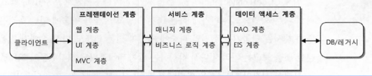
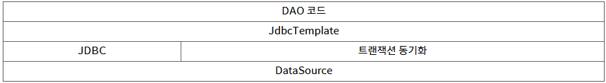
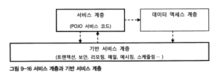

# 9장 (9.3)

Created: December 4, 2021 7:46 PM
계정: Charlie Lee

# 9.3 애플리케이션 아키텍처

---

클라이언트와 백엔드 시스템의 종류와 사용 기술, 연동 방법을 결정했다면

시스템 레벨의 아키텍처는 대략 구성된 셈이다.

다음으로 결정할 사항은 스프링 웹 애플리케이션의 아키텍처다.

## 9.3.1 계층형 아키텍처

---

성격이 다른 모듈이 강하게 결합되어 한데 모여 있으면 한 가지 이유로 변경이 일어날 때 그와 상관없는 요소도 함께 영향을 받게 된다. 

따라서 인터페이스와 같은 유연한 경계를 만들어두고 분리하거나 모아주는 작업이 필요하다.

### 아키텍처와 SoC

---

지금까지는 주로 오브젝트 레벨에서 이런 분리의 문제에 대해 생각해봤다.

이런 원리는 아키텍처 레벨에서 좀 더 큰 단위에 대해서도 동일하게 적용할 수 있다.

애플리케이션을 구성하는 오브젝트들을 비슷한 성격과 책임을 가진 것들끼리 묶을 수 있다.

예를 들면 데이터 액세스 로직을 담당하는 DAO들은 하나의 단위로 생각해도 좋다.

또 비즈니스 로직을 구현해놓은 비즈니스 서비스 오브젝트들도 같은 성격으로 묶을 수 있다.

이렇게 성격이 다른 것은 아키텍처 레벨에서 분리해주는 게 좋다.

책임과 성격이 다른것을 크게 그룹으로 만들어 분리해두는 것을 아키텍처 차원에서는 계층형 아키텍처라고 부른다.

보통 웹 기반의 엔터프라이즈 애플리케이션은 일반적으로 세 개의 계층을 갖는다고해서 3계층 애플리케이션이라고 한다.

### 3계층 아키텍처와 수직 계층

---

3계층 아키텍처는 백엔드의 DB나 레거시 시스템과 연동하는 인터페이스 역할을 하는 데이터 액세스 계층, 비즈니스 로직을 담고 있는 서비스 계층, 주로 웹 기반의 UI를 만들어내고 그 흐름을 관리하는 프레젠테이션 계층으로 구분한다.



- 데이터 액세스 계층

DAO 계층이라고도 불린다. 기본 3계층은 기술 계층보다는 역할에 따라 구분한 것이므로 보통 그림으로 나타낼 때도 가로로 배열한다. 반면에 추상화 레벨에 따라 구분하는 경우는 세로로 배열한다. 

스프링의 JdbcTemplate을 사용하는 DAO 계층이라면 



로 표현할 수 있다.

JdbcTemplate을 사용하는 데이터 액세스 계층의 특징은 JdbcTemplate이 추상화를 위한 계층으로
사용되서 로우레벨의 기반 계층에 존재하는 JDBC와 드라이버, 스프링의 트랜잭션 
추상화 서비스의 동기화 기능을 간접적으로 이용하게 만든다는 것이다.

추상화 계층구조를 따른다면 항상 JdbcTemplate을 통해 접근하도록 코드를 작성하는 것이 바람직하다.  추상화 계층은 필요하면 얼마든지 추가할 수 있다. 

JdbcTemplate 기능과 SqlService의 SQL을 가져오는 기능을 묶어서 더 단순한 방법으로 DAO코드를 작성하고 싶다면 또 하나의 추상계층을 추가할 수 있다.

- **서비스 계층**

서비스 계층은 구조로 보자면 가장 단순하다. 잘 만들어진 스프링 
애플리케이션의 서비스 계층 클래스는 이상적인 POJO로 작성된다. 

POJO로 만든다면 객체지향적인 설계 기법이 적용된 코드를 통해서 비즈니스 로직의 핵심을 잘 담아내고, 이를 쉽게 테스트하고 유연하게 확장할 수 있다.

서비스 계층은 DAO 계층을 호출하고 이를 활용해서 만들어진다. 때론 데이터 액세스를 위한 기능 외에 서버나 시스템 레벨에서 제공하는 기반 서비스를 활용할 필요도 있다.

메시징 서비스를 이용하는 것이 대표적인 예다. 이런 기반 서비스는 3계층 어디에서나 접근이 가능하도록 만들 수도 있고, 아키텍처를 설계하기에 따라서 반드시 서비스 계층을 통해 사용되도록 제한할 수도 있다.

원칙적으로는 서비스 계층 코드가 기반 서비스 계층의 구현에 종속되면 안 된다. 서비스 계층의 코드는 추상화된 기반 서비스 인터페이스를 통해서만 접근하도록 만들어서 특정 구현과 기술에 종속성을 제거해야 한다.



- **프레젠테이션 계층**

프레젠테이션 계층은 가장 복잡한 계층이다. 프레젠테이션 계층은 매우 다양한 기술과 프레임워크의 조합을 가질 수 있다.

엔터프라이즈 애플리케이션의 프레젠테이션 계층은 클라이언트의 종류와 상관없이 HTTP 프로토콜을 사용하는 서블릿이 바탕이 된다.

프레젠테이션 계층은 다른 계층과 달리 클라이언트까지 그 범위를 확장될 
수도 있다. 초기 클라이언트 모델은 단순히 HTML로 만들어진 결과를 사람이 볼 수 있도록 그려주고, 폼을 통해 입력받은 값을 
전달하는 것이었다. 하지만 최근에는 점점 많으 프레젠테이션 로직이 클라이언트로 이동하고 있다.

## 9.3.2 애플리케이션 정보 아키텍처

---

엔터프라이즈 시스템은 본질적으로 동시에 많은 작업이 빠르게 수행돼야 하는 시스템이다.

애플리케이션의 주요 상태정보는 클라이언트나 백엔드 시스템에 분산돼서 
보관된다. 비교적 장기간 보관되는 상태정보는 주로 DB나 메인프레임 같은 EIS백엔드 시스템에 저장된다. 하나의 업무 작업이 여러 번의 요청과 페이지에 걸쳐 일어나는 경우에 유지되어야 하는 임시 상태정보는 클라이언트에 일시적으로 보관되기도 하고 서버의 사용자별 세션 메모리에 저장되기도 한다.

애플리케이션을 사이에 두고 흘러다니는 정보를 어떤 식으로 다룰지를 경장하는 일도 아키텍처를 결정할 때 매우 중요한 기준이 된다.

1. **애플리케이션에 존재하는 정보를 단순히 데이터로 다루는경우**
2. **애플리케이션에 존재하는 정보를 오브젝트로 다루는 경우**

- **DB/SQL 중심의 로직 구현 방식**

데이터 중심구조의 특징은 하나의 업무 트랜잭션에 모든 계층의 코드가 
종속되는 경향이 있다는 점이다. 

예를 들어 사용자의 이름으로 사용자 정보를 검색해서 일치하는 사용자의 아이디, 비밀번호, 이름 등을 보여주는 작업이 있다고 하자. 이것이 하나의 업무 단위가 되면 모든 계층의 코드가 이 기준에 맞춰서 만들어 진다. 사용자 조회라는 단위 업무를 위해서만 존재하는 각 계층의 코드가 만들어진다는 뜻이다.

이런 식의 개발 방법과 아키텍처는 자바 기술이 발전하기 이전의 엔터프라이즈 시스템에서 흔히 발견할 수 있다.

2계층 구조에서도 비슷하게 발견할 수 있다.

이런 방식은 자바 코드를 단지 DB와 웹 화면을 연결해주는 단순한 인터페이스 도구로 전락시키는 것이다. 자바의 오브젝트는 단지 HTTP 서비스 채널을 만들어 JDBC를 이용해 DB기능을 사용하게
 하는 스크립트 정도로 역할이 축소된다.

## 9.3.3 오브젝트 중심 아키텍처

---

오브젝트 중심 아키텍처가 데이터 중심 아키텍처와 다른 가장 큰 특징은 
도메인 모델을 반영하는 오브젝트 구조를 만들어두고 그것을 각 계층 사이에서 정보를 전송하는 데 사용한다는 것이다. 

그래서 오브젝트 중심 아키텍처는 객체지향 분석과 모델링의 결과로 나오는 도메인 모델을 오브젝트 모델로 활용한다.

### 데이터와 오브젝트

---

간단한 예를 가지고 데이터와 오브젝트 방식을 비교해 보자.

카테고리와 상품이라는 두 가지 엔티티가 나온다고 해보자. 이 둘은 1:N 관계다.

이를 표로 정리해 보자.


조건에 맞는 모든 카테고리와 상품 정보를 가져와서 화면에 출력하는 
기능을 만든다고 해보자. 이때 데이터 중심 아키텍처에서는 SQL과 DB관점에서 생각한다. 이 두 개의 정보를 조합해서 가져오는 
방법은 JOIN을 이용해 2차원 구조의 정보를 만드는 것이다. 따라서  DAO에서 다음과 같은 SQL을 사용하게 만들 것이다.

```sql
SELECT c.categoryid, c.description, p.productid, p.name, p.price
FROM product p JOIN category c
ON p.categoryid = c.categoryid
```

결과를 맵에 담는 DAO코드

```java
while rs.next()) {
  Map<String, Object> resMap = new HashMap<>();
  resMap.put("categoryid", rs.getString(1));
  resMap.put("description", rs.getString(2));
  …
  list.add(resMap);
}
```

서비스 계층에 전달되는 것은 List<Map<String, Object>>타입이다.

이 타입만 봐서는 안에 담긴 내용이 어떤 것인지 알 수 없다.

따라서 이결과를 사용하는 서비스 계층이나 프레젠테이션 계층의 코드에서는

DAO메소드에서 두 개의 테이블을 조인해서 다섯 가지 필드의 값을 가져오고, 필드 이름을
키로 갖는 맵에 값을 저장했음을 알아야 사용할 수 있다.

만약 DAO에서 SQL을 변경하거나 필드 개수나 순서, 이름을 바꾼다면 서비스 계층과 프레젠테이션 계층의 코드도 같이 변경되어야 한다.

이렇게 데이터 중심의 아키텍처에서는 DAO가 만드는 SQL의 결과에 모든 계층의 코드가 의존하게 된다.

반면에 오브젝트 방식에서는 애플리케이션에서 사용되는 정보가 도메인 모델의 구조를 반영해서

만들어진 오브젝트 안에 담긴다. 도메인 모델은 애플리케이션 전 계층에서 동일한 의미를 가진다.

따라서 도메인 모델이 반영된 도메인 오브젝트도
모든 계층에서 일관된 구조를 유지한 채로 사용될 수 있다. 

SQL이나 웹페이지의 출력 포맷, 입력폼 등에 종속되지 않는 일관된 형식의 애플리케이션의 정보를 다룰수 있게 된다.

### 도메인 오브젝트

```java
public class Category {
  int categoryid;
  String description;
  Set<Product> products;  // 0~N 개의 Product를 참조하고있는 컬렉션을 가질수 있다.
  …
}

public class Product {
  int productid;
  Stringname;
  int price;
  Category category;  // 1개의 Category를 가리키는 레퍼런스를 직접 갖고 있다.
  …
}
```

애플리케이션 어디에서도 사용될 수 있는 일관된 형식의 도메인 정보를 담고 있다.

Product클래스에는 Product테이블처럼 categoryid라는 
외래키가 없다. 대신 Category 오브젝트를 가리키는 레퍼런스 변수를 갖고 있다. 반대로 하나의 Category는 여러개의 
Product와 관계를 가질 수 있으므로 Set이라는 컬렉션을 이용해 여러 개의 Product 오브젝트를 참조하게 만들 수 
있다.

원한다면 Category 오브젝트에서 다음과 같은 코드로 Category에 속한 Product를 간단히 가져올 수도 있다.

```java
Set<Product> products = myCategory.getProducts();
```

데이터 중심 방식에서는 Category와 그에 대응되는 Product를 찾아 SQL을 이용해 조인한 다음
하나의 맵에 뭉뚱그려서 가져왔다. 

반면에 오브젝트 중심 방식에서는 테이블의 정보과 그 관계를 유지한 채로 정확한 개수의 Category 오브젝트와 그에 대응되는 Product 오브젝트로 만들어 사용한다.

### 도메인 오브젝트 사용의 문제점

---

일관된 의미를 가지고 유연하며 애플리케이션 전반에 공유 가능한 도메인 모델을 따르는 오브젝트로 정보를 다루면 많은 장점이 있다. 이해하기 쉽고 로직 작성도 수월하다.

하지만 단점도 있다. 최적화된 SQL을 매번 만들어 사용하는 경우에 
비해 성능 면에서 조금은 손해를 감수해야 할 수도 있다. DAO는 비즈니스 로직의 사용 방식을 알지 못하므로, 도메인 오브젝트의 모든 필드 값을 다 채워서 전달하는 경우가 대부분이다.

그런데 하나의 오브젝트에 담긴 필드의 개수가 많아지다 보면 그중에는 
드물게 사용되는 필드도 있을 수 있다. 어떤 비즈니스 로직에서 필요한 정보가 몇 개의 필드 뿐이라면 DAO에서 도메인 오브젝트의 모든 필드 정보를 채워서 전달하는 것은 낭비일 수도있다.

이런 문제를 해결하는 접근 방법은 여러 가지가 있다.

`지연된 로딩`(lazy loading) 기법을 이용하면 일단 최소한의 오브젝트 정보만 읽어두고 관계하고 있는 오브젝트가 필요한 경우에만 다이내믹하게 DB에서 다시 읽어올 수 있다.

물론 도메인 오브젝트를 사용하는 코드는 이런 사실을 전혀 의식하지 않고
 처음부터 모든 오브젝트의 정보가 다 제공된다고 생각하고 작성하면 된다.

필드가 너무 많을 경우에는 따로 도메인 오브젝트로  정의해두고 사용할 수 있다.
물론 그에 따라 DAO 메소드가 추가되니 약하지만 계층간에 결합이 발생한다.

사실 가장 좋은 방법은 RDB 매핑(ORM) 기술을 사용하는 것이다. 이런 데이터 액세스 기술은 기본적으로 지연된 로딩 기법 등을 제공해주기 때문에 번거로운 코드를 만들지 않고도 도메인 오브젝트의 생성을 최적화할 수 있다.

그래서 도메인 오브젝트를 사용하는 오브젝트 중심 아키텍처에서는 가능하다면 ORM과 같은 오브젝트 중심 데이터 액세스 기술을 사용하는 것을 권장한다.

### 빈약한 도메인 오브젝트 방식

---

도메인 오브젝트에 정보만 담겨 있고, 정보를 활용하는 아무런 기능도 갖고 있지 않다면 이는 온전한 오브젝트라고 보기 힘들다. 그래서 이런 오브젝트를 빈약한 오브젝트라고 부른다.

물론 이렇게라도 도메인 모델을 반영한 오브젝트에 정보를 담아 활용하는 편이 도메인 오브젝트를 사용하지 않는 것보다는 훨씬 낫다.

그렇다면 도메인 오브젝트에 넣을 수 있는 기능은 무엇일까? 도메인 오브젝트이니 그 기능이라고 하면 도메인의 비즈니스 로직이라고 볼 수 있다.

그렇다면 빈약한 도메인 오브젝트 방식에서는 비즈니스 로직이 어디에 존재할까? 바로 서비스 계층이다.

사실 도메인 오브젝트 방식은 거대한 서비스 계층구조와 비슷하다. 하지만 비즈니스 로직이 복잡하지 않다면 가장 만들기 쉽고 3계층 구조의 특징을 잘 살려서 개발할 수 있는 유용한 아키텍처다.

### 풍성한 도메인 오브젝트 방식

---

풍성한 도메인 오브젝트 또는 영리한 도메인 오브젝트 방식은 빈약한 도메인 오브젝트의 단점을 극복하고 도메인 오브젝트의 객체지향적인 특징을 잘 사용할 수 있도록 개선한 것이다.

어떤 비즈니스 로직은 특정 도메인 오브젝트나 그 관련 오브젝트가 가진 정보와 깊은 관계가 있다. 

이런 로직을 서비스 계층의 코드가 아니라 도메인 오브젝트에 넣어주고, 서비스 계층의 비즈니스 로직에서 재사용하게 만드는 것이다.

예를들어 앞에서 만든 Category에 해당하는 Product의 가격을 모두 합하는 로직을 굳이 서비스 계층에 두지않고 Category 도메인 오브젝트에 로직을 담는 것.

이렇게 만드는 경우는 서비스 계층의 메소드에 따로 만드는 것보다 응집도가 높다.

물론 도메인 오브젝트에 비즈니스 로직을 넣는다고 해서 비즈니스 로직을 
담고 있던 서비스 계층 오브젝트가 필요 없어지는 건 아니다. 

도메인 오브젝트는 직접 데이터 액세스 계층이나 기반 계층 또는 다른 
서비스 계층의 오브젝트에 접근할 수 없기 때문에 서비스 계층이 필요하기도 하다.

### 도메인 계층 방식

---

도메인 오브젝트에 담을 수 있는 비즈니스 로직은 데이터 액세스 계층에서 가져온 내부 데이터를 분석하거나, 조건에 따라 오브젝트 정보를 변경, 생성 하는 정도에 그칠 수밖에 없다.

이렇게 변경된 정보가 다시 DB등에 반영되려면 서비스 계층 오브젝트의 부가적인 작업이 필요하다.

도메인 오브젝트가 스스로 필요한 정보는 DAO를 통해 가져올 수 있고, 생성이나 변경이 일어났을 때 직접 DAO에게 변경사항을 반영해달고 요청할 수는 없을까?

도메인 계층의 역할과 비중을 극대화하려다 보면 기존의 풍성한 도메인 
오브젝트의 방식으로는 만족할 수 없다. 

그래서 등장한 것이 바로 도메인 오브젝트가 기존 3계층과 같은 레벨로 격상되어 하나의 계층을 이루게 하는 도메인 계층 방식이다.

도메인 오브젝트가 독립된 계층을 이뤘기 때문에 기존 방식과는 다른 두 가지 특징을 갖게 된다.

- **도메인에 종속적인 비즈니스 로직의 처리는 서비스 계층이 아니라 도메인 계층의 오브젝트 안에서 진행된다.**
- **도메인 오브젝트가 기존 데이터 액세스 계층이나 기반 계층의 기능을 직접 활용할 수 있다.**

스프링이 관리하지 않는 도메인 오브젝트에 DI를 적용하기 위해서는 AOP가 필요하다.
물론 AOP의 적용 대상도 스프링의 빈 오브젝트 뿐이다. 하지만 스프링 AOP대신 AspectJ AOP를 
사용하면 클래스의 생성자가 호출되면서 오브젝트가 만들어지는 시점을 조인 포인트로 사용할 수 있고 스프링 빈이 아닌 일반 오브젝트에도 AOP 부가기능을 적용할 수 있다.

도메인 계층 방식은 이전의 어떤 방식보다 도메인 오브젝트에 많은 비즈니스 로직을 담아낼 수 있다. 그럼에도 서비스 계층의 역할이 완전히 사라지는 건 아니다.

때로는 여러 도메인 오브젝트의 기능을 조합해서 복잡한 작업을 진행해야 하는 경우가 있다.

도메인 오브젝트를 독립적인 계층으로 만들려고 할 때 고려해야 할 중요한 사항이 있다. 

도메인 오브젝트가 도메인 계층을 벗어나서도 사용되게 할지 말지 결정해야 한다. 도메인 오브젝트가 계층을 이루기 전에는 모든 계층에 걸쳐 사용되는 일종의 정보전달 도구 같은 역할을 했다.

선택할 수 있는 방법은 두 가지가 있다.

- **여전히 모든 계층에서 도메인 오브젝트를 사용한다.**
    - 주의하지 않으면 막강한 기능을 가진 도메인 오브젝트를 프레젠테이션 계층이나 뷰 등에서 사용하게 해주면 이를 함부로 사용하는 위험이 따를 수 있다.
    - 철저한 가이드라인을 만들어두고 이를 강력하게 적용하는 것이 필요.
    
- **도메인 오브젝트는 도메인 계층을 벗어나지 못하게 하는 것이다.**
    - 도메인 계층 밖으로 전달될 때는 별도로 준비된 정보 전달용 오브젝트에 도메인 오브젝트의 내용을 복사해서 넘겨줘야한다. 이런 오브젝트를DTO라고한다.
    - DTO는 변화를 허용하지 않고 읽기전용으로 만들어지기도 한다.
    - DTO는 기능을 갖지 않으므로 사용하기 안전하다.
    - 

이 두 가지 방법 중 어느것이 더 낫다고 말하기는 힘들다.

## 9.3.4 스프링 애플리케이션을 위한 아키텍처 설계

---

### 상태 관리와 빈 스코프

아키텍처 설계에서 한 가지 더 신경 써야 할 사항은 상태 관리다. 
크게는 사용자 로그인 세션 관리부터, 작게는 하나의 단위 작업이지만 여러 페이지에 걸쳐 진행되는 위저드 기능까지 애플리케이션은 
하나의 HTTP 요청의 범위를 넘어서 유지해야 하는 상태정보가 있다.

엔터프라이즈 애플리케이션은 특정 사용자가 독점해서 배타적으로 사용되지 
않는다. 

하나의 애플리케이션이 동시에 수많은 사용자의 요청을 처리하게 하기 위해 매번 간단한 요청을 받아서 그 결과를 돌려주는 방식으로 동작한다. 

따라서 서버의 자원이 특정 사용자에게 일정하게 할당되지 않는다. 

그래서 서버 기반의 애플리케이션은 원래 지속적으로 유지되는 상태를 갖지 않는다(stateless)는 특징이 있다.

하지만 어떤 식으로든 애플리케이션의 상태와 장시간 진행되는 작업정보는 유지되어야 한다. 

이를 위해 웹 클라이언트에 URL, 파라미터, 폼 히든 필드, 쿠키 등을 이용해 상태정보 또는 서버에 저장된 상태정보에 키 값 등을 전달해야 한다.

이렇게 상태를 저장, 유지하는데 어떤 방식을 사용할지 결정하는 일은 매우 중요하다. 

스프링은 기본적으로 상태가 유지되지 않는 빈과 오브젝트를 사용하는 것을 권장한다. 반면에 웹 클라이언트에 폼 정보를 출력하고 이를 수정하는 등의 작업을 위해서는 HTTP 세션을 적극 활용하기도 한다.